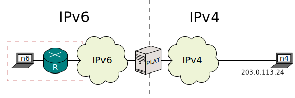
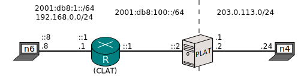
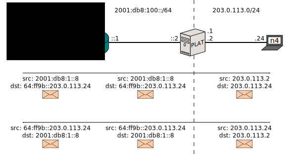
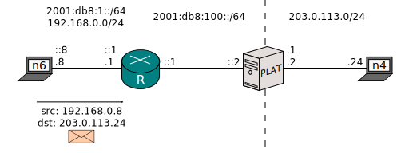
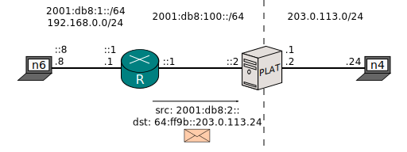
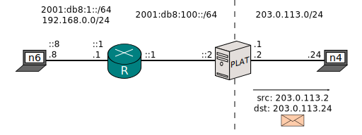
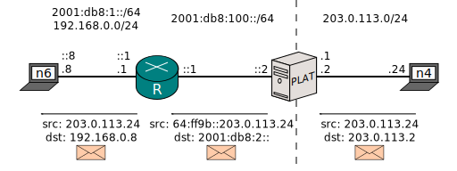

[Documentation](documentation.html) > [Architectures](documentation.html#architectures) > 464XLAT

# 464XLAT

## Index

1. [Introduction](#introduction)
2. [Problem Statement](#problem-statement)
2. [Sample Network](#sample-network)
3. [Sample Translator Configuration](#sample-translator-configuration)
3. [Expected Packet Flows](#expected-packet-flows)
4. [Actual Configuration](#actual-configuration)
4. [Testing](#testing)
5. [Closing words](#closing-words)

## Introduction

This document is a summary of the 464XLAT architecture ([RFC 6877](https://tools.ietf.org/html/rfc6877)), collapsed into a walkthrough that uses Jool.

## Problem Statement

Barring [RFC 6384](https://tools.ietf.org/html/rfc6384), NAT64 only translates network (IPv4, IPv6 and ICMP) and transport headers (UDP and TCP). Unfortunately, some protocols on top of UDP and TCP have a bad habit of including IP addresses ("IP literals") along their conversations. Because NAT64 only translates lower protocols, these addresses will slip past the NAT64 unmodified.

For example, some IPv6-unaware website, which would normally contain this HTML:

	<a href="nicmx.github.io/Jool">Link to something.</a>

Could be poorly coded like this:

	<a href="203.0.113.24/Jool">Link to something.</a>

This address lies within the body of an HTML file, not a network or transport header. It is not viable for a NAT64 to support translation of all existing application protocols.

Clicking the latter version of the link from an IPv6-only node via a NAT64 will result in failure, because the node doesn't have an IPv4 stack which to access `203.0.113.24` with. `nicmx.github.io` works fine because the DNS64 appends the NAT64 prefix once the node asks about it; on the other hand, if all the node has is `203.0.113.24`, it can't really tell it's talking via a NAT64, much less know which prefix should be appended.

[464XLAT](https://tools.ietf.org/html/rfc6877) is a technique meant to address this limitation. It appends an SIIT to the path, which mirrors the NAT64's work, which grants a controlled amount of clients a fallback IPv4 stack to access IP literals with.

## Sample Network

The red box would be your domain. _n6_ stands for "IPv6 node" and _R_ is "router". Say your ISP gives you only IPv6 addresses, but it also grants you access to IPv4 via a Stateful NAT64 (_PLAT_; "Provider-side Translator"). _n4_ is a random IPv4 Internet node.

Say your user from _n6_ clicks a link towards `203.0.113.24`. _n6_ does not have an IPv4 stack, so the request has nowhere to go. The situation could be amended by manually appending the NAT64 prefix to the address, but the user doesn't know that. Of course, a DNS64 would be the ideal and transparent solution, but unfortunately the site provided an address and not a domain name, so _n6_ is not querying the DNS.

In broad terms, the solution is to provide _n6_ with a "fake" IPv4 stack whose packets will be translated into IPv6 before reaching _PLAT_. In other words, an SIIT service (in 464XLAT terms called "_CLAT_"; "Customer-side Translator") will be sort of undoing _PLAT_'s work.

If _n6_ is a lone case and you want to isolate the mirror hack as much as possible, [_n6_ itself can be the CLAT](node-based-translation.html). If you want to provide this feature to several nodes however, _R_ is a better candidate:

I also removed the clouds to simplify routing in the example. The dual translation idea has really nothing to do with routing, so this is unimportant.

## Sample Translator Configuration

Both translators will hold the same `pool6` prefix: `64:ff9b::/96`. R will, additionally, keep the following [EAM table](eamt.html):

| IPv4        | IPv6         |
|-------------|--------------|
| 192.168.0.8 | 2001:db8:2:: |

With this configuration, we intend to achieve the following packet flows:

## Expected Packet Flows

This is the normal flow an IPv6-sourced packet would traverse. It is a typical Stateful NAT64 flow and the Dual Translation presented in this configuration will not interfere with it:

The 464XLAT flow we want to achieve follows. _n6_ will use its IPv4 address to try to query the literal (or whatever IPv4 Internet address):

_R_ will SIIT the packet into IPv6 so it can traverse the IPv6-only chunk. Address `192.168.0.8` will be translated using the EAMT, and 203.0.113.24 will receive the `pool6` prefix treatment to mirror _PLAT_'s.

_PLAT_ will do its magic and send the packet to the IPv4 Internet:

And the mangling will be mirrored for the response:

## Actual Configuration

_n6_ doesn't know it kind of owns another IPv6 address in the 2001:db8:2::/96 network. It never sees this traffic, because _R_ always translates it as 192.168.0.0/24.

	ip link set eth0 up
	ip addr add 2001:db8:1::8/64 dev eth0
	ip addr add 192.168.0.8/24 dev eth0

	ip route add default via 2001:db8:1::1
	ip route add default via 192.168.0.1

This is _R_:

	ip link set eth0 up
	ip addr add 192.168.0.1/24 dev eth0
	ip addr add 2001:db8:1::1/64 dev eth0

	ip link set eth1 up
	ip addr add 2001:db8:100::1/64 dev eth1

	# Traffic headed to the real IPv4 Internet goes via PLAT.
	ip route add 64:ff9b::/96 via 2001:db8:100::2

	sysctl -w net.ipv4.conf.all.forwarding=1
	sysctl -w net.ipv6.conf.all.forwarding=1
	
	# Enable SIIT.
	# We're masking the private network using an EAMT entry.
	# Traffic towards the Internet is to be appended PLAT's prefix.
	# Recall that the EAMT has higher precedence than the prefix.
	jool_siit instance add --netfilter --pool6 64:ff9b::/96
	jool_siit eamt add 192.168.0.8 2001:db8:2::

Perhaps an easy way to understand the latter lines of this configuration is that the EAMT will be used to translate the addresses of the nodes at the left of _CLAT_, while the pool6 prefix will be used to translate the addresses of the nodes at the right of _PLAT_.

Again, _n6_'s packet will have addresses `192.168.0.8` (its assigned IPv4 address) and `203.0.113.24` (the random Internet address). The former will be translated using the EAMT entry and the latter will use the `pool6` prefix. Notice that, since every EAMT entry masks one node in this example, you will need one EAMT entry for every "_n6_" in your setup. In real life though, you can aggregate EAMT entries; see [EAMT](eamt.html).

Also note that _R_ is an average SIIT implementation and you shouldn't think of this installation of Jool as anything other than that.

For completeness sake, here's _PLAT_'s network configuration:

	ip link set eth0 up
	ip addr add 2001:db8:100::2/64 dev eth0
	# I'm pretending the ISP gave us these two prefixes to play with.
	ip route add 2001:db8:1::/64 via 2001:db8:100::1
	ip route add 2001:db8:2::/64 via 2001:db8:100::1

	ip link set eth1 up
	ip addr add 203.0.113.1/24 dev eth1
	ip addr add 203.0.113.2/24 dev eth1

	sysctl -w net.ipv4.conf.all.forwarding=1
	sysctl -w net.ipv6.conf.all.forwarding=1
	
	modprobe jool
	jool instance add --netfilter --pool6 64:ff9b::/96
	jool pool4 add 203.0.113.2

And _n4_ is thoroughly boring:

	ip link set eth0 up
	ip addr add 203.0.113.24/24 dev eth0
	ip route add default via 203.0.113.2

## Testing

Ping _n4_ via IPv4 from _n6_:

	$ ping 203.0.113.24 -c 1
	PING 203.0.113.24 (203.0.113.24) 56(84) bytes of data.
	64 bytes from 203.0.113.24: icmp_seq=1 ttl=62 time=4.13 ms

	--- 203.0.113.24 ping statistics ---
	1 packets transmitted, 1 received, 0% packet loss, time 0ms
	rtt min/avg/max/mdev = 4.130/4.130/4.130/0.000 ms

- [ipv4-n6.pcapng](../obj/464xlat/ipv4-n6.pcapng)
- [ipv4-r.pcapng](../obj/464xlat/ipv4-r.pcapng)
- [ipv4-plat.pcapng](../obj/464xlat/ipv4-plat.pcapng)
- [ipv4-n4.pcapng](../obj/464xlat/ipv4-n4.pcapng)

Ping _n4_ via IPv6 from _n6_:

	$ ping6 64:ff9b::203.0.113.24 -c 1
	PING 64:ff9b::203.0.113.24(64:ff9b::cb00:7118) 56 data bytes
	64 bytes from 64:ff9b::cb00:7118: icmp_seq=1 ttl=62 time=14.0 ms

	--- 64:ff9b::203.0.113.24 ping statistics ---
	1 packets transmitted, 1 received, 0% packet loss, time 0ms
	rtt min/avg/max/mdev = 14.053/14.053/14.053/0.000 ms

- [ipv6-n6.pcapng](../obj/464xlat/ipv6-n6.pcapng)
- [ipv6-r.pcapng](../obj/464xlat/ipv6-r.pcapng)
- [ipv6-plat.pcapng](../obj/464xlat/ipv6-plat.pcapng)
- [ipv6-n4.pcapng](../obj/464xlat/ipv6-n4.pcapng)

## Closing words

Though at this point you can see how you can defend yourself against IP literals and legacy IPv4-only appliances, you might want to be forewarned that at least [one application protocol](http://tools.ietf.org/html/rfc959) out there is so poorly designed it works differently depending on whether it's sitting on top of IPv6 or IPv4. Therefore, [addressing IP literals in this case is not sufficient to make FTP work via NAT64]({{ site.repository-url }}/issues/114).

On the other hand, some network-aware protocols only partially depend on literals, and the NAT64 is not going to get in the way of the features that don't. FTP's "extended passive" mode falls in this category.

You can make active FTP work by deploying a fully stateless dual translation environment such as [siit-dc-2xlat]({{ site.draft-siit-dc-2xlat }}). It works because both the client and server are both using IPv4 sockets, the IPv4 addresses are unchanged end-to-end, and it's fully bi-directional, so active and passive FTP on arbitrary ports work fine. In siit-dc-2xlat, the IPv6 network in the middle becomes an invisible "tunnel" through which IPv4 is transported.

Here's a list of protocols that are known to use IP literals. You might also want to see [RFC 6586](http://tools.ietf.org/html/rfc6586).

 - FTP (active and passive modes)
 - Skype
 - NFS
 - Google Talk Client
 - AIM (AOL)
 - ICQ (AOL)
 - MSN
 - Webex
 - [Some games](http://tools.ietf.org/html/rfc6586#section-5.4)
 - [Spotify](http://tools.ietf.org/html/rfc6586#section-5.5)
 - [Poorly coded HTML](http://tools.ietf.org/html/rfc6586#section-6.1)

