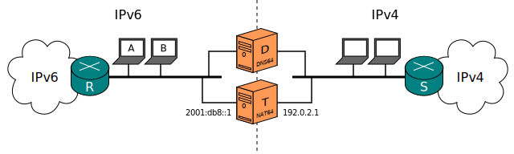
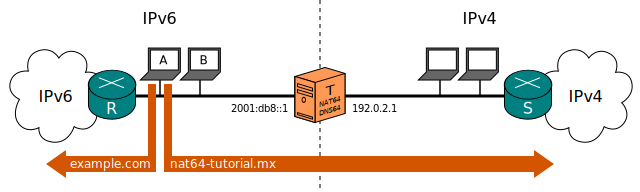
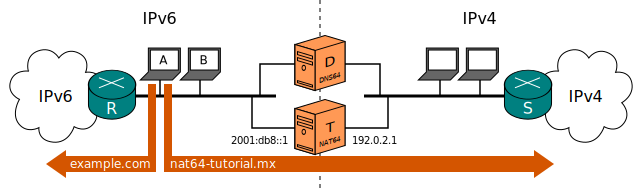

[Documentation](documentation.html) > [Basic Tutorials](documentation.html#basic-tutorials) > DNS64

# DNS64 Tutorial

## Index

1. [Introduction](#introduction)
2. [Network](#network)
3. [Configuration](#configuration)
   1. [BIND](#bind)
   2. [Everything else](#everything-else)
4. [Outcome](#outcome)

## Introduction

This document focuses on DNS64, the last key to have a fully-sensical Stateful NAT64 installation.

Any correct DNS64 implementation is supposed to work; BIND will be used for illustration here. I expect you to be already familiarized with DNS and have at least an idea of what BIND's configuration looks like.

## Network

<div>
	<div class="selector-menu">
		<span>Joined</span>
		<span>Separate</span>
	</div>
	<div class="selector-items">
		
		
	</div>
</div>

## Configuration

### BIND

First, I will clarify what we want to achieve:

From a machine connected to either Internet, you can personally verify that the `example.com` domain is both IPv4-enabled and IPv6-enabled:

```bash
$ dig +short example.com A       # Query for IPv4 address
93.184.216.119
$ dig +short example.com AAAA    # Query for IPv6 address
2606:2800:220:6d:26bf:1447:1097:aa7
```

On the other hand, the `nat64-tutorial.mx` domain is only IPv4-enabled:

```bash
$ dig +short nat64-tutorial.mx A
200.94.182.36
$ dig +short nat64-tutorial.mx AAAA
$ # No response received
```

There's no need for an IPv6 node to access `example.com` via the NAT64. On the other hand, `nat64-tutorial.mx` cannot be accessed from IPv6 without one.

In other words, we want the DNS server to return `2606:2800:220:6d:26bf:1447:1097:aa7` when asked for the AAAA record of `example.com` (which is what it normally does), and `64:ff9b::200.94.182.36` (i.e. the NAT64 prefix plus the IPv4 address) when asked for the AAAA record of `nat64-tutorial.mx` (which is the whole NAT64 hack).

First, have a working BIND server. On Ubuntu, the only thing you have to do (assuming you don't already have one) is run

<div>
	<div class="selector-menu">
		<span>Joined</span>
		<span>Separate</span>
	</div>
	<div class="selector-items">
		<div class="language-bash highlighter-rouge"><div class="highlight"><pre class="highlight"><code>user@T:~# apt <span class="nb">install </span>bind9</code></pre></div></div>
		<div class="language-bash highlighter-rouge"><div class="highlight"><pre class="highlight"><code>user@D:~# apt <span class="nb">install </span>bind9</code></pre></div></div>
	</div>
</div>

In order to enable DNS64, we need to append some directives in BIND configuration's `options` block. In Ubuntu, `options` can be found in `/etc/bind/named.conf.options`:

<div>
	<div class="selector-menu">
		<span>Joined</span>
		<span>Separate</span>
	</div>
	<div class="selector-items">
		<div class="language-plaintext highlighter-rouge"><div class="highlight"><pre class="highlight"><code>acl translator {
	# Please list all the translator's addresses here.
	localhost;
};
acl dns64-good-clients {
	# Please list here the clients that should be allowed to query
	# the DNS64 service.
	# "localnets" is a convenient moniker for devices sharing a
	# network with our DNS64.
	localnets;
};

options {
	# Ubuntu BIND's default options.
	# Might need to tweak this if you use some other distribution.
	directory "/var/cache/bind";
	dnssec-validation auto;
        auth-nxdomain no;    # conform to RFC1035
	listen-on-v6 { any; };

	# Make sure our nameserver is not abused by external
	# malicious users.
	allow-query { dns64-good-clients; };

	# This enables DNS64.
	# "64:ff9b::/96" has to be the same as Jool's `pool6`.
	dns64 64:ff9b::/96 {
		# Though serving standard DNS to the translator device
		# is perfectly normal, we want to exclude it from DNS64.
		# Why? Well, one reason is that the translator is
		# already connected to both IP protocols, so its own
		# traffic doesn't need 64:ff9b for anything.
		# But a more important reason is that Jool can only
		# translate on PREROUTING [0]; it specifically excludes
		# local traffic. If the Jool device itself attempts to
		# communicate with 64:ff9b, it will fail.
		# Listing !translator before our good clients here
		# ensures the translator is excluded from DNS64, even
		# when it belongs to the client networks.
		clients { !translator; dns64-good-clients; };

		# Other options per prefix (if you need them) here.
		# More info here: https://kb.isc.org/article/AA-01031
	};
};
</code></pre></div></div>
		<div class="language-plaintext highlighter-rouge"><div class="highlight"><pre class="highlight"><code>acl translator {
	# Please list all the translator's addresses here.
	192.0.2.1; 2001:db8::1;
};
acl dns64-good-clients {
	# Please list here the clients that should be allowed to query
	# the DNS64 service.
	# "localnets" is a convenient moniker for devices sharing a
	# network with our DNS64.
	localnets;
};

options {
	# Ubuntu BIND's default options.
	# Might need to tweak this if you use some other distribution.
	directory "/var/cache/bind";
	dnssec-validation auto;
        auth-nxdomain no;    # conform to RFC1035
	listen-on-v6 { any; };

	# Make sure our nameserver is not abused by external
	# malicious users.
	allow-query { dns64-good-clients; };

	# This enables DNS64.
	# "64:ff9b::/96" has to be the same as Jool's `pool6`.
	dns64 64:ff9b::/96 {
		# Though serving standard DNS to the translator device
		# is perfectly normal, we want to exclude it from DNS64.
		# Why? Well, one reason is that the translator is
		# already connected to both IP protocols, so its own
		# traffic doesn't need 64:ff9b for anything.
		# But a more important reason is that Jool can only
		# translate on PREROUTING [0]; it specifically excludes
		# local traffic. If the Jool device itself attempts to
		# communicate with 64:ff9b, it will fail.
		# Listing !translator before our good clients here
		# ensures the translator is excluded from DNS64, even
		# when it belongs to the client networks.
		clients { !translator; dns64-good-clients; };

		# Other options per prefix (if you need them) here.
		# More info here: https://kb.isc.org/article/AA-01031
	};
};
</code></pre></div></div>
	</div>
</div>

[0] [intro-jool.html#design](intro-jool.html#design)

And remember to reload:

<div>
	<div class="selector-menu">
		<span>Joined</span>
		<span>Separate</span>
	</div>
	<div class="selector-items">
		<div class="language-bash highlighter-rouge"><div class="highlight"><pre class="highlight"><code>user@T:~# service bind9 restart</code></pre></div></div>
		<div class="language-bash highlighter-rouge"><div class="highlight"><pre class="highlight"><code>user@D:~# service bind9 restart</code></pre></div></div>
	</div>
</div>

## Outcome

Assuming your IPv6 nodes (`A` and `B` in the diagram) have been configured to use the DNS64 as default DNS server, you should get the following output from them:

```bash
$ dig +short example.com AAAA
2606:2800:220:6d:26bf:1447:1097:aa7
$ dig +short nat64-tutorial.mx AAAA
64:ff9b::c85e:b624
```

And, if you sniff the traffic, you should see packets towards `example.com` on R, and packets towards `nat64-tutorial.mx` via S:

<div>
	<div class="selector-menu">
		<span>Joined</span>
		<span>Separate</span>
	</div>
	<div class="selector-items">
		
		
	</div>
</div>

Happy ending!

