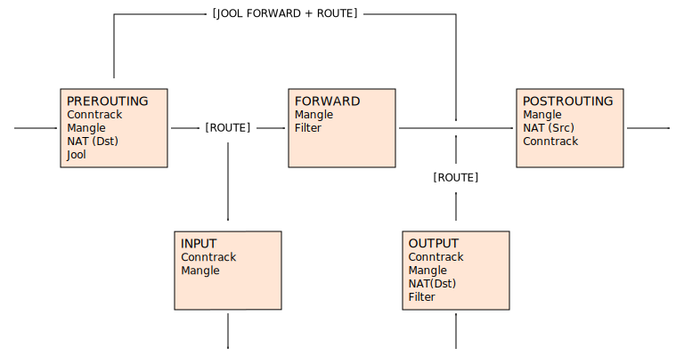
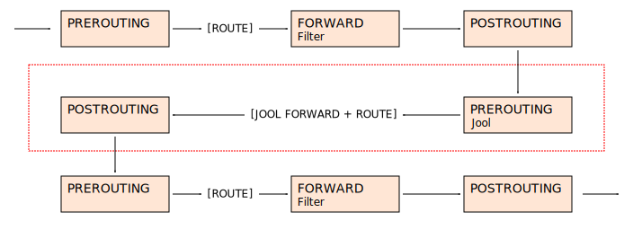

[Documentation](documentation.html) > [Introduction](documentation.html#introduction) > What is Jool?

# Introduction to Jool

## Index

1. [Overview](#overview)
2. [Compliance](#compliance)
3. [Compatibility](#compatibility)
4. [Design](#design)
	1. [Netfilter](#netfilter)
	2. [iptables](#iptables)
5. [Untranslatable packets](#untranslatable-packets)

## Overview

Jool is an Open Source implementation of [IPv4/IPv6 Translation](intro-xlat.html) on Linux. Until version 3.2.x, it used to be only a Stateful NAT64; starting from 3.3.0, it also supports SIIT mode.

## Compliance

As far as we know, this is the compliance status of Jool 4.1:

| RFC/draft | Reminder name | Status |
|-----------|---------|--------|
| [RFC 6052](https://tools.ietf.org/html/rfc6052) | IP address translation | Fully compliant. |
| [RFC 6144](https://tools.ietf.org/html/rfc6144) | IPv4/IPv6 Translation Framework | Fully compliant. |
| [RFC 7915](https://tools.ietf.org/html/rfc7915) | SIIT | Fully compliant. |
| [RFC 6146](https://tools.ietf.org/html/rfc6146) | Stateful NAT64 | Fully compliant. |
| [RFC 6384](http://tools.ietf.org/html/rfc6384) | FTP over NAT64 | [Not yet compliant]({{ site.repository-url }}/issues/114). |
| [RFC 6791](https://tools.ietf.org/html/rfc6791) | ICMP quirks | In short, this RFC wants two things: A pool of IPv4 addresses and an ICMP header extension. Jool implements the former but not the latter. |
| [RFC 6877](http://tools.ietf.org/html/rfc6877) | 464XLAT | Rather implemented as SIIT-DC-DTM; see below. |
| [RFC 7755]({{ site.draft-siit-dc }}) | SIIT-DC | Fully compliant. |
| [RFC 7756]({{ site.draft-siit-dc-2xlat }}) | SIIT-DC: Dual Translation Mode | Fully compliant. |
| [RFC 8021]({{ site.draft-deprecate-atomfrag-generation }}) | Atomic Fragment Deprecation | Fully compliant. |
| [RFC 7757]({{ site.draft-siit-eam }}) | EAM | Fully compliant. |
| [RFC 7422](https://tools.ietf.org/html/rfc7422) | Deterministic port allocations | Deterministic port allocations (sequential algorithm only) can be achieved using the pool4's `--mark` argument ([mark-src-range](https://github.com/NICMx/mark-src-range) ip6tables plugin suggested). |

Please [let us know]({{ site.repository-url }}/issues) if you find additional compliance issues or RFCs/drafts we've missed.

## Compatibility

<!-- Remember: The man pages mention the lowest supported kernel. -->

| Jool version                        | Supported Linux kernels (mainline)   | Supported Linux kernels (RHEL) |
|-------------------------------------|--------------------------------------|--------------------------------|
| [main]({{ site.repository-url }}), [4.1.11](download.html#41x) | 4.18 - 4.20, 5.0 - 5.19, 6.0 - 6.7 | RHEL 8.6 - 8.9, RHEL 9.0 - 9.3 |
| [4.1.10](download.html#41x) | 4.14 - 4.20, 5.0 - 5.19, 6.0 - 6.3 | RHEL 8.6 - 8.7, RHEL 9.0 - 9.3 |
| [4.1.9](download.html#41x) | 4.9 - 4.20, 5.0 - 5.19, 6.0 - 6.1 | RHEL 8.6 - 8.7, RHEL 9.0 - 9.1 |
| [4.1.8](download.html#41x) | 4.9 - 4.20, 5.0 - 5.16 | RHEL 8.5 |
| [4.1.6](download.html#41x), [4.1.7](download.html#41x) | 4.4 - 4.20, 5.0 - 5.15 | RHEL 8.5 |
| [4.1.5](download.html#41x) | 3.16 - 3.19, 4.0 - 4.20, 5.0 - 5.11 | RHEL 7.6 - RHEL 7.7, RHEL 8.0 |
| [4.1.3](download.html#41x), [4.1.4](download.html#41x) | 3.16 - 3.19, 4.0 - 4.20, 5.0 - 5.9 | RHEL 7.6 - RHEL 7.7, RHEL 8.0 |
| [4.1.2](download.html#41x) | 3.16 - 3.19, 4.0 - 4.20, 5.0 - 5.7 | RHEL 7.6 - RHEL 7.7, RHEL 8.0 |
| [4.1.1](download.html#41x), [4.1.0](download.html#41x) | 3.16 - 3.19, 4.0 - 4.20, 5.0 - 5.7 | RHEL 7.6 - RHEL 7.7, <del>[RHEL 8.0](https://github.com/NICMx/Jool/issues/334)</del> |
| [4.0.9](download.html#40x)          | 3.13 - 3.19, 4.0 - 4.20, 5.0 - 5.6 | RHEL 7.0 - RHEL 7.7, <del>[RHEL 8.0](https://github.com/NICMx/Jool/issues/334)</del> |
| [4.0.8](download.html#40x)          | 3.13 - 3.19, 4.0 - 4.20, 5.0 - 5.5 | RHEL 7.0 - RHEL 7.7, <del>[RHEL 8.0](https://github.com/NICMx/Jool/issues/334)</del> |
| [4.0.7](download.html#40x)          | 3.13 - 3.19, 4.0 - 4.20, 5.0 - 5.4 | RHEL 7.0 - RHEL 7.7, <del>[RHEL 8.0](https://github.com/NICMx/Jool/issues/334)</del> |

If you're using a non-RHEL distribution (eg. Debian derivatives), execute `uname -r` to print the kernel version you're running. Suffixes rarely matter. Here's an example from my running machine, which states that my running kernel is 4.15:

	user@T:~$ /bin/uname -r
	4.15.0-36-generic

RHEL-based distributions (such as Red Hat and CentOS) do not follow the normal kernel versioning conventions; use the third column instead.

## Design

A Jool instance can be attached to one of two different traffic-intercepting, plugin-enabling, kernel-based frameworks: _Netfilter_ and _iptables_. Despite some documentation out there, these two are not the same thing; at least not from Jool's point of view.

>  Yes, we know we're supposed to add nftables support, but it's going to be a lot of work, and so it's tentatively scheduled to come out in late 2021.

### Netfilter

_Netfilter_ is a bunch of [hooks](http://www.netfilter.org/documentation/HOWTO/netfilter-hacking-HOWTO-3.html) (`PREROUTING`, `LOCALIN`, `FORWARD`, `LOCALOUT` and `POSTROUTING`) in the Linux kernel where modules can inject code. Whenever a packet reaches a hook, the kernel runs it through all the corresponding registered modules. Netfilter Jool instances hook themselves to `PREROUTING` and as such intercept all incoming traffic ("pre"vious to "routing") with the intent of translating it.

Netfilter Jool instances are simple to configure. However, they are also _greedy_. This is, since there is no _matching_ conditional (other than "packets need to _match_ the network namespace the instance exists in"), translation has overwhelming priority. Only packets that meet failure during translation are left untouched by a Netfilter instance. _Jool attempts to translate everything, and the rest of the network subsystem gets the leftovers_. Because of this, a careless Netfilter Jool configuration could deprive its own namespace of external network traffic.

There can only be **one** Netfilter SIIT Jool instance and **one** Netfilter NAT64 instance per network namespace.

Netfilter Jool instances start packet translation as soon as they are created. They drop packets deemed corrupted, translate packets which _can_ be translated (according to their configuration) and return [everything else](#untranslatable-packets) to the kernel.

Netfilter plugins are not allowed to change the network protocol of their packets. Additionally, the kernel API does not export a means to post packets in the `FORWARD` chain. For these reasons, successfully translated packets skip `FORWARD`, going straight to `POSTROUTING`:

Be aware that this means that, because filtering normally happens during `FORWARD`, if you want to firewall forwarding traffic, you should probably enclose Jool in a network namespace and filter during the `FORWARD` boxes outside of it:

Alternatively, if you know what you're doing, you can [filter on mangle]({{ site.repository-url }}/issues/41#issuecomment-77951288).

Until Jool 3.5, Netfilter used to be the only available operation mode.

### iptables

_iptables_ is another packet-handling framework. It is built on top of Netfiter, and is mostly known for its NAT'ing and firewalling capabilities. In regards to this discussion, its most relevant feature is its _match_ system--A means to specify which packets are handled by some "target" plugin.

If you're familiar with the `iptables` utility, you might be accustomed to the following syntax:

	# iptables -t filter -A PREROUTING --destination 192.0.2.0/24 -j DROP

For anyone not in the knowing, that command adds a _rule_ to iptables' _filter_ table, which "DROP"s all packets headed towards the `192.0.2` network. This happens during `PREROUTING`. (Which is the same concept from Netfilter.)

iptables Jool is implemented as an ordinary iptables target. Thus,

	# iptables -t mangle -A PREROUTING --destination 192.0.2.0/24 -j JOOL --instance potato

adds a _rule_ to iptables's _mangle_ table, which "Jools" all packets headed towards the `192.0.2` network. This happens during `PREROUTING`. Of all the Jool instances available in the current namespace, the translation is done by the one whose name is `potato`.

There can be any number of iptables Jool instances in any namespace, and any number of iptables rules can reference them.

iptables Jool instances sit idle until some iptables rule sends packets to them. (Of course, only packets that [match the rule's conditions](https://www.netfilter.org/documentation/HOWTO/packet-filtering-HOWTO-7.html#ss7.3) are sent.) As of version 4.0.6, iptables instances function the same as Netfilter instances: They drop packets deemed corrupted, translate packets which _can_ be translated (according to their configuration) and return [everything else](#untranslatable-packets) to the kernel. (In this context, "return to the kernel" means that the packet will go back to the iptables chain, right after the Jool rule that matched it.)

iptables Jool has a quirk similar to Netfilter Jool that you should be aware of: iptables rules are also not allowed to change the network protocol of their packets, so iptables Jool rules also send their matched and successfully translated packets straight to `POSTROUTING`. Packets which do not match the rule continue through the chain normally.

iptables Jool first became available in Jool 4.0.0.

## Untranslatable packets

As of version 4.0.6, both Netfilter Jool and iptables Jool return the packet to the kernel if any of these conditions are met:

- An iptables rule's `--instance` parameter does not match any existing iptables instances. (ie. user created the iptables rule but hasn't yet created the instance.)
- The packet was translated successfully, but the translated packet cannot be routed. (Most of the time, this is because its destination address does not match any entries in the routing table.)
- The translator is [disabled by configuration](usr-flags-global.html#manually-enabled).

SIIT Jool also returns the packet to the kernel when at least one of these conditions are met:

- The packet is IPv4 and at least one of its addresses cannot be translated. An IPv4 address cannot be translated when
	- it's subnet-scoped,
	- belongs to one of the translator's interfaces,
	- is [denylist4ed](usr-flags-denylist4.html), or
	- cannot be translated by any of the populated address translation strategies (EAMT, pool6 and rfc6791).
- The packet is IPv6 and at least one of its addresses cannot be translated. An IPv6 address cannot be translated when
	- it cannot be translated by any of the populated address translation strategies (EAMT, pool6 and rfc6791),
	- its IPv4 counterpart is denylist4ed,
	- its IPv4 counterpart is subnet-scoped, or
	- its IPv4 counterpart belongs to a local interface.

Stateful NAT64 Jool also returns the packet to the kernel when at least one of these conditions are met:

- The packet's transport protocol is unsupported. (NAT64 Jool only supports TCP, UDP and ICMP as of now.)
- The packet is IPv6 and its destination address does not match pool6. (ie. packet is not meant to be translated.)
- The packet is IPv4 and its destination transport address (address + port) does not match any BIB entries. (ie. packet lacks IPv6 destination.)
- Untranslatable/unknown ICMPv4 and ICMPv6 types.
