[Documentation](documentation.html) > [Introduction](documentation.html#introduction) > What is SIIT/NAT64?

# Introduction to IPv4/IPv6 Translation

## Index

1. [Introduction](#introduction)
2. [IPv4/IPv6 Translation](#ipv4ipv6-translation)
   1. [SIIT (EAMT)](#siit-eamt)
   2. [SIIT (traditional)](#siit-traditional)
   3. [SIIT-DC](#siit-dc)
   4. [SIIT-DC Dual Translation](#siit-dc-dual-translation-mode)
   5. [NAPT](#napt)
   6. [Stateful NAT64](#stateful-nat64)
   7. [464XLAT](#464xlat)
   8. [MAP-T](#map-t)

## Introduction

This document is intended to provide a straightforward introduction to the IP translation techniques currently known to this particular software developer.

The reader is assumed to have a basic understanding of [IPv4](https://en.wikipedia.org/wiki/IPv4), [IPv6](https://en.wikipedia.org/wiki/IPv6), and [TCP](https://en.wikipedia.org/wiki/Transmission_Control_Protocol) and/or [UDP](https://en.wikipedia.org/wiki/User_Datagram_Protocol). Familiarity with [DNS](https://en.wikipedia.org/wiki/Domain_Name_System) and static routing is recommended. Acquaintance with other surrounding protocols (such as ARP, ND and Ethernet) is not needed.

>  Please remember that 2001:db8::/32, 192.0.2/24, 198.51.100/24 and 203.0.113/24 are all **documentation prefixes** (defined in RFCs [3849](https://tools.ietf.org/html/rfc3849) and [5737](https://tools.ietf.org/html/rfc5737)) you’re free to experiment with, but you should replace them once you build actual public deployments.

<!-- TODO Replace those bad apostrophes. -->

>  Please [let me know](contact.html) if you have feedback on this documentation.

## IPv4/IPv6 Translation

Here's a problem: IPv4 and IPv6 are not compatible with each other. A node that only speaks IPv4 cannot directly interact with a node that only speaks IPv6.

Similar to hiring a human translator so you can have people from different cultures understand each other, an “IP translator” is a device (or sometimes a service) you place between networking nodes that speak different IP protocols with the intent of exchanging data.

A typical IPv4 packet consists of an IPv4 header, a TCP (or UDP) header and a block of payload:

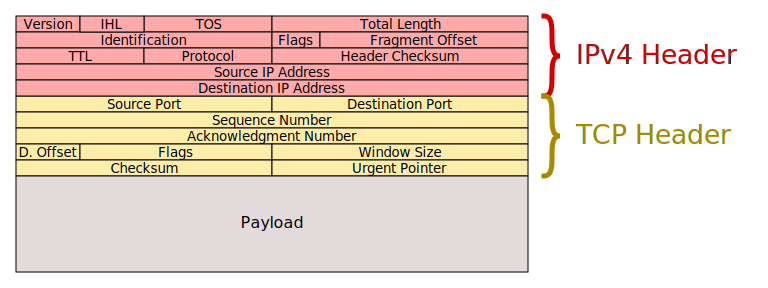

In contrast, a typical IPv6 packet consists of an IPv6 header, a TCP (or UDP) header and a block of payload:

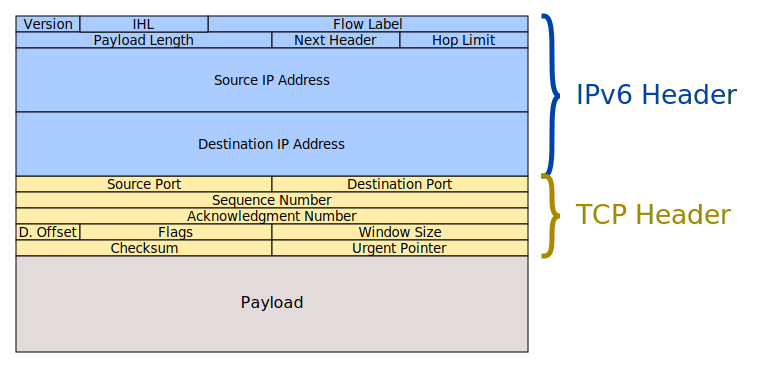

The task of an IP translator, then, is to replace incoming IP headers, while leaving the actual data unmodified:

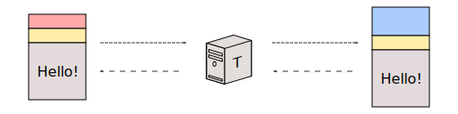

>  Sometimes, the TCP/UDP header also needs to be adjusted slightly, but we’ll get to that later.

Most of the header translation is straightforward. For example, the IPv4 “Protocol” field is basically the same as the IPv6 “Next Header” field. IPv4 “TTL” is the same as IPv6 “Hop Limit,” etc. The only part where it gets tactical is the IP addresses. Largely, address translation strategies are what separate the different types of translators from the others.

Most of the IP translation mechanisms were designed by the [_Internet Engineering Task Force_](https://www.ietf.org/) (IETF), and formally defined in several different [RFC](https://en.wikipedia.org/wiki/Request_for_Comments)s (which have been listed in their corresponding translators’ dedicated sections below).

In general, there are three different basic types of IP translators:

1. SIIT (also sometimes known as “Stateless NAT64.” Perhaps arguably, it is also sometimes referred to as “NAT46.” YMMV.)
2. Stateful NAT64 (Spelled “NAT-six-four,” not “NAT-sixty-four.”)
3. MAP-T

These, along with the different available address translation strategies, will be explained in the following sections.

## SIIT (EAMT)

This is the easiest one to explain. Consider the following setup:

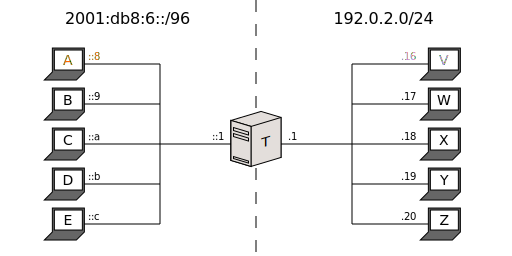

(_T_ stands for “Translator”.)

Assuming everyone’s default gateway is _T_, how do you communicate _A_ (IPv6) with _V_ (IPv4)?

- You tell _T_ (By SIIT-EAM configuration): “Change 2001:db8:6::8 into 203.0.113.8, and 192.0.2.16 into 2001:db8:4::16.”
- You tell _A_ (usually by DNS): “_V_’s address is 2001:db8:4::16.”
- You tell _V_ (usually by DNS): “_A_’s address is 203.0.113.8.”

This will happen:

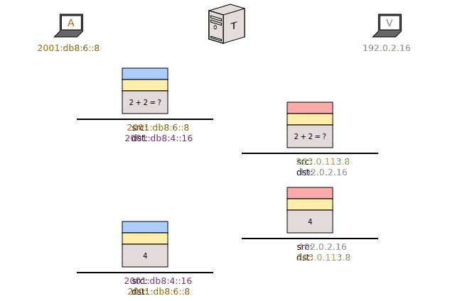

The translator is “fooling” each node into thinking the other one can speak their language. It’s an address translation strategy in which you assign specific addresses to specific nodes without them realizing it.

> **USAGE!**
> 
> In other words, you would use an SIIT (EAM) translator when you have a _limited number of IPv6 nodes_ wanting to interact with a _limited number of IPv4 nodes_. Whether explicitly or implicitly assigned, every participating node will need both a dedicated IPv4 address and a dedicated IPv6 address to function.

On one hand, “SIIT” stands for “Stateless IP/ICMP Translation,” or, in our case, “Stateless IP/ICMP Translator.”

>  Actually, that’s not strictly true. According to the [official specification](https://tools.ietf.org/html/rfc7915), “SIIT” stands for “Stateless IP/ICMP Translation _Algorithm_,” which is somewhat awkward. As far as I can tell, the closest SIIT translators have to an official name is "stateless translator," but it's not actually defined by any glossaries. And it doesn't seem to account for MAP-Ts also being "stateless" and "translators." Then again, by that argument you could also say that MAP-Ts are also "Stateless IP/ICMP Translators," but I've dragged this train of thought too much already.
> 
> From my personal experience, the IETF tends to struggle sustaining precise terminology, so I recommend that you don’t lose sleep over it either. We call them "SIITs." You might see them being referred to as elsewhat elsewhere.

An SIIT is a Network Layer device (or service) that simply swaps IPv4 and IPv6 addresses according to a preconfigured static address translation mechanism.

On the other hand, the “Explicit Address Mapping Table” (EAMT) is the specific address translation mechanism at play here. It is a table in which every row maps an arbitrary IPv4 addresses to its corresponding IPv6 addresses, and vice-versa.

Here’s an example of an EAMT which would allow communication between all the nodes in the network depicted above:

| IPv6           | IPv4         |
|----------------|--------------|
| 2001:db8:6::8 | 203.0.113.8 |
| 2001:db8:6::9  | 203.0.113.9  |
| 2001:db8:6::a  | 203.0.113.10 |
| 2001:db8:6::b  | 203.0.113.11 |
| 2001:db8:6::c  | 203.0.113.12 |
| 2001:db8:4::16 | 192.0.2.16 |
| 2001:db8:4::17 | 192.0.2.17   |
| 2001:db8:4::18 | 192.0.2.18   |
| 2001:db8:4::19 | 192.0.2.19   |
| 2001:db8:4::20 | 192.0.2.20   |

Given the configuration above, the IPv6 nodes perceive the network like this:

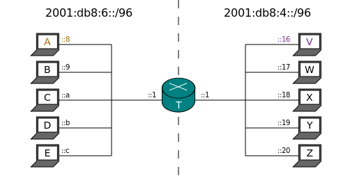

And conversely, it looks like this from the IPv4 side:

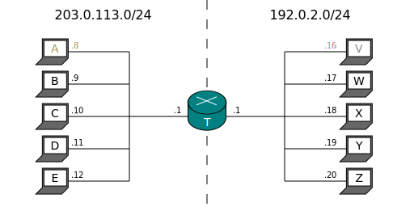

I have simplified the EAMT here for the sake of illustration. In truth, it is more versatile than simply allowing you to bind single arbitrary addresses to other single arbitrary addresses. You can find more information in its formal specification, [RFC 7757](https://tools.ietf.org/html/rfc7757). Jool's documentation also has a bit of a [summary](eamt.html).

## SIIT (traditional)

This is actually the originally designed form of SIIT, and as such, it’s more constrictive. We need to change the sample IPv6 network to make it work:

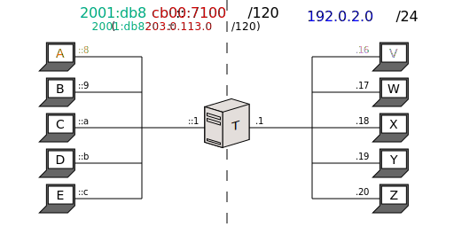

The idea is to simply remove a prefix while translating from IPv6 to IPv4, and prepend it in the other direction:

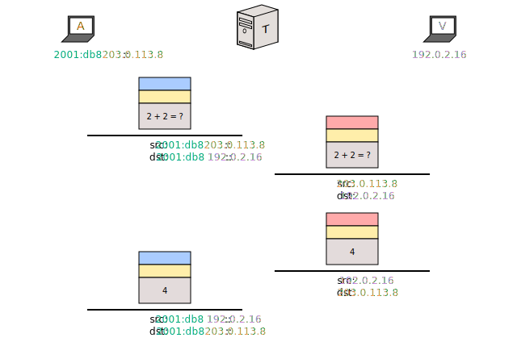

As you can see, this translation mechanism allows any IPv4 address to be converted to an IPv6 address by way of one simple configurable IPv6 prefix. The reverse, however, is not true. An IPv6 address needs a valid, public and embedded IPv4 address (in addition to the prefix) to be translatable. Your mileage might vary as to how viable this is to fulfill.

> **USAGE!**
> 
> You would use a traditional SIIT when you have a _limited number of IPv6 nodes_ wanting to interact with _any number of IPv4 nodes_. As with EAM SIIT, every participant will need (explicit or implicit) IPv4 and IPv6 addresses.
> 
> (You might notice that IPv4 addresses length 32 bits, which is exactly the length of the suffix of our translation prefix (128 - 96). In other words, the literal **entirety of the IPv4 Internet** comfortably fits in the tail of 2001:db8::.)
> 
> However, keep in mind that traditional SIIT imposes constraints on your IPv6 addresses, which _might_ turn out to be impractical.

>  When SIIT was originally conceived, what we refer to as “traditional” mode was the only stateless address translation algorithm expected to exist. For this reason, one might assume, it wasn’t given an official name. Off a quick search, the IETF specifications tend to allude to it with descriptors such as the “stateless address mapping algorithm defined in [RFC6052],” the “IPv4-Embedded IPv6 Address Format” or the “[RFC6052] algorithm.” Again, this naming is obnoxious to me, so for the purposes of this documentation (not just this introduction but the entire documentation of Jool), we will use the unofficial “_traditional_” moniker to refer to the algorithm, and “_pool6_” to refer to the prefix.
> 
> Why “pool6”? Because that’s how it’s called in Jool’s code and configuration.
> 
> (To be perfectly honest, “traditional” is a bit of a misnomer, because there used to exist an even older and simpler version of the algorithm, but it was obsoleted by RFC 6145 in 2011.)

The IPv6 view is followed by the IPv4 view:

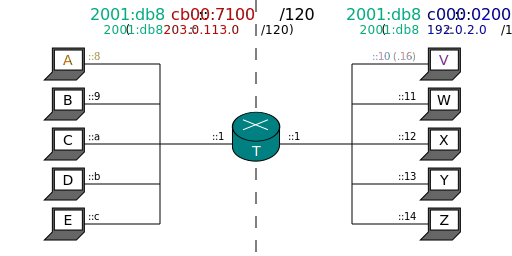 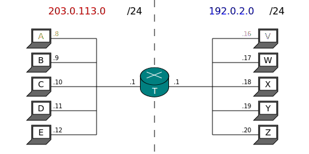

As already mentioned, you can find the formal definition of the traditional address translation algorithm in [RFC 6052](http://tools.ietf.org/html/rfc6052). Jool's documentation also has a [summary](pool6.html) of it.

## SIIT-DC

SIIT-DC (_SIIT for IPv6 Data Center Environments_) is more of an architecture than a dedicated address translation mechanism, but I’m including it here because (a) it’s a useful and far more down-to-earth stateless scenario you should keep in mind, and (b) it’s a perfect opportunity to show the EAMT and pool6 working in concert.

So here’s the thing:

I might have given you the impression that “EAMT” SIIT and “traditional” SIIT refer to different types of translators. This is not the case; this is all SIIT. A modern implementation is expected to always try to translate an address based on the EAMT first, and if no mapping is found, fall back to append or remove pool6. The separation was done above for illustrative purposes only.

Suppose you have an IPv6-only Data Center. To save space, we will show it to have only two servers. _s6a_ needs to be accessed only by remote IPv6 clients, but turns out _s6b_ one needs to be accesed from IPv4 as well:

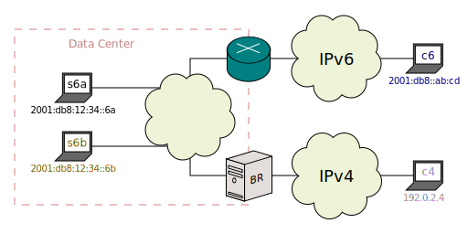

>  A _Border Relay_ (BR) is just a gateway, which in the SIIT-DC context is simply an SIIT translator. (Or several identical ones, if you want redundancy.)

Basically, the pool6 prefix is only used to mask IPv4 Internet nodes (which is a pattern you will see often from now on, because it works well), whereas the EAMT is used to mask your IPv6 servers.

Suppose _BR_ has the following configuration:

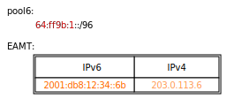

(Add one EAM entry for every other server you want available from IPv4.)

Here’s the expected packet flow between your EAM’d server and a random IPv4 Internet client:

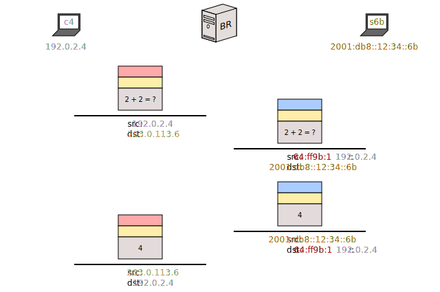

> **USAGE!**
> 
> In this way, _any_ IPv4 Internet node can access your EAM’d servers, and only your EAM’d servers can respond. You are also not forced to assign constrained IPv6 addresses to your servers, **effectively gaining the advantages of both traditional and EAM, and the drawbacks of neither**. It is also worth mentioning that most of your Data Center enjoys the simplicity of IPv6-only, since IPv4 has been relegated into a “service.”

>  Much like the documentation prefixes, “64:ff9b:1::/48” is officially reserved, and it’s publicly known as the “Local-Use IPv4/IPv6 Translation Prefix.” You can use it freely for translation purposes in your network, as long as you don’t route it globally. If you're curious, it's defined in [RFC 8215](https://tools.ietf.org/html/rfc8215).

Do note that pure IPv6 traffic is not affected by the translator in any way:

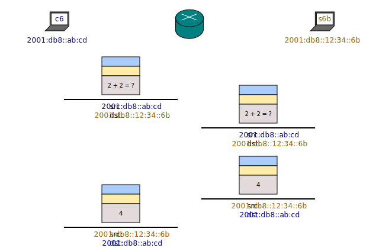

Naturally, DNS-wise, the _A_ record of _s6b_ should be 203.0.113.6, and its _AAAA_ record should be 2001:db8:12:34:1. As usual, you’ve effectively given _s6b_ a dual stack (ie. both IPv4 and IPv6 capabilities) without it knowing it.

This is how _s6b_ views the network:

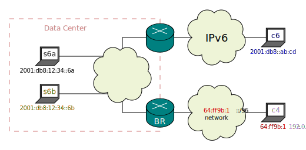

This is how _s6a_ and _c6_ view the network:

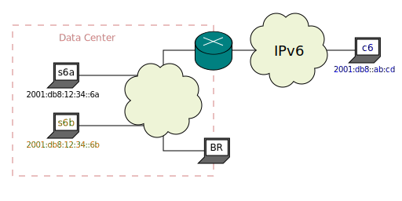

And this is the _c4_ view:

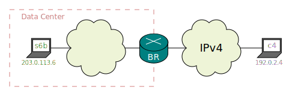

SIIT-DC is formally defined in [RFC 7755](https://tools.ietf.org/html/rfc7755).

## SIIT-DC: Dual Translation Mode

Even though your endgoal might be an IPv6-only Data Center, services which are still completely incompatible with IPv6 are not unheard of.

You can’t give these IPv6 stacks, but if you still wish to have a mostly IPv6 Data Center, you can isolate them into small IPv4 islands and still keep most of your infrastructure IPv6. This technique is known as “SIIT-DC: Dual Translation Mode” (SIIT-DC-2xlat).

> **USAGE!**
> 
> Well, this is just a summary of the previous two paragraphs. You would use a SIIT-DC-2xlat when you want a SIIT-DC, but you also need IPv4 islands as a workaround for legacy software.

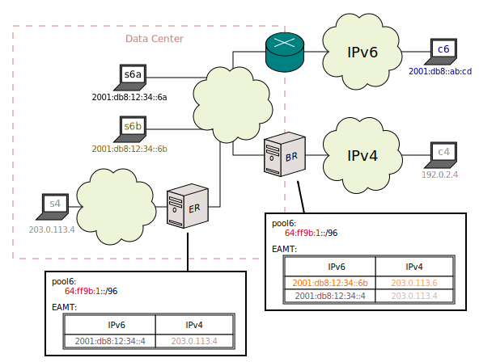

>  In the context of SIIT-DC-2xlat, a translator that serves a specific island is called an _Edge Relay_ (ER). Again, it’s just a normal SIIT.

This is the expected packet flow for these little infidels:

The rest of the network is normal SIIT-DC.

The _c6_, _s6a_ and _s6b_ views are the same as in SIIT-DC. The new _c4_ view is

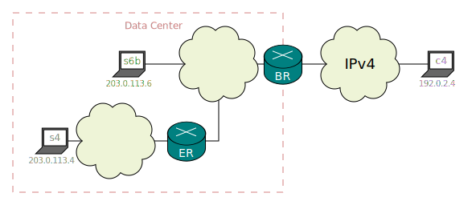

and the _s4_ view is

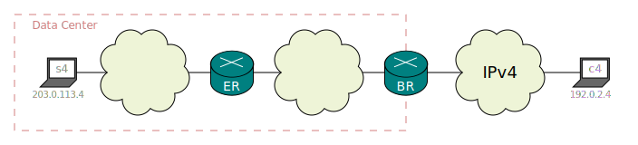

SIIT-DC-2xlat is formally defined by [RFC 7756](https://tools.ietf.org/html/rfc7756).

## NAPT

_Network Address and Port Translation_ (NAPT) (usually commonly known as “NAT” or, more specifically, “Stateful NAT”) is not an IPv6/IPv4 translation mechanism, but it might help you understand Stateful NAT64 because of their similarities.

Therefore, this section is a reminder of how NAPT works.

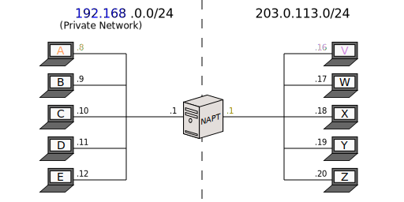

NAPT is a hack whose purpose is to minimize the amount of global ("real") IPv4 address you spend on the "Private Network" nodes. (Why? [Because the world has officially run out of IPv4 addresses](https://en.wikipedia.org/wiki/IPv4_address_exhaustion).) Basically, the left network has been assigned "fake" [192.168 addresses](https://tools.ietf.org/html/rfc1918#section-3) (ie. ["Private" IPv4 addresses](https://en.wikipedia.org/wiki/Private_network)), and the _NAPT_ machine's job is to permute packet transport addresses with the goal of impersonating the private nodes. It fools outsiders into thinking that the traffic started by the private nodes was actually started by itself:

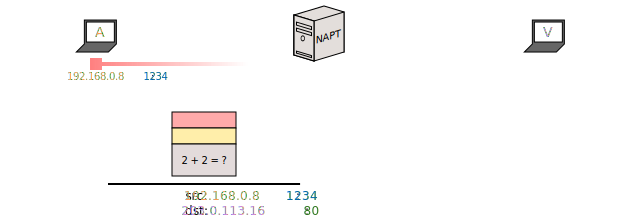

Here's the setup: _A_ wants to request an HTTP resource from _V_. It therefore sends a packet to 203.0.113.16:80. The source address is its own IP, while the source port was chosen randomly when the socket was bound. This is all normal and independent of _NAPT_.

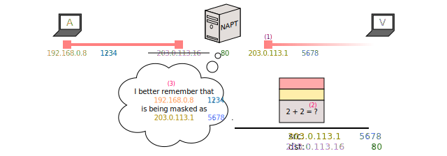

When _A_’s first packet arrives to _NAPT_, the latter realizes it lacks an mapping for 192.168.0.8:1234, so it opens a new socket (1) towards _V_. (Again, the source address is its own IP, while the source port is chosen randomly.)

It will, from now, act as a middleman, and proceed to copy the data received from one socket to the other (2).

Since there’s no algorithmic relationship between the private transport address and its corresponding masking public transport address (ie. any public address can be used to mask any private socket), the NAPT keeps a dynamic table (3) that remembers the mappings (where “mapping” is defined as a link between two sockets). In this case, it stores the relationship between 192.168.0.8:1234 and 203.0.113.1:5678 (among others):

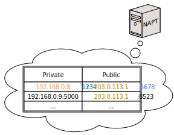

The mapping is then used to correlate the two sockets for every subsequent packet in the connection, which keeps the addressing consistent:

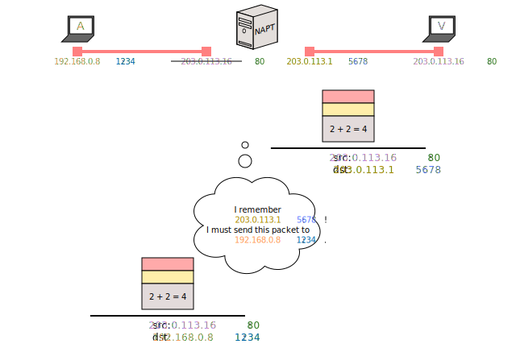

With this, you've effectively given IPv4 Internet to all the private nodes, at the cost of a single public IPv4 address. (As opposed to giving each of them a separate IPv4 address.)

> **USAGE!**
> 
> You want a NAPT when you need to reduce the amount of IPv4 addresses you use, and don't care about IPv6.
> 
> Again, NAPT is not an IPv4/IPv6 Translation mechanism, and Jool doesn't implement it. In Linux, use standard iptables/nftables to put forth a NAPT. (in the context of iptables/nftables, it's called "Masquerade.")

Mappings are created when needed, and destroyed after a certain timeout of inactivity. This dynamic table is why we refer to NAPTs as “Stateful NATs.”

For outside purposes, you can say that nodes _A_ through _E_ are “sharing” _NAPT_’s global address (or addresses). You can think of _NAPT_ as a non-malicious man-in-the-middle device that impersonates everyone involved by multiplexing private sockets with its own public ones:

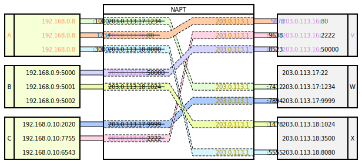

For example, 192.168.0.8:1234 thinks it’s talking directly to 203.0.113.16:80, but _NAPT_ is in fact sneakily rehashing its traffic. Because _NAPT_ has opened its own socket to 203.0.113.16:80, the latter thinks it’s talking to _NAPT_, and is not even aware of the existence of 192.168.0.8:1234.

This is the view from the Private Network (it's identical to the actual network):

And this is the view from the nodes outside:

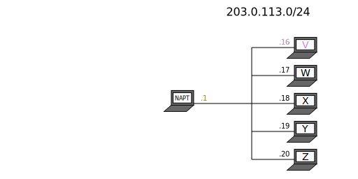

There are a couple more things you might want to be aware of in regards to NAPT:

NAPT was generally designed with the objective of allowing a limited set of clients (ie. the private network left side) to access any number of servers (the public right side) with the cost of only one public IPv4 address. The somewhat unfortunate result is that communication can only be started from the private network by default. Why? Because, in the absence of state, the NAPT can make sense out of an outbound destination address, but not an inbound destination address. Packet `192.168.0.8:5000 → 203.0.113.16:80` is simply headed to `203.0.113.16:80`, but _NAPT_ cannot know which of the private nodes inbound packet `203.0.113.16:5000 → 203.0.113.1:80` belongs to (again, assuming the mappings table is empty). This is the reason why you have to set up Port Forwarding if you want to, say, publish an HTTP server behind a NAPT. Port Forwarding rule `[192.168.0.8:80, 203.0.113.1:80]`, as an example, is static configuration that permanently reserves the `203.0.113.1:80` mask for the `192.168.0.8:80` service, and allows inbound packets to be “Network Address Translated” even in the absense of the usual required dynamic state.

Second, the number of public masks available to a NAPT is limited to 65536 per transport protocol (assuming you don’t want to exclude system ports), per public IPv4 address. Why? Because both TCP and UDP grant 65536 ports to each IP address. This means that, if your NAPT is impersonating 130 private nodes, and it only has one public IPv4 address, then each can have at most ~500 (65536 divided by 130) sockets simultaneously, at least for speaking with nodes through the NAPT. This limitation isn’t really remarkable on NAPT, since it’s often used to serve households with ~10 or even ~20 devices interacting with the Internet, but it might become a more pressing matter depending on what you want to do with you Stateful NAT64.

## Stateful NAT64

Stateful NAT64 (often abbreviated to “NAT64” in this documentation) is pretty much the same as NAPT. The only difference is that the “Private Network” is actually an IPv6 network:

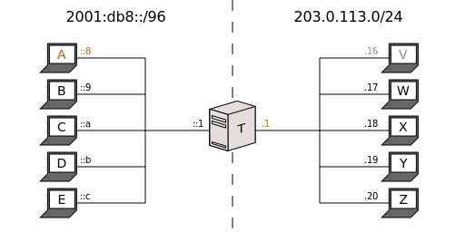

Once an outbound packet arrives, its source address is translated in exactly the same way as in NAPT, whereas its destination address is translated according to pool6:

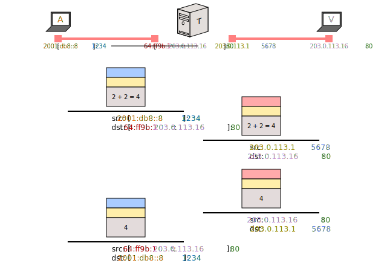

Most everything else applies:

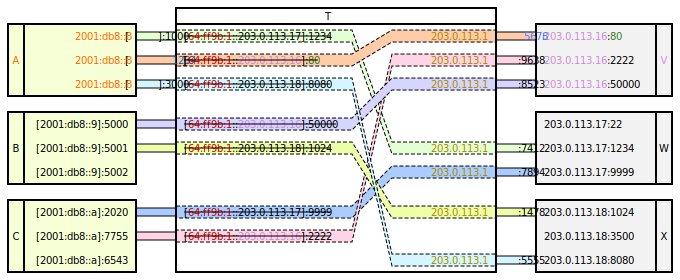

> **USAGE!**
> 
> NAT64 is useful when you have _up to a certain large number of IPv6 nodes_ (ie. limited to the number of transport addresses available to _T_) wanting to interact with _any number of IPv4 nodes_.
> 
> So it's like a traditional SIIT on steroids, except its stateness make it difficult to [create redundancy for it](session-synchronization.html).

IPv6 view:

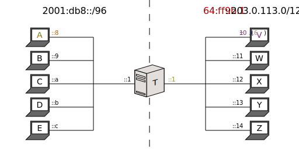

IPv4 view:

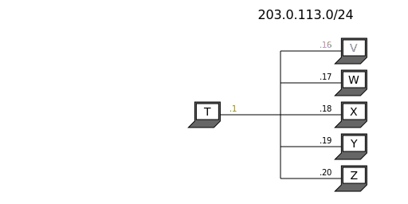

Basically, a Stateful NAT64 is similar to an SIIT, but it has all the benefits and drawbacks of NAPT. You get to represent all your IPv6 nodes with as few IPv4 addresses as possible, but you are limited to 65536 connections per public IPv4 addresses, and in the absence of Port Forwarding, all communication has to start from the IPv6 side.

You might also draw comparisons to SIIT-DC. In a way, a Stateful NAT64 is sort of a reverse SIIT-DC; The former feels at home when you have a handful of IPv6 clients that need to access any amount of IPv4 Internet servers, while the latter is a more adequate fit when you have a handful of IPv6 servers that need to be accessed by any IPv4 Internet clients.

In the context of NAT64, you don’t normally say the IPv6 network is “Private,” because the whole point is that it should also be connected to the IPv6 Internet:

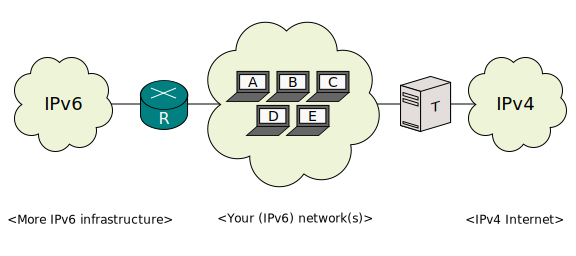

In this way, _A_ through _E_ are IPv6-only nodes, but they have access to both Internets (the IPv6 one via router _R_, and the IPv4 one via _T_).

Stateful NAT64 is defined by [RFC 6146](https://tools.ietf.org/html/rfc6146) and is most of the time coupled with DNS64 (which has a small introduction [here](dns64.html#bind)).

## 464XLAT

464XLAT is basically a SIIT-DC-2xlat where the BR is a Stateful NAT64 instead of an SIIT. I think it's more typically used by ISPs. (As opposed to SIIT-DC's Data Centers.)

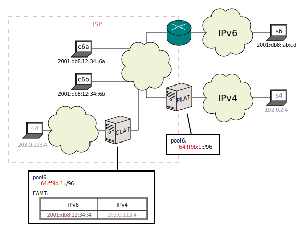

>  In the context of 464XLAT, the _ER_ is called _CLAT_ ("Customer-side Translator"), and the _BR_ is called _PLAT_ ("Provider-side Translator"). Don't look too deep into it.

Just to be clear: _PLAT_ is the Stateful NAT64. The _CLAT_ is still an SIIT. Since Stateful NAT64 connections have to start from the IPv6 side, it doesn't really make sense for the _CLAT_ to be a NAT64.

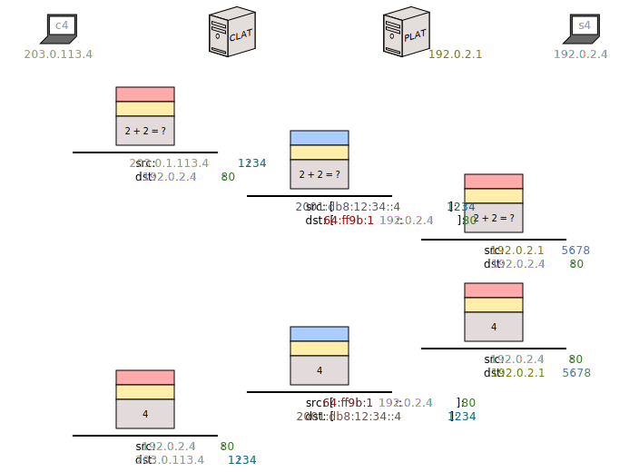

> **USAGE!**
> 
> Why would you want to do this? If you're an ISP, you can use 464XLAT to give IPv4 Internet to your customers, without actually having IPv4 in your infrastructure. (Each "IPv4 island" is a customer premise, each CLAT is their home router.)
> 
> If you're not an ISP, you can still employ 464XLAT if you have a NAT64 gateway to the IPv4 Intenet, but some of your IPv6-side applications still don't support IPv6. Just like in [SIIT-DC-2xlat](#siit-dc-dual-translation-mode), the point is a mostly IPv6 infrastructure with small IPv4 islands as a workaround. (464XLAT is to [NAT64](#stateful-nat64) what SIIT-DC-2xlat is to [SIIT-DC](#siit-dc).)

## BIBless NAT64

>  Under construction.

## MAP-T

<!-- https://github.com/NICMx/Jool/blob/265a4d24b6639ab262a5e48596d9fc0350066e35/en/intro-xlat.md -->

>  MAP-T support on Jool is presently in late development. It will come out in Jool 4.2.0. See [Downloads](download.html).

(Note: This is an oversimplification meant as a general introduction. The terminology is particularly concealed because I have some beef with the official one. Please read the [MAP-T summary](map-t.html) after this to learn more.)

Suppose you're an Internet Service Provider (ISP) with 4 customers, but you only have one IPv4 address free to distribute among them.

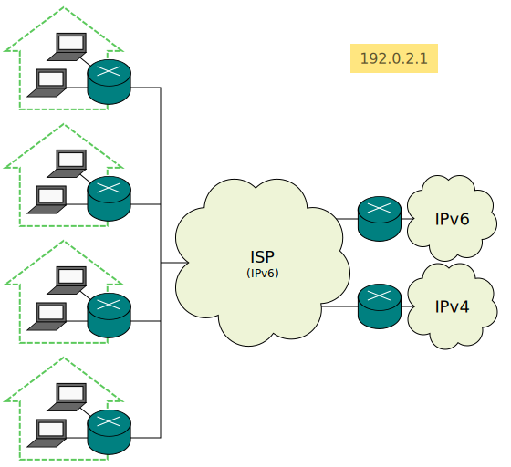

The idea of MAP-T is to "subdivide" your IPv4 address into equal slices, and give each slice to a separate customer. (And make the rest of the _ISP_ cloud pure IPv6.)

How do you "subdivide" an IPv4 address? By remembering that each address has 65536 ports per transport protocol:

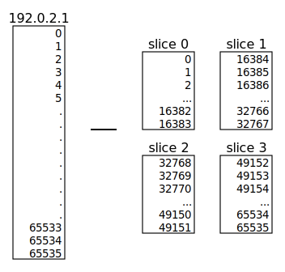

Of course, it's not possible to physically assign a slice of an IPv4 address to a node, and that's where the MAP translators come in:

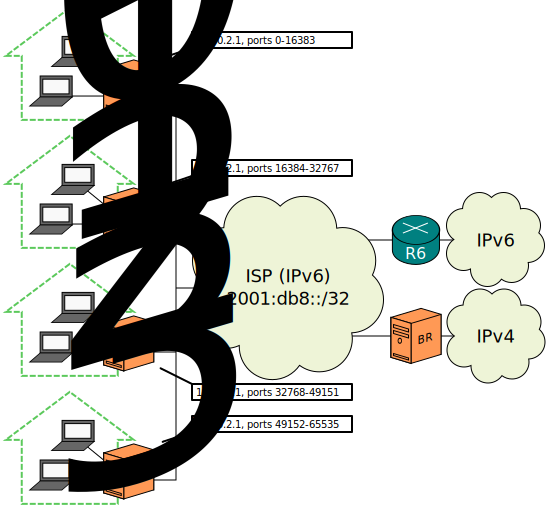

(Note: Those address slices are not physically assigned. Note that the ISP cloud is still IPv6.)

Customer Edges (CEs) and Border Relays (BRs) will, as usual, make sure everyone is unknowingly speaking the protocol everyone else wants to hear.

Each household will use private addresses (192.168.x.y), and each CE will consist of a traditional NAPT chained to a translator. The NAPT will reduce the private address space to the assigned slice, and the translator will convert the resulting packet into something that can traverse the IPv6 network.

Here's an example:

Suppose we've decided to reserve subnetwork 2001:db8:ce::/48 for all our CE needs, and we're using 64:ff9b:1::/96 to mask the IPv4 Internet as usual. Client 192.168.0.4 is behind the CE who owns slice 2 (ports 32768-49151) (and therefore owns prefix 2001:db8:ce:2::/64), and wants to send a packet to IPv4 Internet HTTP server 203.0.113.56.

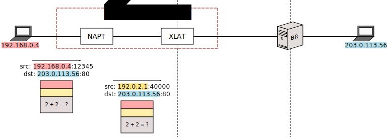

The packet first gets NAPT'd from a private IPv4 transport address into a pseudorandom public IPv4 transport address that can be used by the CE.

Though you can be forgiven if you’ve never NAPT’d into a reduced port range, you can be assured that this is a perfectly ordinary stateful NAT operation. The packet would already be routable, if we had an IPv4 network on hand.

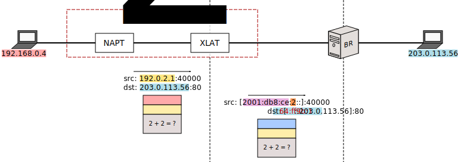

The packet is then properly MAP-T'd. The source address contains the CE's slice identifier, and pool6 is prepended to the destination address as usual.

(By the way: I'm lying. The address format used to translate the source is significantly more complicated than that, but you get the point. It contains the "CE prefix" and the slice ID, and everything else is fluff.)

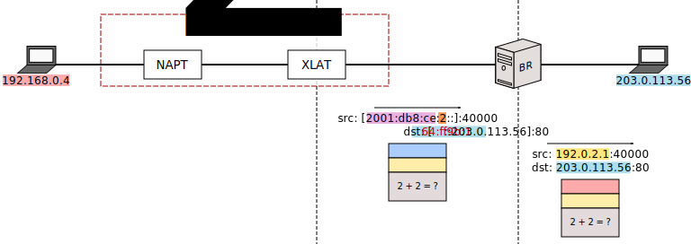

The BR mirrors the translation part of what the CE did, but not the NAPT part.

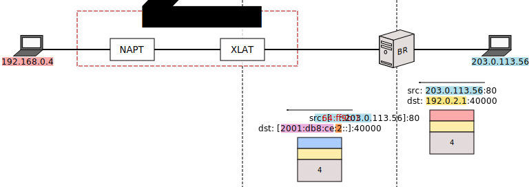

The server responds. The BR applies the appropriate transformation to each address.

You might be wondering: Since all CEs technically own address 192.0.2.1, how does the BR know that the intended CE is 2, and not one of the others? Because, by configuration, the BR knows that port 40000 belongs to slice 2.

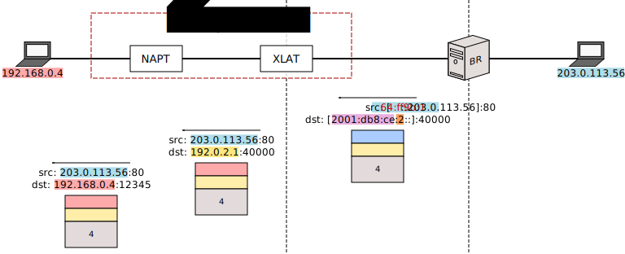

The packet is then routed to the CE that owns the prefix it's destined to. Things end by continuing to happen in reverse.

Of course, while MAP-T is a technique primarily preoccupied with transferring IPv4 traffic through an IPv6 backbone, there's nothing stopping you from also assigning IPv6 addresses to your customers, and have that traffic routed normally. (Through the R6 router.)

So what did we accomplish with this pseudoconvoluted address manhandling? Well, we've assembled a 464XLAT in which the PLAT is stateless, and which can therefore be replicated for redundancy. Also, it's interesting to note that, because the slices are preallocated, one malicious customer cannot exhaust all our public transport address; they would only exhaust their own.

Here; have a comparison table:

| 464XLAT | MAP-T |
|---------|-------|
| You might be forced to perform BIB/Session logging by your government. | No need to perform BIB/Session logging, because all mappings are predefined by configuration. |
| The PLAT assigns public transport addresses to customers on demand. (Customers needing lots of public transport addresses will get more than those who need few.) | Everyone is assigned the same number of public transport addresses. |
| One customer can perform DoS to other customers by exhausting the PLAT's public transport address pool. | One customer cannot steal other customers' public transport addresses because they're all preallocated by configuration. |

MAP-T is formally defined by [RFC 7599](https://tools.ietf.org/html/rfc7599) and, to a significant extent, [RFC 7597](https://tools.ietf.org/html/rfc7597).

>  A word of caution: It is my personal opinion that these are not the most well-written RFCs ever devised by the IETF, and if you're going to consume them, I suggest that you read RFC 7597's Appendix B instead of RFC 7597's section 5.1. (And skip 5.1 entirely.)
> 
> Or just read [Jool's MAP-T summary](map-t.html).
