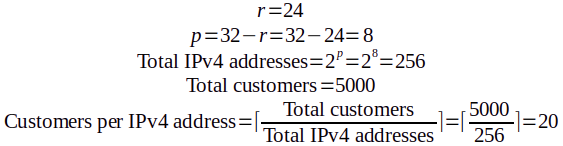
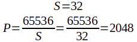
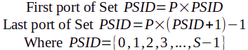
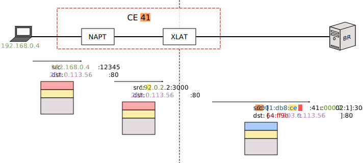
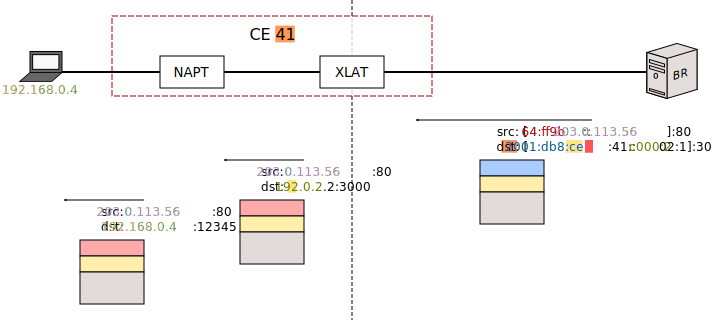
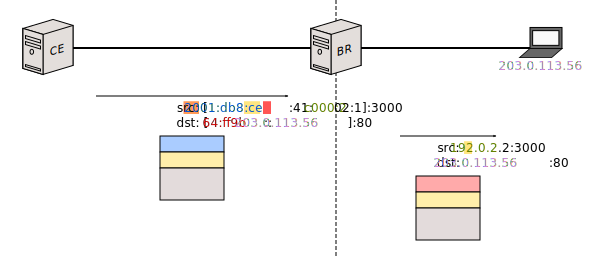
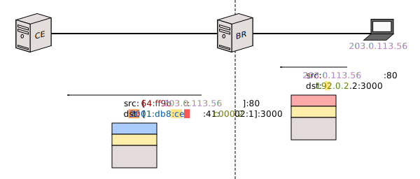
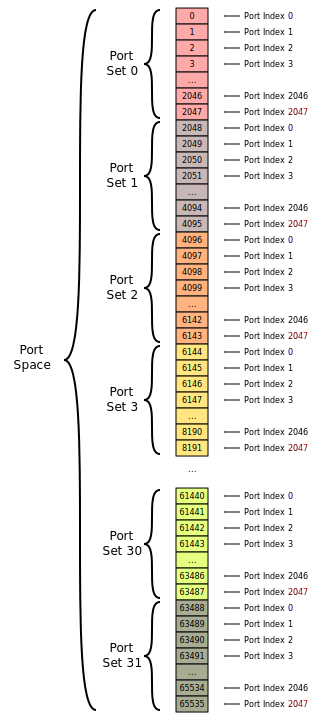
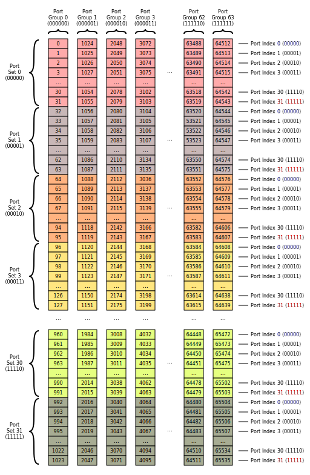

# MAP-T

## Index

1. [Introduction](#introduction)
2. [Foreword](#foreword)
2. [Scenario 1: Thought Process](#scenario-1-thought-process)
3. [The MAP Address Format](#the-map-address-format)
	1. [End-user IPv6 Prefix](#end-user-ipv6-prefix)
	2. [Rule IPv6 Prefix](#rule-ipv6-prefix)
	3. [EA-bits](#ea-bits)
	4. [Subnet ID](#subnet-id)
	5. [Interface ID](#interface-id)
	6. [16 bits](#16-bits)
	7. [IPv4 address](#ipv4-address)
	8. [PSID](#psid)
4. [CE Configuration](#ce-configuration)
5. [CE Behavior](#ce-behavior)
6. [BR Configuration](#br-configuration)
7. [BR Behavior](#br-behavior)
8. [Additional Configuration](#additional-configuration)
	1. [The `a`, `k` and `m` configuration variables](#the-a-k-and-m-configuration-variables)
	2. [FMR on the CE](#fmr-on-the-ce)

## Introduction

This document explains MAP-T. It is intended to serve as a general audience's replacement for RFCs 7597 and 7599. **I'm assuming you've already consumed the [general introduction to the topic](intro-xlat.html#map-t), so you know what you're getting into.**

>  Please be aware that Jool does not yet implement MAP-T. (Support will be added in version 4.2.0.)
> 
> In any case, this particular document does not deal with Jool in any way. (That's the [tutorial](run-mapt.html)'s job.)

Expected background knowledge:

- IPv4 addresses
- IPv6 addresses
- Hexadecimal and binary numbers

## Foreword

Depending on how many IPv4 addresses you have, and how many you're willing to assign to each CE, MAP-T can address three different scenarios:

1. You have less IPv4 addresses than CEs, so your CEs will have to share IPv4 addresses.
2. You have the same number of IPv4 addresses as CEs, so each CE will have one IPv4 address.
3. You have more IPv4 addresses than CEs, thus you can assign more than one IPv4 address to each CE.

MAP-T's main contribution is scenario 1. (The others can also be accomplished with other translation mechanisms, such as [SIIT-DC-2xlat](intro-xlat.html#siit-dc-dual-translation-mode).) So let's look at it first:

## Scenario 1: Thought Process

In order to define your MAP-T network, you first need a general idea of how you're going to distribute your available public transport addresses.

Suppose you have the entirety of block 192.0.2.0/24 to distribute among your CEs. Suppose, as well, that you have 5000 customers.

Let's define some variables:

- `r` = Length of the IPv4 prefix
- `p` = Length of the IPv4 suffix

>  Yes, I know that using "`p`" to refer to the _suffix_ is a bit asinine, but these variables are defined by RFC 7597, and I've chosen to tolerate them to prevent further chaos.

In our example,

>  The "&#8968;&#8969;" operator means [_ceiling_](https://en.wikipedia.org/wiki/Floor_and_ceiling_functions).

As you can see, each address needs to be divided into 20 "Sets" of ports. (But MAP-T likes powers of two, so we'll have to round that up to 32.) We will assign each Set to a different customer. (And leftovers will be reserved for a future growth of our customer pool.)

- `S` = Number of "S"ets per IPv4 address
- `P` = Number of "P"orts per Set

So, we will divide each address into 32 sets of 2048 ports each. (Each customer will get 2048 ports.)

>  The following is an oversimplification that assumes `a = 0` and `m = 11`. Don't worry about this for now; `a` and `m` will be explained later.

In other words:

| Port Set # (aka. "Port Set Identifier," "PSID") | First Port | Last Port |
|--------------------|------------|-----------|
| 0                  | 0          | 2047      |
| 1                  | 2048       | 4095      |
| 2                  | 4096       | 6143      |
| 3                  | 6144       | 8191      |
| ...                | ...        | ...       |
| 30                 | 61440      | 63487     |
| 31                 | 63488      | 65535     |

With that in mind, I would like to introduce the notion of _Embedded Address bits_ ("EA-bits"). It's basically a CE identifier. It's composed of a concatenation of the suffix of the IPv4 address that has been assigned to the CE, as well as the identifier of its Port Set. We need `p` bits for the suffix, and <code>q = log2(S)</code> bits for the _PSID_. In our example, that would be `p = 8` and `q = 5`:

Each CE will have a unique EA-bits number.

>  The general introduction used to refer to EA-bits as "slice ID."

>  Only scenario 1 includes PSID. Port Sets only need to exist if the IPv4 addresses are being shared.

Let's visualize all of that. Please don't stop staring at this picture until you've understood the relationship between each CE's identifier (ie. its EA-bits, shown in hexadecimal representation) and its assigned IPv4 address and PSID (also shown in hexadecimal):

>  The RFCs define a rather important notion called "MAP domain," whose meaning is unfortunately significantly inconsistent across the specification. (Probably as a result of its evolution as the documents were written.)
> 
> For the purposes of this documentation, I've decided to go with the meaning that makes the most sense to me:
> 
> The diagram pictured above represents exactly one MAP domain. It's a group of MAP devices (CEs and BR) that share a common essential configuration known as the _Basic Mapping Rule_ (BMR).
> 
> Stick to the diagram for now; I will properly define the BMR later.

Once you've designed your own version of that, you're ready to start assigning IPv6 prefixes to the CEs.

## The MAP Address Format

Remember when I [lied](intro-xlat.html#map-t)? Well, here's the full IPv6 address format defined by the MAP proposed standard:

Though these are part of the CE configuration, they are actually used to mask the IPv4 island clients. (The address you will assign to the CE's IPv6-facing interface is a separate--and completely normal--IPv6 address.)

There's a fair bit of information encoded in the MAP address, which might help you understand and troubleshoot your network. Therefore, here's an explanation of every field:

### End-user IPv6 Prefix

An IPv6 prefix that is unique to the CE, reserved for MAP-T usage. As the diagram implies, it is composed of the binary concatenation of the MAP domain's CE-dedicated IPv6 prefix, and well as the corresponding CE's actual identifier (EA-bits).

It represents the IPv4 network behind the CE. (ie. if you see a packet containing an address that matches this prefix, you can tell the address is the IPv6 mask on one of the IPv4 nodes behind the CE.)

All the traffic headed towards this prefix needs to be routed by the network towards the corresponding CE.

It is interesting to note that, unless you're on scenario 3, this is actually the only technically meaningful part of the address. (It's the only part of the address you need to ensure is correct.) Everything else is essentially [cosmetics](#interface-id).

### Rule IPv6 Prefix

This is just an arbitrary prefix owned by your organization, reserved for CE usage. (All CEs sharing a common MAP domain will have the same Rule IPv6 Prefix.)

For example, if your organization owns 2001:db8::/32, you might for example assign something like 2001:db8:ce::/51 as your "Rule IPv6 prefix." Each of your CEs would need to pick a subprefix (ie. the [End-user IPv6 Prefix](#end-user-ipv6-prefix)) from 2001:db8:ce::/51 to operate.

(These are just examples. Both the Rule IPv6 Prefix and the End-user IPv6 Prefix are technically allowed to span anywhere between 0 and 128 bits, so you can pick lengths that make more sense for your network.)

### EA-bits

The CE's unique identifier. (See [Thought Process](#scenario-1-thought-process) for the rundown.)

In scenario 1, EA-bits is actually two subfields glued together: the IPv4 address suffix and the PSID. In the other scenarios, EA-bits only contains the IPv4 address suffix.

The length of the EA-bits is defined by the RFC to be `o` (`o = p + q`). Depending on your network needs, `o` must be a number between 0 and 48 bits. (32 bits for a full IPv4 address plus 16 for an entire port as PSID.)

### Subnet ID

The trailing bits required to assemble a full IPv4 address in scenario 3.

(This field only exists in scenario 3, so ignore it for now.)

### Interface ID

A block of redundant data. It's essentially the [EA-bits](#ea-bits) again, but in an expanded, more human-friendly format.

Even after writing a full MAP-T implementation, I still can only speculate about the purpose of this field. Jool is supposed to write it, but never read it. Given a MAP address, the _Interface ID_ can help you (as a network administrator) visually locate the CE's public IPv4 address and PSID without having to analyze the EA-bits. That's all there is to it.

As the diagram implies, the _Interface ID_ formally lengths 64 bits. However, the [_End-user IPv6 Prefix_](#end-user-ipv6-prefix) is allowed to span up to 128 bits. In order to accomplish this, it simply overrides the _Interface ID_ bits. You are free to sacrifice the _Interface ID_ for the sake of a longer End-user IPv6 prefix.

The _Interface ID_ is composed of three subfields:

### 16 bits

Just padding; sixteen zeroes with no meaning.

### IPv4 address

The full IPv4 address from which the EA-bits' IPv4 address suffix came from.

For reference, it's also the public side address of the CE's NAPT.

### PSID

The CE's PSID again, right-aligned and left-padded with zeroes for your viewing convenience.

## CE Configuration

>  Please note that, in this context, "CE" is used to refer to the translator mechanism exclusively (ie. Jool). The NAPT is assumed to be a separate tool, configured independently.

A formal minimal CE configuration contains

1. [The End-user IPv6 Prefix](#end-user-ipv6-prefix)
2. A _Basic Mapping Rule_ (BMR)
3. A _Default Mapping Rule_ (DMR)

CEs sharing a MAP domain must always have the same BMR. They also usually share a common DMR too. The _End-user IPv6 prefix_ is the only important configuration-wise distinction between them.

For some reason, the RFCs insist that "Mapping Rules" are always triplets of the following form:

	{
		<IPv6 Prefix>,
		<IPv4 Prefix>,
		<EA-bits length>
	}

This is not really true, but for the sake of simplifying things for now, we'll play along.

Let's define those Mapping Rules:

### BMR

>  Because the definition of the BMR is intrinsically tied to the concept of a "MAP domain," the BMR is also inconsistent across the RFCs. Once again, the definition presented here is my preferred one.

The _Basic Mapping Rule_ is a MAP domain's common MAP address configuration. Basically, this field is the essential piece of configuration that allows the translator to assemble [MAP addresses](#the-map-address-format) out of IPv4 addresses, and viceversa.

It refers specifically to addresses that will be governed by the [MAP address format](#the-map-address-format), not the [RFC 6052 address format](#dmr). Again, the BMR defines the base MAP address configuration that all CEs share, while the _End-user IPv6 prefix_ describes the additional MAP address specifics that belong to one particular CE.

Here's what each of the triplet fields stand for in the BMR:

	{
		<Rule IPv6 Prefix>,
		<IPv4 prefix reserved for CEs>,
		<EA-bits length>
	}

The "Rule IPv6 Prefix" is the same one defined [above](#rule-ipv6-prefix). The "IPv4 prefix reserved for CEs" is exactly what it sounds like (192.0.2.0/24 in the [example](#thought-process)). The "EA-bits length" is [`o`](#ea-bits).

So what does this do? Well, the suffix length of the _IPv4 prefix reserved for CEs_ (`p`, as defined [above](#thought-process)) and the _EA-bits length_ (`o`) describes the structure of the [EA-bits](#thought-process), and the _Rule IPv6 Prefix_ length describes their [offset](#the-map-address-format). If we define `r` as the length of the _IPv4 prefix reserved for CEs_,

- If `o + r > 32`, we're dealing with scenario 1. (`q > 0`)
- If `o + r = 32`, we're dealing with scenario 2. (`q = 0`)
- If `o + r < 32`, we're dealing with scenario 3. (`q = 0`)

In our example, the BMR would be

<pre><code>{
	2001:db8:ce::/51,
	192.0.2.0/24,
	13
}</code></pre>

Which, in turn, will yield MAP Addresses that have the following form:

Again, for context: These address will represent devices on the IPv4 customer islands. (ie. Behind the CEs.)

### DMR

_Default Mapping Rule_ is just a fancy name for pool6. It's the "default" prefix that should be added to an outbound destination address so the packet is routed by the IPv6 network towards the _BR_ (and therefore, towards the IPv4 Internet). It has the following form:

	{
		<pool6>,
		<unused>,
		<unused>
	}

>  Yes, defining this as a "Mapping Rule" triplet is a stretch. Code-wise, it doesn't even make sense to implement it as one.

In our example, the DMR would be

<pre><code>{
	64:ff9b::/96,
	&lt;unused&gt;,
	&lt;unused&gt;
}</code></pre>

Again: Addresses masked with the DMR will represent devices on the IPv4 Internet. (ie. Behind the BR.)

## CE Behavior

When one of the CE's clients makes an outbound request, the CE uses the BMR to translate the source address, and the DMR to translate the destination address.

Here's the breakdown:

- [Rule IPv6 Prefix](#rule-ipv6-prefix)
- [EA-bits](#ea-bits) (4116 = 00000010000012)
- [IPv4 prefix](#bmr)
- [IPv4 suffix](#ea-bits)
- [PSID](#psid)
- [DMR](#dmr)

The opposite happens in the other direction:

## BR Configuration

The BR only needs two things:

- A _Forwarding Mapping Rule_ (FMR) table
- The _Default Mapping Rule_ (DMR)

The FMR table is a bunch of BMRs. The BR will have one FMR for each serviced MAP domain.

In our example, the FMR would only have one entry:

| IPv6 Prefix          | IPv4 Prefix  | EA-bits length |
|----------------------|--------------|----------------|
| 2001:db8:ce::/51     | 192.0.2.0/24 | 13             |

The DMR is, once again, pool6.

	{
		64:ff9b::/96,
		<unused>,
		<unused>
	}

## BR Behavior

Source is translated by FMR, destination by DMR.

Source is translated by DMR, destination by FMR.

## Additional Configuration

If you're curious to get some hands-on experience, by now you should have the fundamentals required to know what you're doing if you [set up your own MAP-T scenario 1 environment with Jool](run-mapt.html).

Additional bells and whistles follow:

### The `a`, `k` and `m` configuration variables

You might have noticed that, through our 32 outlined port sets, one of them is special: Port Set zero (PSID 0). Why? Because it contains the ["Well-known" port range](https://en.wikipedia.org/wiki/List_of_TCP_and_UDP_port_numbers#Well-known_ports). (0-1023.)

The RFCs imply to believe that the Well-known ports are problematic, and this renders PSID 0 unusable.

>  I should mention, however, that one of my users pointed out that PSID 0 can actually be seen as the most valuable one, because you can sell it to whoever is willing to pay a little extra for (say) a public HTTP server.

If you agree that the Well-known ports are undesirable, one way to avoid them is to simply refrain from using PSID 0. Another solution is to set up the NAPT owning PSID 0 to only use ports 1024-2048 (instead of 0-2048). (You'd assign that particular port set to low-traffic CEs.) The RFCs opt to recommend a third option, which allows you to employ Port Set 0 while still excluding the Well-known ports, at the expense of some complexity.

To understand the RFCs' solution, you need to internalize how we're dividing the port space. Let's take a look at this table again, and add some binary representations:

| PSID                                | First Port                                         | Last Port                                          |
|-------------------------------------|----------------------------------------------------|----------------------------------------------------|
| 010 (000002)  | 010 (00000 000000000002)     | 204710 (00000 111111111112)  |
| 110 (000012)  | 204810 (00001 000000000002)  | 409510 (00001 111111111112)  |
| 210 (000102)  | 409610 (00010 000000000002)  | 614310 (00010 111111111112)  |
| 310 (000112)  | 614410 (00011 000000000002)  | 819110 (00011 111111111112)  |
| ...                                 | ...                                                | ...                                                |
| 3010 (111102) | 6144010 (11110 000000000002) | 6348710 (11110 111111111112) |
| 3110 (111112) | 6348810 (11111 000000000002) | 6553510 (11111 111111111112) |

Here are some patters that you might notice:

- The first port always ends in zeroes.
- The last port always ends in ones.
- **The first `q` bits of the port number are always its PSID**.

Therefore, we can think of a port number as a 16-bit field which can be subdivided into two separate pieces of information:

The first field tells you which subdivision ("Set") of the port space the port belongs to, and the second one tells you that port number's index within that group:

The Well-known ports have a similar quirk: 0-1023 happen to be exactly the ports whose first 6 bits are all zero:

So that's our current standing. By excluding PSID 0, we effectively also exclude the Well-known ports. But we don't want to exclude PSID 0. What can we do?

The solution is to add a third field to the port number:

>  Just a heads up: I more or less made up "Port Block" and "Port Index." The RFC sort of uses them, but not in a formal capacity. "Port Block" is actually called `A` (though it's sometimes referred to as `i`), and "Port Index" is called `j`.
> 
> And by the way: Those are the actual values. The *lengths* of these values are `a`, `q` and `m`.

>  In our example, `a = 6`, `q = 5` and `m = 5`. They can be any non-negative numbers you need them to be, as long as `a + q + m = 16`.

The result is a distribution that looks as follows. Each port number is the result of the binary concatenation of its block, then its set, and then its index:

What have we accomplished with this? Instead of excluding Port Set 0, we now exclude Port Block 0. In other words, instead of excluding half of the ports from the first PSID, we exclude the first <code>2m</code> ports from every PSID. And now all PSIDs are equal. (Each PSID has <code>(2a - 1) * 2m</code> ports.)

Per the three-subfield diagram above, `a` is the number of bits that will define the Port Block. (It defaults to 6, because that's exactly the number of bits you need to exclude exactly the Well-known ports.) `q` is whatever you need your Port Set ID to length (in accordance to your network needs; `q = o - p`). `m` is whatever remains of the port's 16 bits.

>  And `k` is just a synonym for `q`.

And I know this section has gone for too long already, but there's one more thing to say:

Remember when I said that, despite what the RFC says, the Mapping Rules aren't actually triplets? Here's the reason: Mapping Rules are actually 4-tuples. The fourth field is `a`:

	{
		<Rule IPv6 Prefix>,
		<Rule IPv4 Prefix>,
		<EA-bits length>,
		<a>
	}

This allows you to have a dedicated port distribution for each of your MAP domains.

>  If you're wondering why Mapping Rules need to define `a` but not `k` nor `m`, note that they already have an implicit `k` (`k = q = o - p`, `o` being the EA-bits length and `p` being the suffix length of the Rule IPv4 Prefix), and `m` is just `16 - a - k`.

### FMR on the CE

>  Under Construction.

The CEs also have an FMR table. When an outgoing destination address matches one of the FMRs, the FMR is used as translation method instead of the DMR. This allows the clients of CEs to communicate directly with the clients of other CEs, without having to use the BR as a middleman.

(Again, each BMR in the FMR table allows communication to a different MAP domain.)

In fact, a CE's BMR is usually added to its own FMR table. This allows clients from a MAP domain's CE to speak directly with other clients from the same MAP domain, but different CE.

