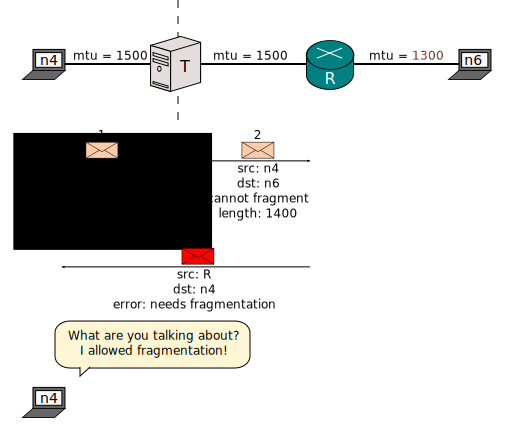
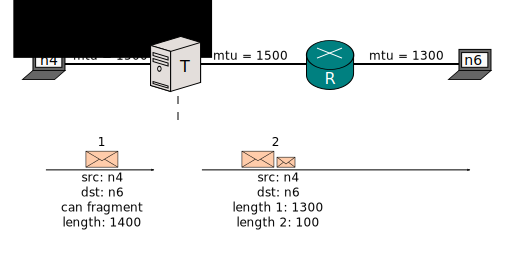
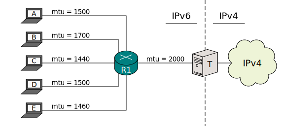
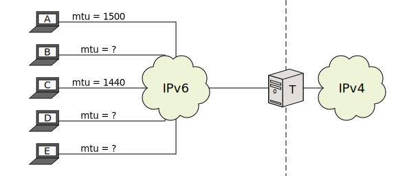

[Documentation](documentation.html) > [Miscellaneous](documentation.html#miscellaneous) > MTU and Fragmentation

# MTU and Fragmentation

## Problem Statement

There's one major difference between IPv4 and IPv6 which an IP Translator alone cannot make up for: DF.

The IPv4 header rather ill-advisedly "features" a flag called [_Don't Fragment_](http://en.wikipedia.org/wiki/IPv4#Packet_structure) (DF). It dictates whether the source allows intermediary routers to fragment the packet.

In IPv6, packets can never be fragmented by routers. DF is implicit and always active.

Therefore, when there's a translator in the middle, an IPv4 packet which can be fragmented will inevitably become an IPv6 packet that must not be fragmented.

So what happens if the packet is too big? Well, the following exchange will take place:

(Packet sizes would actually be slightly different due to header changes, but you get the point.)

And what happens afterwards is implementation defined. If _n4_ is smart, it will stop fooling around and perform [Path MTU Discovery](https://en.wikipedia.org/wiki/Path_MTU_Discovery) like a proper Internet citizen. If it is slightly less smart, it will try to gradually decrease the length of its packet until it succeeds. If it is completely dumb, it will retry unmodified and its packet will never reach _n6_.

Your operative system normally has a means to tell you the MTU of a particular interface:

<pre><code class="bash">$ ip link
(...)
2: eth0: &lt;BROADCAST,MULTICAST,UP,LOWER_UP&gt; <strong>mtu 1500</strong> qdisc pfifo_fast state UP mode DEFAULT group default qlen 1000
    link/ether 08:00:27:bf:a6:6e brd ff:ff:ff:ff:ff:ff
</code></pre>

## Solution

[`lowest-ipv6-mtu`](usr-flags-global.html#lowest-ipv6-mtu).

	$ (jool | jool_siit) global update lowest-ipv6-mtu 1300

The command above will force yor Jool instance to ensure that, through fragmentation, DF-disabled IPv4 packets never be translated into IPv6 packets larger than 1300 bytes.

This will, in turn, prevent R from ever responding "Packet Too Big" errors.

If you don't know the minimum MTU of your IPv6 networks, assign 1280. Every IPv6 node must be able to handle at least 1280 bytes per packet by standard.

## Examples

Suppose this is your organization's network:

Your `lowest-ipv6-mtu` should be 1440.

Now suppose C will never need to access the IPv4 Internet: Your `lowest-ipv6-mtu` should be 1460. (But if you're unsure, 1440 is probably fine.)

Now suppose your NAT64 is openly available to the entire IPv6 Internet:

Your `lowest-ipv6-mtu` should be 1280.
