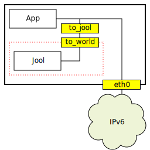
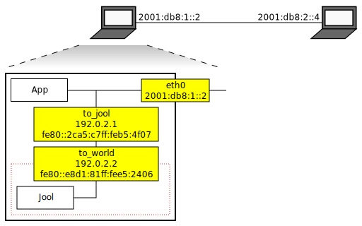

[Documentation](documentation.html) > [Other Sample Runs](documentation.html#other-sample-runs) > Node-Based Translation

# Node-Based Translation

## Index

1. [Introduction](#introduction)
2. [A Word on Terminology](#a-word-on-terminology)
3. [Design](#design)
4. [Configuration](#configuration)

## Introduction

Sometimes you might want a machine to translate its own traffic. This is usually because you have IPv6-only connectivity, an application that only works on IPv4, and no access to a translator nearby.

A Node-Based Translator (NBT) is a logical function that hooks an SIIT or NAT64 (typically the former) layer somewhere between your application and your network interface. The application sends packets normally and the translator converts them before they reach the medium. As stated, the idea is usually applied to amend IPv4 packets so they can traverse an IPv6 network, but there's nothing stopping you from doing the opposite.

This document introduces a means to achieve such an arragement using Jool.

## A Word on Terminology

The expression "Node-Based Translation" is not actually defined in any standards; it was actually created for the purposes of this documentation.

When used as a mirror translator in the [SIIT-DC-DTM](siit-dc-2xlat.html) architecture, an NBT can be more specifically referred to as "[Node-Based Edge Relay]({{ site.draft-siit-dc-2xlat }}#section-3.1)". In the [464XLAT](464xlat.html) architecture, it is called "[Wireless 3GPP CLAT](https://tools.ietf.org/html/rfc6877#section-4.2)" (rather misleadingly, since it's tied to neither Wireless nor 3GPP).

Old Jool documentation (Github issues in particular) used to refer to NBT as "Host-Based Edge Translation". This is because this used to be the official name in [SIIT-DC-DTM draft version 00](https://tools.ietf.org/html/draft-ietf-v6ops-siit-dc-2xlat-00#section-3.1), and this changed in [SIIT-DC-DTM version 01](https://tools.ietf.org/html/draft-ietf-v6ops-siit-dc-2xlat-01#section-3.1).

## Design

The idea is to wrap Jool within a network namespace and route translating packets towards it. It should look like this:

_to_jool_ and _to_world_ are interconnected dual-stack virtual interfaces. _to_jool_ is named such because it is used to reach Jool. _to_world_ belongs to an isolated network namespace (the dotted red square) where Jool is translating traffic, and is Jool's gateway to everything else.

Application _App_ binds itself to the IPv4 address of _to_jool_, which makes its packets reach Jool. Jool translates and bounces the equivalent IPv6 traffic, which gets routed to _eth0_ normally. If there's a response, the new IPv6 packet traverses the path in reverse until it reaches _App_ as an IPv4 packet.

## Configuration

The following commands assume _App_'s packet is `192.0.2.1 -> 203.0.113.2` and that we want to convert that to `2001:db8:1::3 -> 2001:db8:2::4`.

`eth0` will own address `2001:db8:1::2` and proxy `2001:db8:1::3` for the "private" Jool's traffic.

### 0: Predefine eth0

	# ip -6 address add 2001:db8:1::2/32 dev eth0
	# ip -6 route add default via ...

### 1: Create the virtual interfaces and the new namespace

	# ip netns add joolns
	# ip link add name to_jool type veth peer name to_world
	# ip link set up dev to_jool
	# ip link set dev to_world netns joolns
	# ip netns exec joolns ip link set up dev to_world

### 2: Determine link-local addresses of veth pair (used as nexthops later)

	$ ip -6 address show scope link dev to_jool
	4: to_jool: <BROADCAST,MULTICAST,UP,LOWER_UP> mtu 1500 qlen 1000
	    inet6 fe80::2ca5:c7ff:feb5:4f07/64 scope link 
	       valid_lft forever preferred_lft forever
	# ip netns exec joolns ip -6 address show scope link dev to_world
	3: to_world: <BROADCAST,MULTICAST,UP,LOWER_UP> mtu 1500 qlen 1000
	    inet6 fe80::e8d1:81ff:fee5:2406/64 scope link 
	       valid_lft forever preferred_lft forever

### 3: Set up IP addressing and routing inside the Jool namespace

	# ip netns exec joolns ip -6 route add default via fe80::2ca5:c7ff:feb5:4f07 dev to_world
	# ip netns exec joolns ip -4 address add 192.0.2.2/24 dev to_world

### 4: Set up IP addressing and routing in the global namespace

	# echo 1 > /proc/sys/net/ipv6/conf/eth0/proxy_ndp
	# ip -6 neigh add proxy 2001:db8:1::3 dev eth0
	# ip -6 route add 2001:db8:1::3/128 via fe80::e8d1:81ff:fee5:2406 dev to_jool
	# ip -4 address add 192.0.2.1/24 dev to_jool
	# ip -4 route add default via 192.0.2.2 dev to_jool
	# echo 1 | tee /proc/sys/net/ipv6/conf/*/forwarding

### 5: Fire up Jool inside joolns

	# modprobe jool_siit
	# 
	# ip netns exec joolns sysctl -w net.ipv4.conf.all.forwarding=1
	# ip netns exec joolns sysctl -w net.ipv6.conf.all.forwarding=1
	# 
	# ip netns exec joolns jool_siit instance add --netfilter
	# ip netns exec joolns jool_siit eamt add 192.0.2.1   2001:db8:1::3
	# ip netns exec joolns jool_siit eamt add 203.0.113.2 2001:db8:2::4

### 6: Confirm that it works

From the left node's global namespace, start a ping to the IPv6 node on the right using its new mask:

	# ping -c1 203.0.113.2
	PING 203.0.113.2 (203.0.113.2) 56(84) bytes of data.
	64 bytes from 203.0.113.2: icmp_req=1 ttl=62 time=0.843 ms

	--- 203.0.113.2 ping statistics ---
	1 packets transmitted, 1 received, 0% packet loss, time 0ms
	rtt min/avg/max/mdev = 0.843/0.843/0.843/0.000 ms

See [issue #177]({{ site.repository-url }}/issues/177#issuecomment-144648229) for the originally proposed version of these commands, which apply NBT in actual 464XLAT fashion.

