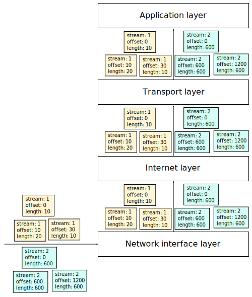
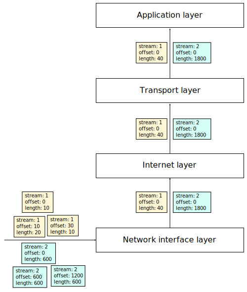
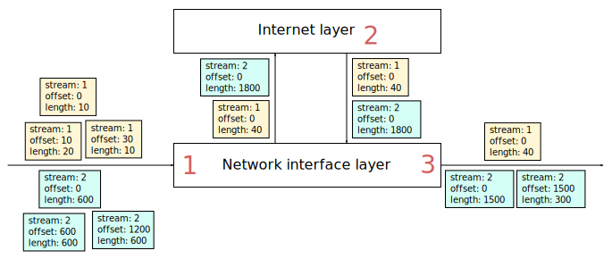

[Documentation](documentation.html) > [Miscellaneous](documentation.html#miscellaneous) > Offloads

# Offloads

## Index

1. [Introduction](#introduction)
2. [Receive Offloads - What are they?](#receive-offloads---what-are-they)
3. [Receive Offloads - The Problem](#receive-offloads---the-problem)
4. [Getting Rid of Receive Offloads](#getting-rid-of-receive-offloads)

## Introduction

This document explains receive offloads, their relationship with Jool and the means to get rid of them.

## Receive Offloads - What are they?

Offloading is a technique meant to optimize network throughput. Born from the observation that a single large packet is significantly faster to process than several small ones, the idea is to combine several packets from a common stream on reception, and then pretend (to the eyes of the rest of the system) that the merged packet was the one received from the cord all along.

Here's an example. This is how packets are normally processed (no offloading):

(For the moment, assume the Internet layer holds IPv4.)

There are two streams here. The yellow one consists of three very small packets:

1. 1st packet: bytes 0 through 9.
2. 2nd packet: bytes 10 to 29.
3. 3rd packet: bytes 30 to 39.

And the blue one has somewhat larger packets:

1. bytes 0 to 599
2. bytes 600 to 1199
3. bytes 1200 to 1799

There are several ways to implement offloading. Pictured below is a simplified version of what a NIC could perhaps do, rather than the above:

Simply put, several contiguous packets are merged together into an equivalent, larger one. The card could for example do this by merging IP fragments or even TCP segments (even if TCP sits two layers above). It doesn't matter as long as the change is transparent for data transfer purposes.

And yes, we're now dealing with heavier data chunks, but truth be told, most of the Internet and Transport layers' activity lies in the first few bytes of each packet (i.e. headers). So we mostly get to process several packets for the price of one.

## Receive Offloads - The Problem

A machine that is supposed to forward the data (rather than consume it) tends to break the assumption "It doesn't matter as long as the change is transparent for data transfer purposes."

Say the hardware has a [Maximum Transmission Unit (MTU)](https://en.wikipedia.org/wiki/Maximum_transmission_unit) of 1500; this is what happens:

Aggregation happens in step 1, which makes step 2 very fast, but then the assembled packet of the blue stream is too big for the outgoing interface (size 1800 > max 1500). Depending on the IPv4 header's DF flag, this can lead to either refragmentation (which is slow) or a packet drop (and because the source is setting DF, this can easily become a black hole).

(In practice, a number of conditions are required for the NIC to run offloading. These conditions might rarely and randomly not be met, so certain packets will occasionally not be aggregated, and as such will slip past the hole. If your transport protocol retries enough, instead of having a complete denial of service, you get an extremely - **EXTREMELY** - slow network.)

Linux gets away with this (not asking you to tweak receive offloads when you turn your machine into a router) by having a number of hacks in the packet forwarding pipeline that deal with resegmentation. Jool attempts to do this too, but offloading is a dirty enough hack that we're not done coding this workaround yet. For this reason, you really do need to stop offloads if your system supports them and you want to run Jool.

If you're running Jool in a guest virtual machine, something important to keep in mind is that you might rather or also have to disable offloads in the [VM host](http://en.wikipedia.org/wiki/Hypervisor)'s uplink interface.

## Getting Rid of Receive Offloads

[`ethtool`](https://www.kernel.org/pub/software/network/ethtool/) seems to be the de facto interface tweaking tool.


$ sudo apt-get install ethtool


Apply this to every interface where you expect to see translation-needing packets:


$ sudo ethtool --offload [your interface here] lro off
$ sudo ethtool --offload [your interface here] gro off


`ethtool` sometimes claims it cannot tweak some of the variants, but keep in mind this is usually because it is not supported and hence it wasn't on in the first place. Have a look at your configuration using


$ sudo ethtool --show-offload [your interface here] | grep receive-offload


