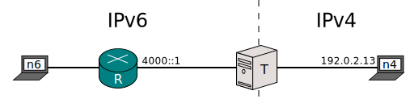

[Documentation](documentation.html) > [SIIT in Detail](documentation.html#siit-in-detail) > Untranslatable IPv6 Addresses

# Untranslatable IPv6 Addresses

Suppose _n4_ is trying to reach _n6_, but there is a problem (eg. the packet is too big), and _R_ sends _n4_ an ICMP error. _T_ is translating using prefix 2001:db8::/96 and doesn't have any records in the [EAMT](eamt.html).

_R_'s packet will have the following addresses:

| Source  | Destination          |
|---------+----------------------|
| 4000::1 | 2001:db8::192.0.2.13 |

_T_ is in trouble because the source address of the packet lacks the translation prefix, so an IPv4 address cannot be extracted from it.

Normally, you don't have many translatable IPv4 addresses, so it's not reasonable to grant one to every node in your IPv6 domain. Due to their generally forwarding-only purpose, routers are good candidates for owning untranslatable addresses. On the other hand, ICMP errors are important, and an SIIT should not drop it simply because it comes from a router.

Stateful NAT64s do not have this problem because they [render every IPv6 address translatable](intro-xlat.html#stateful-nat64) (because all IPv6 nodes are sharing the NAT64's [pool4](pool4.html)).

To sort things out, [RFC 6791](https://tools.ietf.org/html/rfc6791) mandates SIIT modules should keep an additional pool of reserved IPv4 addresses. Upon receiving an ICMPv6 error with an untranslatable source, the translator must fall back to use a random address from this pool as source.

In Jool, the pool is called "pool6791v4" and can be populated through [`global update`](usr-flags-global.html#pool6791v4).

In practice, Jool doesn't actually force you to populate pool6791. If you leave it empty, Jool will fall back to source untranslatable ICMP errors using its machine's own IPv4 addresses. As you will see below, this is not entirely ideal, but you can live with it as long as you don't mind your traceroutes looking confusing.

If you intend on populating pool6791, consider the following (quoting RFC 6791):

	The source address used SHOULD NOT cause the ICMP packet to be
	discarded.  It SHOULD NOT be drawn from [RFC1918] or [RFC6598]
	address space, because that address space is likely to be subject to
	unicast Reverse Path Forwarding (uRPF) [RFC3704] filtering.

	(...)

	Another consideration for source selection is that it should be
	possible for the IPv4 recipients of the ICMP message to be able to
	distinguish between different IPv6 network origination of ICMPv6
	messages (for example, to support a traceroute diagnostic utility
	that provides some limited network-level visibility across the IPv4/
	IPv6 translator). (...)
	Currently, the TRACEROUTE and MTR [MTR] are
	the only consumers of translated ICMPv6 messages that care about the
	ICMPv6 source address.
	
	(...)

	If a pool of public IPv4 addresses is configured on the translator,
	it is RECOMMENDED to randomly select the IPv4 source address from the
	pool.  Random selection reduces the probability that two ICMP
	messages elicited by the same TRACEROUTE might specify the same
	source address and, therefore, erroneously present the appearance of
	a routing loop.

