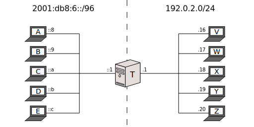
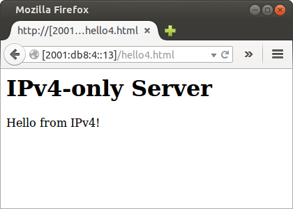
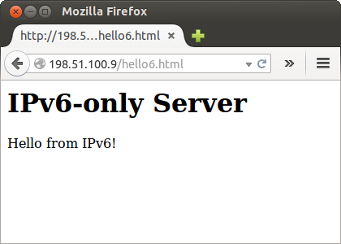

[Documentation](documentation.html) > [Basic Tutorials](documentation.html#basic-tutorials) > SIIT + EAM

# EAM Run

## Index

1. [Introduction](#introduction)
2. [Sample Network](#sample-network)
3. [Jool](#jool)
4. [Testing](#testing)
5. [Stopping Jool](#stopping-jool)
6. [Afterwords](#afterwords)

## Introduction

This document explains how to run Jool in [EAM mode](intro-xlat.html#siit-eamt) (which actually more than a "mode" is simply stock SIIT with records in the EAM table). Follow the link for more details on what to expect. See also [the EAMT RFC summary](eamt.html) for more details on how the EAMT works.

I really don't want to have to maintain three almost identical tutorials (it's a surprising amount of work), so please read the [traditional SIIT tutorial](run-vanilla.html#introduction) first. You don't need to follow it; just make sure you generally understand all the remarks.

## Sample Network



Again, all the remarks in the traditional SIIT's [Sample Network section](run-vanilla.html#sample-network) apply here.

This is nodes _A_ through _E_:

```bash
user@A:~# /sbin/ip link set eth0 up
user@A:~# # Replace "::8" depending on which node you're on.
user@A:~# /sbin/ip addr add 2001:db8:6::8/96 dev eth0
user@A:~# /sbin/ip route add 2001:db8:4::/120 via 2001:db8:6::1
```

Nodes _V_ through _Z_ have the exact same configuration from the previous document.

```bash
user@V:~# /sbin/ip link set eth0 up
user@V:~# # Replace ".16" depending on which node you're on.
user@V:~# /sbin/ip addr add 192.0.2.16/24 dev eth0
user@V:~# /sbin/ip route add 198.51.100.0/24 via 192.0.2.1
```

Node _T_:

```bash
user@T:~# /sbin/ip link set eth0 up
user@T:~# /sbin/ip addr add 2001:db8:6::1/96 dev eth0
user@T:~# 
user@T:~# /sbin/ip link set eth1 up
user@T:~# /sbin/ip addr add 192.0.2.1/24 dev eth1
user@T:~# 
user@T:~# /sbin/sysctl -w net.ipv4.conf.all.forwarding=1
user@T:~# /sbin/sysctl -w net.ipv6.conf.all.forwarding=1
```

Make sure _T_ can ping everyone before introducing Jool into the mix.

## Jool

First, teach your kernel what SIIT is by attaching the `jool_siit` module to your kernel:

<div class="distro-menu">
	<span class="distro-selector" onclick="showDistro(this);">Most distros</span>
	<span class="distro-selector" onclick="showDistro(this);">OpenWRT</span>
</div>

<!-- Netfilter Jool -->
```bash
user@T:~# /sbin/modprobe jool_siit
```

<!-- iptables Jool -->
```bash
user@T:~# # Please remember: This assumes you're using the packages feed.
user@T:~# # If your Jool version is 3.5.7, you shouldn't be here!
user@T:~# insmod jool_common
user@T:~# insmod jool_siit
```

Then create and configure the instance:

>  [This section](intro-jool.html#design) discusses Netfilter Jool vs iptables Jool.

<div class="distro-menu">
	<span class="distro-selector" onclick="showDistro(this);">Netfilter Jool</span>
	<span class="distro-selector" onclick="showDistro(this);">iptables Jool</span>
</div>

<!-- Netfilter Jool -->
```bash
user@T:~# jool_siit instance add "example" --netfilter
user@T:~# jool_siit -i "example" eamt add 2001:db8:6::/120 198.51.100.0/24
user@T:~# jool_siit -i "example" eamt add 2001:db8:4::/120 192.0.2.0/24
 
 
 
```

<!-- iptables Jool -->
```bash
user@T:~# jool_siit instance add "example" --iptables
user@T:~# jool_siit -i "example" eamt add 2001:db8:6::/120 198.51.100.0/24
user@T:~# jool_siit -i "example" eamt add 2001:db8:4::/120 192.0.2.0/24
user@T:~#
user@T:~# /sbin/ip6tables -t mangle -A PREROUTING -j JOOL_SIIT --instance "example"
user@T:~# /sbin/iptables  -t mangle -A PREROUTING -j JOOL_SIIT --instance "example"
```

`-i` stands for "instance." The `eamt add` commands build an [Explicit Address Mappings Table](eamt.html). You can see it through the `display` operation:

```bash
user@T:~# jool_siit -i "example" eamt display
+---------------------------------------------+--------------------+
|                                 IPv6 Prefix |        IPv4 Prefix |
+---------------------------------------------+--------------------+
|                            2001:db8:4::/120 |       192.0.2.0/24 |
|                            2001:db8:6::/120 |    198.51.100.0/24 |
+---------------------------------------------+--------------------+
```

And again, the IPv6 prefix and the EAM table are not exclusive operation modes. Jool will always try to translate an address using EAMs, and if that fails, fall back to use the prefix. Add `--pool6` during the `instance add` if you want this.

## Testing

Remember the [FAQ](faq.html) and [debug logging](usr-flags-global.html#logging-debug) if something goes south. **Do not try a `2001:db8::X.X.X.X` ping from the translator; it's [not going to work](faq.html#why-is-my-ping-not-working).**

Try to ping _V_ from _A_ like this:

```bash
user@A:~$ ping6 2001:db8:4::10 # Reminder: hex 10 = dec 16.
PING 2001:db8:4::10(2001:db8:4::10) 56 data bytes
64 bytes from 2001:db8:4::10: icmp_seq=1 ttl=63 time=2.95 ms
64 bytes from 2001:db8:4::10: icmp_seq=2 ttl=63 time=2.79 ms
64 bytes from 2001:db8:4::10: icmp_seq=3 ttl=63 time=4.13 ms
64 bytes from 2001:db8:4::10: icmp_seq=4 ttl=63 time=3.60 ms
^C
--- 2001:db8:4::10 ping statistics ---
4 packets transmitted, 4 received, 0% packet loss, time 3003ms
rtt min/avg/max/mdev = 2.790/3.370/4.131/0.533 ms
```

Then ping _A_ from _V_:

```bash
user@V:~$ ping 198.51.100.8
PING 198.51.100.8 (198.51.100.8) 56(84) bytes of data.
64 bytes from 198.51.100.8: icmp_seq=1 ttl=63 time=5.04 ms
64 bytes from 198.51.100.8: icmp_seq=2 ttl=63 time=2.55 ms
64 bytes from 198.51.100.8: icmp_seq=3 ttl=63 time=1.93 ms
64 bytes from 198.51.100.8: icmp_seq=4 ttl=63 time=2.47 ms
^C
--- 198.51.100.8 ping statistics ---
4 packets transmitted, 4 received, 0% packet loss, time 3004ms
rtt min/avg/max/mdev = 1.930/3.001/5.042/1.204 ms
```

How about hooking up a server in _Y_ and access it from _D_:



Then maybe another one in _B_ and request from _X_:



## Stopping Jool

Remove the instance:

<div class="distro-menu">
	<span class="distro-selector" onclick="showDistro(this);">Netfilter Jool</span>
	<span class="distro-selector" onclick="showDistro(this);">iptables Jool</span>
</div>

<!-- Netfilter Jool -->
```bash
 
 
user@T:~# jool_siit instance remove "example"
```

<!-- iptables Jool -->
```bash
user@T:~# /sbin/ip6tables -t mangle -D PREROUTING -j JOOL_SIIT --instance "example"
user@T:~# /sbin/iptables  -t mangle -D PREROUTING -j JOOL_SIIT --instance "example"
user@T:~# jool_siit instance remove "example"
```

And (optionally) remove the kernel modules:

<div class="distro-menu">
	<span class="distro-selector" onclick="showDistro(this);">Most distros</span>
	<span class="distro-selector" onclick="showDistro(this);">OpenWRT</span>
</div>

<!-- Most distros -->
```bash
user@T:~# /sbin/modprobe -r jool_siit
 
```

<!-- OpenWRT -->
```bash
user@T:~# rmmod jool_siit
user@T:~# rmmod jool_common
```

## Afterwords

1. If you care about performance, you might want to raise [`lowest-ipv6-mtu`](mtu.html).
3. Please note that none of what was done in this tutorial survives reboots! [Here](run-persistent.html)'s documentation on persistence.

The [next tutorial](run-nat64.html) is a [Stateful NAT64](intro-xlat.html#stateful-nat64) run.
