[Documentation](documentation.html) > [Basic Tutorials](documentation.html#basic-tutorials) > Basic Linux Networking

# Basic Linux Networking

## Index

1. [Introduction](#introduction)
2. [Scenario 1: Minimal networking on Linux](#scenario-1-minimal-networking-on-linux)
3. [Scenario 2: Connecting different networks](#scenario-2-connecting-different-networks)
4. [Scenario 3: Adding even more networks](#scenario-3-adding-even-more-networks)

## Introduction

This page is a tutorial meant to explain the subset of the core Linux networking toolset which is relevant to the rest of the Jool tutorials.

The thing about Linux is that it comes in many different flavors, and I really have better things to do than explain how to set up a network in each of them. Therefore, Jool's documentation simplifies things by reaching for the lowest common denominator: The `ip` command. Throughout the runs, I will provide you the intended address and routing configuration in `ip` syntax. From this tutorial, you will learn what to extract out of these commands. If you can input them verbatim, great. If you want to translate them into your specific network manager's speak, that's yor job.

To be perfectly honest, I don't actually expect you to follow this tutorial; I only hope that you read and understand it. I've found network managers tend to make horrible habits out of undoing your tweaks under your nose, or shutting down without properly cleaning up their network configurations. Also, I realize expecting people to happen to have more than one computer at hand might sometimes be a stretch. If you have experience with minimalist virtual machines, go nuts. Otherwise just stare at the pictures; `ip` isn't really hard to understand.

To follow along, you're expected to know what IP addresses are, and how they are aggregated into prefixes (ie. networks). You don't need to have experience with command-line terminals beyond knowing how to start one, and type letters in it. However, most of the commands will require administrative privileges, so please also be aware of `su`/`sudo`. You also need to know the purpose of the `ping` command.

## Scenario 1: Minimal networking on Linux

Suppose you have two laptops running Linux. We intend to connect them by an Ethernet cable:

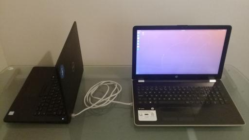

Here's an abstract representation of everything that's important in the picture above:

Fire up a terminal in either laptop and run `ip address show`. Assuming there is no network manager, or it has been terminated cleanly, your output should resemble the following:

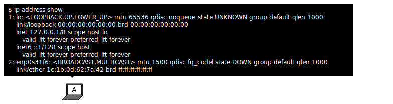

- `lo` is the loopback interface. (For our purposes, we don't really care about it.)
- `enpXsXXXX` is the Ethernet interface. (`en` stands for "EtherNet," presumably.) Note your interface's name; you will need it in the future.
- You might also have a `wlpXsX` interface, which is your Wi-Fi. (`wl` = "Wireless LAN.") Ignore this one too.

This is the minimalistic newbie-friendly state of nil. The Ethernet interfaces are perfectly unconfigured and temporarily dead. There is absolutely no networking going on, and nothing modifying the interfaces in the background. We have complete control.

To have a basic working network, we need to do two things to the relevant network interfaces:

1. Assing IP addresses. (`ip address add`)
2. Enable them. (`ip link set`)

`ip address add` has the following syntax:

	ip address add <ip address>/<network's prefix length> dev <interface>

After adding an address, print it with `ip address show`. If you messed something up, delete the incorrect address with `ip address delete`:

	ip address delete <same arguments you used when adding the address>

`ip link set` has the following syntax:

	ip link set <interface name> <action>

`<action>` is either `up` or `down`, depending on whether you want to enable or disable the interface. (Respectively.)

(Note: I'm going to start trimming output for the sake of cleaner diagrams. Also, colors added for easier comparisons:)

	

		IPv4
		IPv6
	

	

		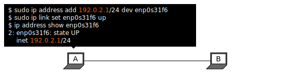
		
	

Then do _B_'s equivalent counterpart:

	

		IPv4
		IPv6
	

	

		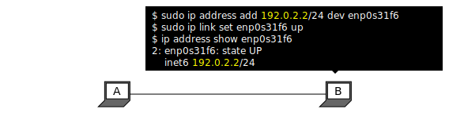
		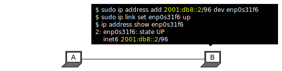
	

Now try some pings:

	

		IPv4
		IPv6
	

	

		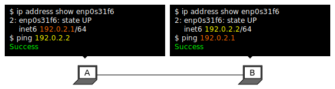
		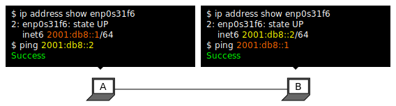
	

It works! That's that.

## Scenario 2: Connecting different networks

The next logical step is to connect two different networks:

	

		IPv4
		IPv6
	

	

		
		
	

Assign addresses just like in the previous scenario:

	

		IPv4
		IPv6
	

	

		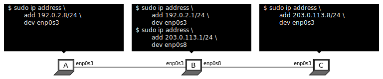
		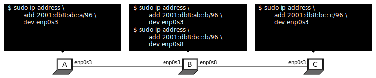
	

Again, you can see the configuration via `ip address show`:

	

		IPv4
		IPv6
	

	

		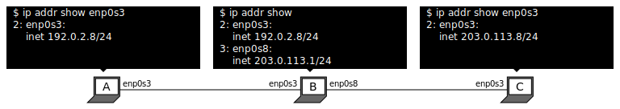
		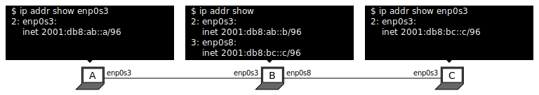
	

For now, these pretty much behave just like link-scoped addresses. Everyone can reach others with whom they share a network, but no one else:

	

		IPv4
		IPv6
	

	

		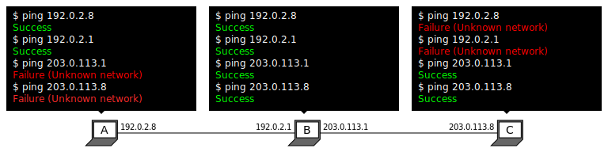
		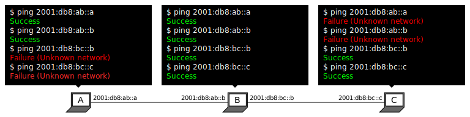
	

To communicate nodes from different networks, we need routing.

Routing is the art of telling your nodes where your packets need to be headed so they can reach other networks.

Linux has a _Routing_ table, in which each known path is registered. You can print the IPv4 routes with `ip route show`, and the IPv6 routes with `ip -6 route show`:

	

		IPv4
		IPv6
	

	

		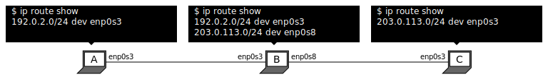
		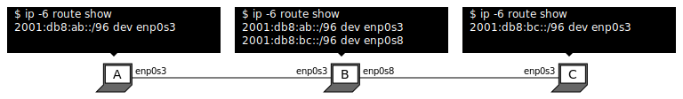
	

As you can see, just by adding addresses to each node, they automatically infer routes to their own networks thanks to the prefix length entered during `ip address add`. We're now going to add the networks that each node is missing.

The `ip route add` command has the following form:

	ip route add <target> via <reachable gateway>

"`ip route add A via B`" means "If you need something delivered to `A`, send it to `B`, and it'll know that to do."

If you mess something up, you can delete a route you previously created with `ip route delete`:

	ip route delete <same arguments you used when creating the rule>

Therefore,

	

		IPv4
		IPv6
	

	

		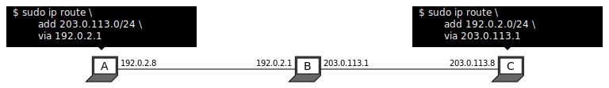
		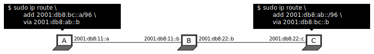
	

Now, all nodes know that they can reach both 192.0.2 and 203.0.113:

	

		IPv4
		IPv6
	

	

		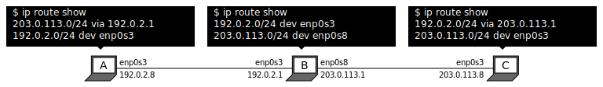
		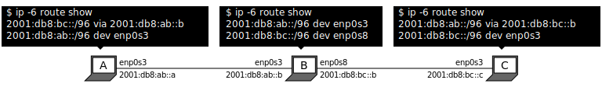
	

In principle, that should be all you need. There's one additional quirk you need to take care of, however: In order for one of `A`'s packets to reach `C`, they need to pass through `B` first. Thing is, `B` won't forward packets unless it's explicitly told to do so:

	

		IPv4
		IPv6
	

	

		
		
	

That "upgrades" laptop `B` into a router:

	

		IPv4
		IPv6
	

	

		
		
	

Now we're ready:

	

		IPv4
		IPv6
	

	

		
		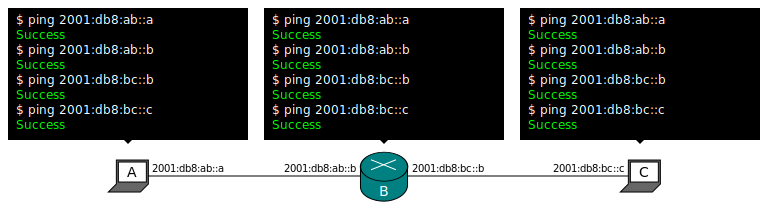
	

And that's it. I mean there's a lot more to `ip`, but this is all that's relevant to Jool's tutorials.

## Scenario 3: Adding even more networks

For the sake of visualization, here's a third scenario involving more routers. The commands shown would allow everyone to ping everyone:

	

		IPv4
		IPv6
	

	

		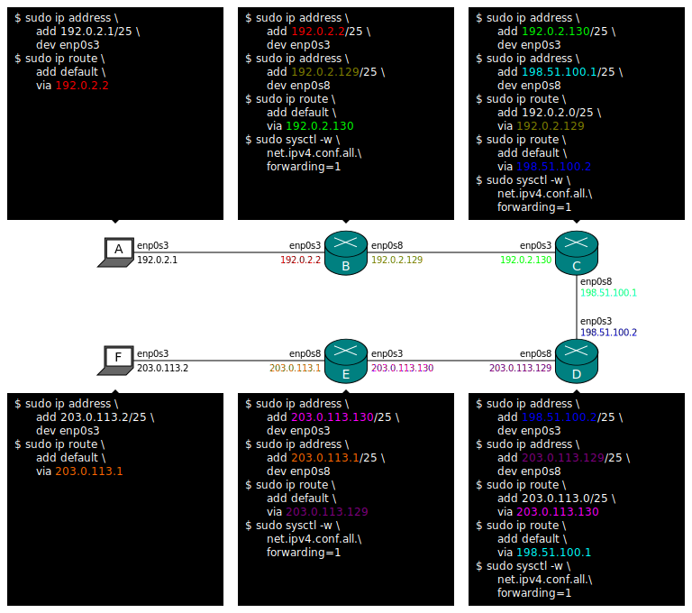
		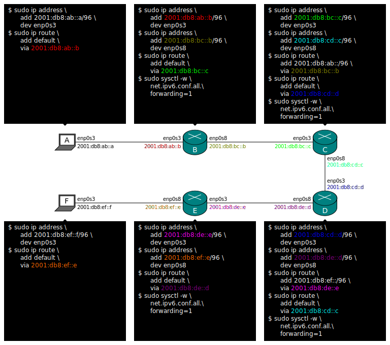
	

In IPv4, "default" stands for `0.0.0.0/0`, and in IPv6, it means `::/0`.

