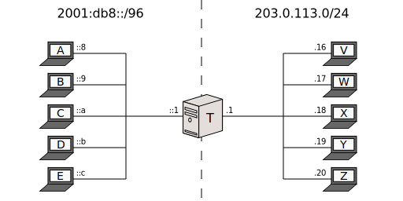
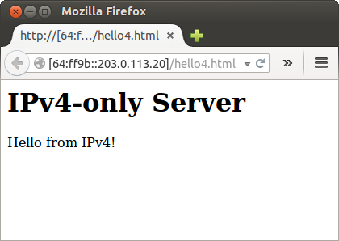

[Documentation](documentation.html) > [Basic Tutorials](documentation.html#basic-tutorials) > Stateful NAT64

# Stateful NAT64 Run

## Index

1. [Introduction](#introduction)
2. [Sample Network](#sample-network)
3. [Jool](#jool)
4. [Testing](#testing)
5. [Stopping Jool](#stopping-jool)
6. [Afterwords](#afterwords)

## Introduction

This document explains how to run Jool in [Stateful NAT64 mode](intro-xlat.html#stateful-nat64). Follow the link for more details on what to expect.

I don't want to have to maintain three almost identical tutorials (it's a surprising amount of work), so please read the [traditional SIIT tutorial](run-vanilla.html#introduction) first. You don't need to follow it; just make sure you generally understand all the remarks.

## Sample Network



Again, all the remarks in the traditional SIIT's [Sample Network section](run-vanilla.html#sample-network) apply here.

Nodes _A_ through _E_:

```bash
user@A:~# /sbin/ip link set eth0 up
user@A:~# # Replace "::8" depending on which node you're on.
user@A:~# /sbin/ip address add 2001:db8::8/96 dev eth0
user@A:~# /sbin/ip route add 64:ff9b::/96 via 2001:db8::1
```

Nodes _V_ through _Z_:

```bash
user@V:~# /sbin/ip link set eth0 up
user@V:~# # Replace ".16" depending on which node you're on.
user@V:~# /sbin/ip address add 203.0.113.16/24 dev eth0
```

Notice these nodes do not need a default route. This is a consequence of them being in the same network as the NAT64; _T_ will be masking the IPv6 nodes, so _V_ through _Z_ think they're talking directly to it.

Node _T_:

```bash
user@T:~# /sbin/ip link set eth0 up
user@T:~# /sbin/ip address add 2001:db8::1/96 dev eth0
user@T:~# 
user@T:~# /sbin/ip link set eth1 up
user@T:~# /sbin/ip address add 203.0.113.1/24 dev eth1
user@T:~# 
user@T:~# /sbin/sysctl -w net.ipv4.conf.all.forwarding=1
user@T:~# /sbin/sysctl -w net.ipv6.conf.all.forwarding=1
```

Make sure _T_ can ping everyone before introducing Jool into the mix.

## Jool

As with vanilla SIIT, all a minimal Stateful NAT64 needs is the translation <span style="color: #00aa88">prefix</span>.

If you followed the SIIT tutorials, do keep in mind that the names of the NAT64 binaries are `jool`, not `jool_siit`:

<div class="distro-menu">
	<span class="distro-selector" onclick="showDistro(this);">Most distros</span>
	<span class="distro-selector" onclick="showDistro(this);">OpenWRT</span>
</div>

<!-- Most distros -->
```bash
user@T:~# /sbin/modprobe jool
```

<!-- OpenWRT -->
```bash
user@T:~# # Please remember: This assumes you're using the packages feed.
user@T:~# # If your Jool version is 3.5.7, you shouldn't be here!
user@T:~# insmod jool_common
user@T:~# insmod jool
```

The same applies to the userspace clients:

<div class="distro-menu">
	<span class="distro-selector" onclick="showDistro(this);">Netfilter Jool</span>
	<span class="distro-selector" onclick="showDistro(this);">iptables Jool</span>
</div>

<!-- Netfilter Jool -->
```bash
user@T:~# jool instance add "example" --netfilter --pool6 64:ff9b::/96
 

 
```

<!-- iptables Jool -->
```bash
user@T:~# jool instance add "example" --iptables  --pool6 64:ff9b::/96
user@T:~#
user@T:~# /sbin/ip6tables -t mangle -A PREROUTING -j JOOL --instance "example"
user@T:~# /sbin/iptables  -t mangle -A PREROUTING -j JOOL --instance "example"
```

## Testing

Remember the [FAQ](faq.html) and [debug logging](usr-flags-global.html#logging-debug) if something goes south. **Do not try a `64:ff9b::X.X.X.X` ping from the translator; it's [not going to work](faq.html#why-is-my-ping-not-working).**

Test by sending requests from an IPv6-only node:

```bash
user@C:~$ ping6 64:ff9b::203.0.113.16
PING 64:ff9b::203.0.113.16(64:ff9b::cb00:7110) 56 data bytes
64 bytes from 64:ff9b::cb00:7110: icmp_seq=1 ttl=63 time=1.13 ms
64 bytes from 64:ff9b::cb00:7110: icmp_seq=2 ttl=63 time=4.48 ms
64 bytes from 64:ff9b::cb00:7110: icmp_seq=3 ttl=63 time=15.6 ms
64 bytes from 64:ff9b::cb00:7110: icmp_seq=4 ttl=63 time=4.89 ms
^C
--- 64:ff9b::203.0.113.16 ping statistics ---
4 packets transmitted, 4 received, 0% packet loss, time 3004ms
rtt min/avg/max/mdev = 1.136/6.528/15.603/5.438 ms
```



>  Obviously, users should not need to be aware of IP addresses, much less know they need to append a prefix whenever they need to speak to IPv4. The [DNS64 document](dns64.html) will tell you how to make the prefix-address-hack transparent to users.

>  Because a NAT64 is stateful, only IPv6-started tests can be run at this point. See [port forwarding](bib.html) if 4-to-6 translation is relevant for you.

## Stopping Jool

Delete instance:

<div class="distro-menu">
	<span class="distro-selector" onclick="showDistro(this);">Netfilter Jool</span>
	<span class="distro-selector" onclick="showDistro(this);">iptables Jool</span>
</div>

<!-- Netfilter Jool -->
```bash
 
 
user@T:~# jool instance remove "example"
```

<!-- iptables Jool -->
```bash
user@T:~# /sbin/ip6tables -t mangle -D PREROUTING -j JOOL --instance "example"
user@T:~# /sbin/iptables  -t mangle -D PREROUTING -j JOOL --instance "example"
user@T:~# jool instance remove "example"
```

Remove module:

<div class="distro-menu">
	<span class="distro-selector" onclick="showDistro(this);">Most distros</span>
	<span class="distro-selector" onclick="showDistro(this);">OpenWRT</span>
</div>

<!-- Most distros -->
```bash
user@T:~# /sbin/modprobe -r jool
 
```

<!-- OpenWRT -->
```bash
user@T:~# rmmod jool
user@T:~# rmmod jool_common
```

## Afterwords

1. If you care about performance, you might want to raise [`lowest-ipv6-mtu`](mtu.html).
3. Please note that none of what was done in this tutorial survives reboots! [Here](run-persistent.html)'s documentation on persistence.

The [next tutorial](dns64.html) explains DNS64.
