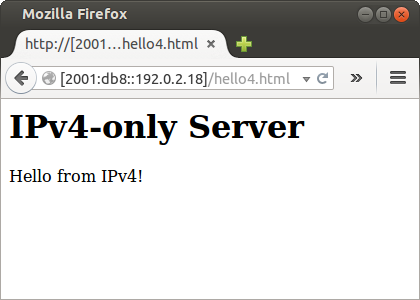
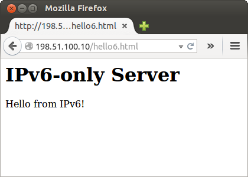

[Documentation](documentation.html) > [Basic Tutorials](documentation.html#basic-tutorials) > SIIT

# Basic SIIT Run

## Index

1. [Introduction](#introduction)
2. [Sample Network](#sample-network)
3. [Jool](#jool)
4. [Testing](#testing)
5. [Stopping Jool](#stopping-jool)
6. [Afterwords](#afterwords)

## Introduction

This document explains how to run Jool in [stock SIIT mode](intro-xlat.html#siit-traditional). Follow the link for more details on what to expect.

To follow along, you're expected to understand

1. what IP addresses are, and how they are aggregated into prefixes (ie. networks).
2. You need to know how to start a command-line terminal, and type letters in it.
	- Most of the commands will require administrative privileges, so please also be aware of `su`/`sudo`. (Commands requiring privileges will be prefixed by `#`, others will be prefixed with `$`.)
3. You're also expected to know how to configure addresses and routes in your specific distribution's networking tools.
	- Familiarity with the `ip address` and `ip route` commands is recommended, because I'm going to use their syntax to formally declare intended network configuration. You can find exactly what you need to know in [Basic Linux Networking](run-linux.html). (Even if you already know, please at least read the second paragraph of the introduction.)
4. If you intend on using iptables Jool (as opposed to Netfilter Jool), basic familiarity with iptables is recommended.
	- If you don't know iptables, really just stick to Netfilter Jool for now. (Even if you don't know what Netfilter is.)
5. It helps to know the purpose of the `ping` command.

In case you're wondering, you can follow along these tutorials using virtual machines or alternate interface types just fine. Jool is _not_ married to physical "_ethX_" interfaces).

## Sample Network

You don't need all the nodes shown in the diagram to follow along; you can get away with only _A_, _T_ and _V_; the rest are very similar to _A_ and _V_ and are shown for illustrative purposes only.


We will pretend I have address block 198.51.100.8/29 to distribute among my IPv6 nodes.

Jool requires _T_ to be Linux. The rest can be anything you want, as long as it implements the network protocol it's connected to. You are also free to configure the networks using any manager you want.

Here is the "formal" definition of the sample network, in `ip` syntax. Whatever your operative system or configuration interface of choice, please accomplish the following:

Nodes _A_ through _E_:

```bash
user@A:~# /sbin/ip link set eth0 up
user@A:~# # Replace ".8" depending on which node you're on.
user@A:~# /sbin/ip address add 2001:db8::198.51.100.8/120 dev eth0
user@A:~# /sbin/ip route add 2001:db8::192.0.2.0/120 via 2001:db8::198.51.100.1
```

Nodes _V_ through _Z_:

```bash
user@V:~# /sbin/ip link set eth0 up
user@V:~# # Replace ".16" depending on which node you're on.
user@V:~# /sbin/ip address add 192.0.2.16/24 dev eth0
user@V:~# /sbin/ip route add 198.51.100.0/24 via 192.0.2.1
```

Node _T_:

```bash
user@T:~# /sbin/ip link set eth0 up
user@T:~# /sbin/ip address add 2001:db8::198.51.100.1/120 dev eth0
user@T:~# 
user@T:~# /sbin/ip link set eth1 up
user@T:~# /sbin/ip address add 192.0.2.1/24 dev eth1
```

Because we haven't turned _T_ into a translator yet, nodes _A_ through _E_ still cannot interact with _V_ through _Z_, but please make sure _T_ can ping everyone before continuing.

Also, enable forwarding on _T_:

```bash
user@T:~# /sbin/sysctl -w net.ipv4.conf.all.forwarding=1
user@T:~# /sbin/sysctl -w net.ipv6.conf.all.forwarding=1
```

That's our sample network out of the way. Let's now talk about Jool:

## Jool

From the [introduction to traditional SIIT](intro-xlat.html#siit-traditional), you might have surmised that all the configuration a minimal traditional SIIT needs is a <span style="color: #00aa88">prefix</span>. And you would be correct.

First, teach your kernel what SIIT is by attaching the `jool_siit` module to your kernel:

<div class="distro-menu">
	<span class="distro-selector" onclick="showDistro(this);">Most Distros</span>
	<span class="distro-selector" onclick="showDistro(this);">OpenWRT</span>
</div>

<!-- Most Distros -->

user@T:~# /sbin/modprobe jool_siit


<!-- OpenWRT -->

user@T:~# # Please remember: This assumes you're using the packages feed.
user@T:~# # If your Jool version is 3.5.7, you shouldn't be here!
user@T:~# insmod jool_common
user@T:~# insmod jool_siit


Then, create a SIIT instance and perform the bare minimum configuration (Note: [This section](intro-jool.html#design) discusses Netfilter Jool vs iptables Jool. When in doubt, just pick Netfilter):

<div class="distro-menu">
	<span class="distro-selector" onclick="showDistro(this);">Netfilter Jool</span>
	<span class="distro-selector" onclick="showDistro(this);">iptables Jool</span>
</div>

<!-- Netfilter Jool -->

user@T:~# # Create a Jool iptables instance named "example."
user@T:~# # Also, establish that the IPv6 representation of any IPv4 address should be
user@T:~# # `2001:db8::<IPv4 address>`. (See sections below for examples.)
user@T:~# jool_siit instance add "example" --netfilter --pool6 2001:db8::/96
 
 
 
 
 


<!-- iptables Jool -->

user@T:~# # Create a Jool iptables instance named "example."
user@T:~# # Also, establish that the IPv6 representation of any IPv4 address should be
user@T:~# # `2001:db8::<IPv4 address>`. (See sections below for examples.)
user@T:~# jool_siit instance add "example" --iptables  --pool6 2001:db8::/96
user@T:~# 
user@T:~# # Create iptables rules that will send traffic to our instance somewhere
user@T:~# # in the mangle chain.
user@T:~# /sbin/ip6tables -t mangle -A PREROUTING -j JOOL_SIIT --instance "example"
user@T:~# /sbin/iptables  -t mangle -A PREROUTING -j JOOL_SIIT --instance "example"


> About iptables Jool:
> 
>  Notice that we did not include any matches (such as [`-s` or `-d`](https://netfilter.org/documentation/HOWTO/packet-filtering-HOWTO-7.html#ss7.3)). This is merely for the sake of tutorial simplicity. If you want to narrow down the traffic that gets translated, you should be able to combine any matches as needed.
> 
>  If you choose to use the `--protocol` match, please **make sure that you include at least one rule properly matching ICMP**, as it's important that you don't prevent the translation of ICMP errors, because they are required for imperative Internet upkeeping (such as [Path MTU Discovery](https://en.wikipedia.org/wiki/Path_MTU_Discovery)).

That's all.

## Testing

If something doesn't work, try the [FAQ](faq.html). In particular, if you think Jool is misbehaving, try [enabling debug](usr-flags-global.html#logging-debug). **Do not try a `2001:db8::X.X.X.X` ping from the translator; it's [not going to work](faq.html#why-is-my-ping-not-working).**

Try to ping _A_ from _V_ like this:


user@V:~$ ping 198.51.100.8
PING 198.51.100.8 (198.51.100.8) 56(84) bytes of data.
64 bytes from 198.51.100.8: icmp_seq=1 ttl=63 time=7.45 ms
64 bytes from 198.51.100.8: icmp_seq=2 ttl=63 time=1.64 ms
64 bytes from 198.51.100.8: icmp_seq=3 ttl=63 time=4.22 ms
64 bytes from 198.51.100.8: icmp_seq=4 ttl=63 time=2.32 ms
^C
--- 198.51.100.8 ping statistics ---
4 packets transmitted, 4 received, 0% packet loss, time 3006ms
rtt min/avg/max/mdev = 1.649/3.914/7.450/2.249 ms


Then ping _V_ from _A_:


user@A:~$ ping6 2001:db8::192.0.2.16
PING 2001:db8::192.0.2.16(2001:db8::c000:210) 56 data bytes
64 bytes from 2001:db8::c000:210: icmp_seq=1 ttl=63 time=3.57 ms
64 bytes from 2001:db8::c000:210: icmp_seq=2 ttl=63 time=10.5 ms
64 bytes from 2001:db8::c000:210: icmp_seq=3 ttl=63 time=1.38 ms
64 bytes from 2001:db8::c000:210: icmp_seq=4 ttl=63 time=2.63 ms
^C
--- 2001:db8::192.0.2.16 ping statistics ---
4 packets transmitted, 4 received, 0% packet loss, time 3003ms
rtt min/avg/max/mdev = 1.384/4.529/10.522/3.546 ms


How about hooking up a server in _X_ and access it from _D_:



Then maybe another one in _C_ and request from _W_:



## Stopping Jool

Destroy your instance by reverting the `instance add`:

<div class="distro-menu">
	<span class="distro-selector" onclick="showDistro(this);">Netfilter Jool</span>
	<span class="distro-selector" onclick="showDistro(this);">iptables Jool</span>
</div>

<!-- Netfilter Jool -->

 
 
user@T:~# jool_siit instance remove "example"


<!-- iptables Jool -->

user@T:~# /sbin/ip6tables -t mangle -D PREROUTING -j JOOL_SIIT --instance "example"
user@T:~# /sbin/iptables  -t mangle -D PREROUTING -j JOOL_SIIT --instance "example"
user@T:~# jool_siit instance remove "example"


And "unteach" SIIT from your kernel by reverting the `modprobe` if you want:

<div class="distro-menu">
	<span class="distro-selector" onclick="showDistro(this);">Most Distros</span>
	<span class="distro-selector" onclick="showDistro(this);">OpenWRT</span>
</div>

<!-- Most Distros -->

user@T:~# /sbin/modprobe -r jool_siit
 


<!-- OpenWRT -->

user@T:~# rmmod jool_siit
user@T:~# rmmod jool_common


## Afterwords

1. If you care about performance, you might want to raise [`lowest-ipv6-mtu`](mtu.html).
3. Please note that none of what was done in this tutorial survives reboots! [Here](run-persistent.html)'s documentation on persistence.

The [next tutorial](run-eam.html) covers [EAMT SIIT](intro-xlat.html#siit-eamt).

