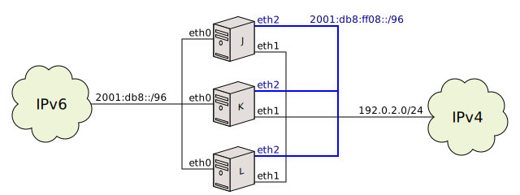
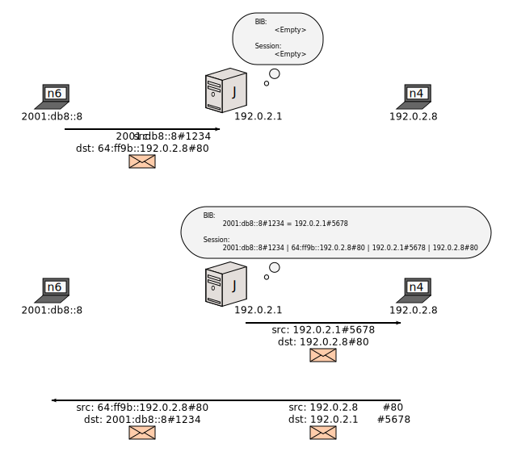
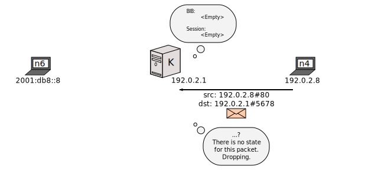
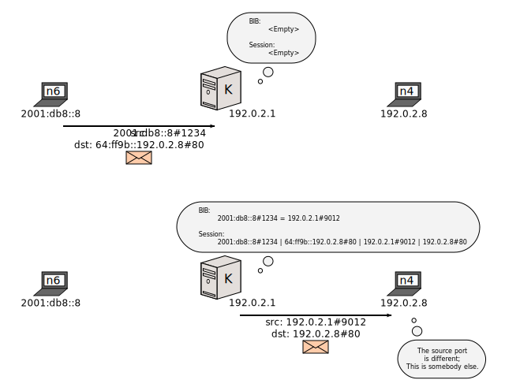
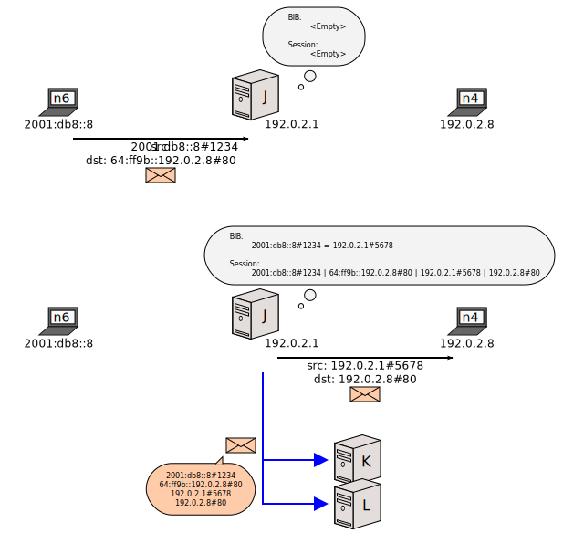
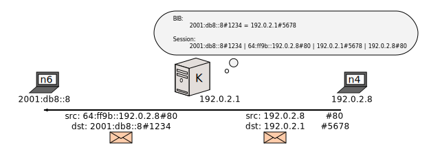
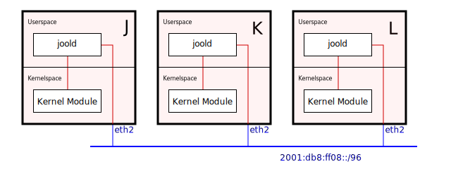
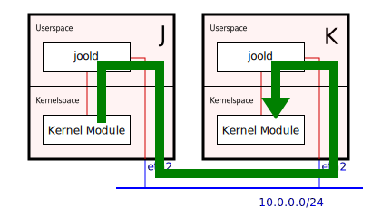

[Documentation](documentation.html) > [Other Sample Runs](documentation.html#other-sample-runs) > Session Synchronization

# Session Synchronization

## Index

1. [Introduction](#introduction)
2. [Sample Network](#sample-network)
3. [Traffic Flow Explanation](#traffic-flow-explanation)
	1. [Session Synchronization Disabled](#session-synchronization-disabled)
	2. [Session Synchronization Enabled](#session-synchronization-enabled)
4. [Architecture](#architecture)
5. [Basic Tutorial](#basic-tutorial)
	1. [Jool Instance](#jool-instance)
	2. [Daemon](#daemon)
	3. [Load Balancer](#load-balancer)
	4. [Testing](#testing)
6. [Configuration](#configuration)
	1. [`jool`](#jool)
	2. [`joold`](#joold)

## Introduction

The fact that stock NAT64 is stateful makes redundancy difficult. You can't simply configure two independent NAT64s and expect that one will serve as a backup for the other should the latter fall.

> Well, you can in reality, but users will notice that they need to re-establish all their lasting connections during a failure since the new NAT64 needs to recreate all the [dynamic mappings](bib.html) (and their sessions) that the old NAT64 lost.

Since version 3.5, Jool ships with a daemon that allows constant synchronization of sessions across Jool instances so you can work around this limitation. The purpose of this document is to explain and exemplify its usage.

Session Synchronization (hereby abbreviated as "SS") applies to NAT64 Jool only. SIIT stores no state, and therefore scales horizontally without any special configuration.

## Sample Network



Nodes `J`, `K` and `L` will be Stateful NAT64s. Their configuration will be only slightly different, and any number of extra backup NAT64s can be appended by replicating similar configuration through additional nodes. You intend to have at least two of these.

`2001:db8:ff08::/96` is a private network where the sessions will be advertised as the NAT64s serve traffic through their other interfaces. It can be IPv4, and is not strictly required to be separate.

## Traffic Flow Explanation

First, let's analyze what happens when you create multiple Jool instances but do not enable SS:

### Session Synchronization Disabled

IPv6 node `n6` will interact with IPv6 node `n4` via `J`. As is natural of NAT64, and since the translation is from v6 to v4, `J` has all the information it needs to store a mapping (and a session) to service this connection:



During `n4` and `n6`'s conversation, `J` dies. `K` then drops a packet written by `n4` since it doesn't have a mask for its destination address:



And `n6` doesn't fare much better either since `K` will compute a new mask, which risks not being the same `J` chose:



The problem lies in the NAT64s not sharing their databases. Let's fix that:

### Session Synchronization Enabled

Whenever `J` translates a packet, it generates another one: A multicast through the private network that informs anyone interested of the new connection:



When `J` dies, `K` has everything it needs to impersonate `J` and continue the conversation as uninterrupted as possible. Notice that measures might need to be taken to redirect traffic towards `192.0.2.1` to its new owner:



## Architecture

Each machine hosting a NAT64 will also hold a daemon that will bridge SS traffic between the private network and its Jool instance. This daemon is named `joold`. So the kernel modules will generate SS traffic and offset the delivery task to these daemons:



Why are the daemons necessary? because kernel modules cannot open IP sockets; at least not in a reliable and scalable manner.

Synchronizing sessions is _all_ the daemons do; the traffic redirection part is delegated to other protocols. [Keepalived](http://www.keepalived.org/) is the implementation that takes care of this in the sample configuration below, but any other load balancer should also get the job done.

In this proposed/inauguratory implementation, SS traffic is distributed through an IPv4 or IPv6 unencrypted UDP connection. You might want to cast votes on the issue tracker or propose code if you favor some other solution.

There are two operation modes in which SS can be used:

1. Active/Passive: One Jool instance serves traffic at any given time, the other ones serve as backup. The load balancer redirects traffic when the current active NAT64 dies.
2. Active/Active: All Jool instances serve traffic. The load balancer distributes traffic so no NAT64 is too heavily encumbered.

>  Active/Active is discouraged because the session synchronization across Jool instances does not lock and is not instantaneous; if the translating traffic is faster, the session tables can end up desynchronized. Users will perceive this mainly as difficulties opening connections through the translators.

It is also important to note that SS is relatively resource-intensive; its traffic is not only _extra_ traffic, but it must also do two full U-turns to userspace before reaching its destination:



To alleviate this to some extent, sessions are normally accumulated in Active/Passive mode before being sent to the private network. Transmitting several sessions in one packet substantially reduces the overhead of SS.

## Basic Tutorial

This is an example of the Active/Passive model. We will remove `L` from the setup since its configuration is very similar to `K`'s.

### Network

<div class="distro-menu">
	<span class="distro-selector" onclick="showDistro(this);">J</span>
	<span class="distro-selector" onclick="showDistro(this);">K</span>
	<span class="distro-selector" onclick="showDistro(this);">n6</span>
	<span class="distro-selector" onclick="showDistro(this);">n4</span>
</div>

<!-- J -->

ip addr add 2001:db8::4/96 dev eth0
ip addr add 192.0.2.4/24 dev eth1
ip addr add 2001:db8:ff08::4/96 dev eth2

ip addr add 2001:db8::1/96 dev eth0
ip addr add 192.0.2.1/24 dev eth1

sysctl -w net.ipv4.conf.all.forwarding=1
sysctl -w net.ipv6.conf.all.forwarding=1

modprobe jool
# Notice that the instance name will default to "default" in this example.
jool instance add --netfilter --pool6 64:ff9b::/96
jool pool4 add --tcp 192.0.2.1 61001-65535
jool pool4 add --udp 192.0.2.1 61001-65535
jool pool4 add --icmp 192.0.2.1 0-65535


<!-- K -->

ip addr add 2001:db8::5/96 dev eth0
ip addr add 192.0.2.5/24 dev eth1
ip addr add 2001:db8:ff08::5/96 dev eth2


sysctl -w net.ipv4.conf.all.forwarding=1
sysctl -w net.ipv6.conf.all.forwarding=1

modprobe jool
# Notice that the instance name will default to "default" in this example.
jool instance add --netfilter --pool6 64:ff9b::/96
jool pool4 add --tcp 192.0.2.1 61001-65535
jool pool4 add --udp 192.0.2.1 61001-65535
jool pool4 add --icmp 192.0.2.1 0-65535


<!-- n6 -->

ip addr add 2001:db8::8/96 dev eth0
ip route add 64:ff9b::/96 via 2001:db8::1


<!-- n4 -->

ip addr add 192.0.2.8/24 dev eth0


This is generally usual boilerplate Jool mumbo jumbo. `2001:db8::4-5` and `192.0.2.4-5` are `J` and `K`'s permanent addresses; `2001:db8::1` and `192.0.2.1` are what Keepalived names "virtual addresses" -- The address the active translator will claim, and through which traffic will be translated. You can have multiple of these.

It is important to note that every translator instance must have the same configuration as the other ones before SS is started. Make sure you've manually synchronized pool6, pool4, static BIB entries, the global variables and any other internal Jool configuration you might have.

The clocks don't need to be synchronized.

### Jool Instance

Because forking SS sessions on every translated packet is not free (performance-wise), jool instances are not SS-enabled by default. The fact that the module and the daemon are separate binaries enhances the importance of this fact; starting the daemon is not, by itself, enough to get sessions synchronized.

	# jool global update ss-enabled true

This asks the instance to open a channel to userspace and start trading SS sessions.

This needs to be applied both in `J` and `K`.

### Daemon

`joold` has two configuration files: One for the socket it uses to exchange sessions with the network, and one for the socket it uses to exchange sessions with its dedicated Jool instance. The latter is presently optional.

This is `netsocket.json`, the network socket configuration file for our example:

```json
{
	"multicast address": "ff08::db8:64:64",
	"multicast port": "6464",
	"in interface": "eth2",
	"out interface": "eth2",
	"reuseaddr": 1
}
```

And this `modsocket.json`, our kernel socket configuration file:

```json
{
	"instance": "default"
}
```

`J` and `K` happen to use the same files in this setup.

A description of each field can be found [here](config-joold.html). For now, suffice to say that the nodes will send and receive SS traffic through multicast address `ff08::db8:64:64` on port `6464`. They will exchange sessions with the Jool instance named `default`.

Please note that `ff08::db8:64:64` is a [documentation address](https://tools.ietf.org/html/rfc6676#section-3) and you should probably change it (along with the others) once you're done experimenting.

Start the daemon (both in `J` and `K`) and send it to the background:

	$ joold /path/to/netsocket.json &

Find any errors by querying syslog; you can probably do this by `tail`ing `/var/log/syslog`.

As far as Jool is concerned, that would be all. If `J` is translating traffic, you should see its sessions being mirrored in `K`:

	user@K:~/# jool session display --icmp --numeric
	---------------------------------
	Expires in 59 seconds
	Remote: 192.0.2.8#39214	2001:db8::8#5831
	Local: 192.0.2.1#39214	64:ff9b::c000:208#5831
	---------------------------------

### Load Balancer

This is not a tutorial on Keepalived and I'm no guru, but I'll try explaining the important stuff. You might want to build on top of this.

Download, compile and install Keepalived:

	$ # Find the latest at http://www.keepalived.org/download.html
	$ wget www.keepalived.org/software/keepalived-X.Y.Z.tar.gz
	$ tar -xzf keepalived*
	$ cd keepalived*
	$ ./configure
	$ make
	# make install

Create `/etc/keepalived/keepalived.conf` and paste something like the following. See `man 5 keepalived.conf` for more information.

<div class="distro-menu">
	<span class="distro-selector" onclick="showDistro(this);">J</span>
	<span class="distro-selector" onclick="showDistro(this);">K</span>
</div>

<!-- J -->

# Keepalived will monitor this action.
# The userspace application `jool` fails when the kernel module is not
# responding, so we will run it every two seconds to monitor its health.
# In reality, you might want to test more than this (such as the state
# of the interfaces and whatnot), but for the purposes of this tutorial
# this should be enough.
vrrp_script check_jool {
	script "jool"
	interval 2
}

vrrp_instance VI_1 {
	# The interface this VRRP instance belongs to.
	interface eth0
	# This is the address (or addresses) that will be claimed by the
	# interface if this is the active translator.
	virtual_ipaddress {
		fe80::0800:2000:104:02/64
		2001:db8::1/96
	}

	# J is our main NAT64; start in the "MASTER" state.
	state MASTER
	# "200" is the largest priority in this experiment.
	# So this node gets to be the active NAT64 whenever it's alive.
	priority 200

	# This is just a random 0-255 id that must be the same for
	# all the Keepalived instances.
	virtual_router_id 64
	# Address VRRP will bind itself to.
	# I attach the server to the permanent address of the translating
	# interface because this way we also end up reacting to interface
	# failures for free.
	unicast_src_ip 2001:db8::4

	# Reference the monitor.
	track_script {
		check_jool
	}

	# Special script to run when Keepalived enters the BACKUP state.
	# (ie. when this Jool is no longer the active one, but it's
	# still alive)
	notify_backup /etc/keepalived/backup.sh
}

# Ok, now the IPv4 interface.
vrrp_instance VI_2 {
	interface eth1
	virtual_ipaddress {
		192.0.2.1/24
	}
	state MASTER
	priority 200
	virtual_router_id 46
	unicast_src_ip 192.0.2.4

	track_script {
		check_jool
	}

	notify_backup /etc/keepalived/backup.sh
}


<!-- K -->

# Keepalived will monitor this action.
# The userspace application `jool` fails when the kernel module is not
# responding, so we will run it every two seconds to monitor its health.
# In reality, you might want to test more than this (such as the state
# of the interfaces and whatnot), but for the purposes of this tutorial
# this should be enough.
vrrp_script check_jool {
	script "jool"
	interval 2
}

vrrp_instance VI_1 {
	# The interface this VRRP instance belongs to.
	interface eth0
	# This is the address (or addresses) that will be claimed by the
	# interface if this is the active translator.
	virtual_ipaddress {
		fe80::0800:2000:104:02/64
		2001:db8::1/96
	}

	# K is our secondary NAT64; start in the "BACKUP" state.
	state BACKUP
	# Will only upgrade to master if this is the highest priority node that
	# is alive.
	priority 100

	# This is just a random 0-255 id that must be the same for
	# all the Keepalived instances.
	virtual_router_id 64
	# Address VRRP will bind itself to.
	# I attach the server to the permanent address of the translating
	# interface because this way we also end up reacting to interface
	# failures for free.
	unicast_src_ip 2001:db8::5

	# Reference the monitor.
	track_script {
		check_jool
	}

	# Special script to run when Keepalived enters the BACKUP state.
	# (ie. when this Jool is no longer the active one, but it's
	# still alive)
	notify_backup /etc/keepalived/backup.sh
}

# Ok, now the IPv4 interface.
vrrp_instance VI_2 {
	interface eth1
	virtual_ipaddress {
		192.0.2.1/24
	}
	state BACKUP
	priority 100
	virtual_router_id 46
	unicast_src_ip 192.0.2.5

	track_script {
		check_jool
	}

	notify_backup /etc/keepalived/backup.sh
}


This is `/etc/keepalived/backup.sh`:

	jool joold advertise

See [`joold`](usr-flags-joold.html).

Start keepalived in both `J` and `K`:

	# keepalived

You're done.

### Testing

Start an infinite ping from `n6` to `n4`. These packets should be translated by `J`:

	user@n6:~/$ ping6 64:ff9b::192.0.2.8
	PING 64:ff9b::192.0.2.8(64:ff9b::c000:208) 56 data bytes
	64 bytes from 64:ff9b::c000:208: icmp_seq=1 ttl=63 time=1.35 ms
	64 bytes from 64:ff9b::c000:208: icmp_seq=2 ttl=63 time=2.65 ms
	64 bytes from 64:ff9b::c000:208: icmp_seq=3 ttl=63 time=0.454 ms
	64 bytes from 64:ff9b::c000:208: icmp_seq=4 ttl=63 time=1.22 ms

Watch the session being cascaded into `K`:

<div class="distro-menu">
	<span class="distro-selector" onclick="showDistro(this);">J</span>
	<span class="distro-selector" onclick="showDistro(this);">K</span>
</div>

<!-- J -->

# jool session display --icmp --numeric
ICMP:
---------------------------------
Expires in 59 seconds
Remote: 192.0.2.8#2168	2001:db8::8#10713
Local: 192.0.2.1#2168	64:ff9b::c000:208#10713
---------------------------------
  (Fetched 1 entries.)


<!-- K -->

# jool session display --icmp --numeric
ICMP:
---------------------------------
Expires in 59 seconds
Remote: 192.0.2.8#2168	2001:db8::8#10713
Local: 192.0.2.1#2168	64:ff9b::c000:208#10713
---------------------------------
  (Fetched 1 entries.)


Then disable `J` somehow.

	user@J:~/# modprobe -r jool

The ping should stop and resume after a small while. This while is mostly just n4 realizing that `192.0.2.1` changed owner. Once that's done, you should notice that `K` is impersonating `J`, using the same old session that `J` left hanging:

	user@K:~/# jool session display --icmp --numeric
	ICMP:
	---------------------------------
	Expires in 59 seconds
	Remote: 192.0.2.8#2168	2001:db8::8#10713
	Local: 192.0.2.1#2168	64:ff9b::c000:208#10713
	---------------------------------
	  (Fetched 1 entries.)

(You can tell because `K` did not have to create a new session to service the ping.)

Restart `J`. The ping should pause again and, after a while, `J` should claim control again (since it has more priority than `K`):

	user@J:~/# modprobe jool \
			&& jool instance add --netfilter --pool6 64:ff9b::/96 \
			&& jool pool4 add tcp 192.0.2.1 61001-65535 \
			&& jool pool4 add udp 192.0.2.1 61001-65535 \
			&& jool pool4 add icmp 192.0.2.1 0-65535 \
			&& jool global update ss-enabled true \
			&& joold /path/to/netsocket.json &

Notice that you need to initialize `J`'s NAT64 in one go; otherwise the new instance will miss `K`'s advertise.

If you forget that for some reason, you can ask `K` to advertise its sessions again manually:

	user@K:~/# jool joold advertise

That's all.

## Configuration

### `jool`

1. [`ss-enabled`](usr-flags-global.html#ss-enabled)
2. [`ss-flush-asap`](usr-flags-global.html#ss-flush-asap)
3. [`ss-flush-deadline`](usr-flags-global.html#ss-flush-deadline)
4. [`ss-capacity`](usr-flags-global.html#ss-capacity)
5. [`ss-max-sessions-per-packet`](usr-flags-global.html#ss-max-sessions-per-packet)

### `joold`

See the [dedicated page](config-joold.html).

