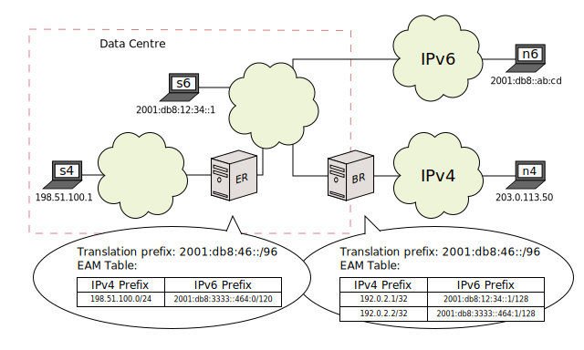
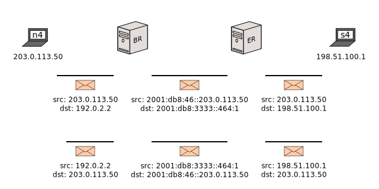

[Documentation](documentation.html) > [Architectures](documentation.html#architectures) > SIIT-DC: Dual Translation Mode

# SIIT-DC: Dual Translation Mode

## Index

1. [Introduction](#introduction)
2. [Sample Network](#sample-network)
3. [Configuration](#configuration)

## Introduction

This document is a summary of the _SIIT-DC: Dual Translation Mode_ (SIIT-DC-DTM) architecture, and a small walkthrough that builds it using Jool.

SIIT-DC-DTM is an optional improvement over [SIIT-DC](siit-dc.html) which adds a mirror translator to inherit the benefits of [464XLAT](464xlat.html).

## Sample Network

This is the sample architecture from [RFC 7756 section 3.2]({{ site.draft-siit-dc-2xlat }}#section-3.2):

It's the same as SIIT-DC, except an isolated IPv4 island amidst the IPv6-only Data Centre has been added. _ER_ will revert the translation done by _BR_ so these nodes can seemingly natively communicate with the IPv4 Internet.

You need this if SIIT-DC doesn't suffice because some application in the Data Centre either doesn't support NAT (i.e., the lack of end-to-end transparency of IP addresses) or gets a flu whenever IPv6 is around.

This will be the expected packet flow (in addition to the ones in the [SIIT-DC Architecture](siit-dc.html)):

## Configuration

Start from the [SIIT-DC configuration](siit-dc.html#configuration) and add the following SIIT Jool setup on _ER_:


sysctl -w net.ipv4.conf.all.forwarding=1
sysctl -w net.ipv6.conf.all.forwarding=1

modprobe jool_siit
jool_siit instance add --netfilter --pool6 2001:db8:46::/96
jool_siit eamt add 198.51.100.0/24 2001:db8:3333::464:0/120


And the new server record on _BR_:


jool_siit eamt add 192.0.2.2 2001:db8:3333::464:1


Of course, also make sure `2001:db8:3333::464:0/120` is routed towards _ER_'s IPv6 interface.

