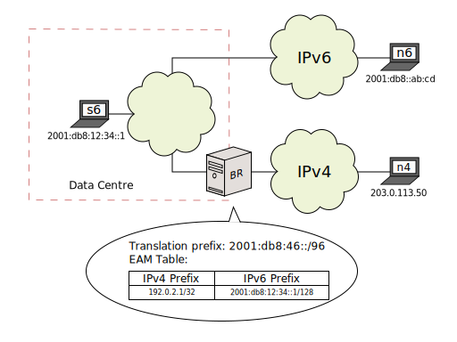
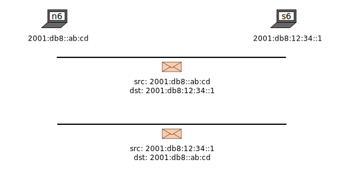
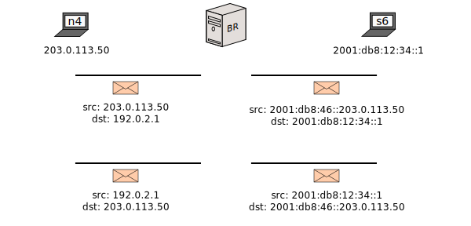

[Documentation](documentation.html) > [Architectures](documentation.html#architectures) > SIIT-DC

# SIIT-DC

## Index

1. [Introduction](#introduction)
2. [Sample Network](#sample-network)
3. [Configuration](#configuration)

## Introduction

This document is a summary of the [_SIIT-DC_ architecture]({{ site.draft-siit-dc }}), and a small walkthrough that builds it using Jool.

SIIT-DC is an improvement over traditional SIIT where EAMs are introduced and standardized. With this, IPv4 address usage is optimized and IPv4 address embedding (in IPv6 servers) becomes redundant.

## Sample Network

This is the sample architecture from [RFC 7755 section 3]({{ site.draft-siit-dc }}#section-3):

_n6_ is a random IPv6 client. _s6_ is one of your Data Centre servers (IPv6). _n4_ is a random IPv4 client. _BR_ ("Border Relay") is an SIIT.

`2001:db8:46::/96` is routed to _BR_'s Data Centre-facing interface, and similarly, `192.0.2.1/32` (or covering aggregate) is routed to its IPv4 Internet-facing interface. This is done using standard IP routing techniques.

The jist of SIIT-DC is _n6_ can use _s6_'s IPv6-only service using normal IPv6 connectivity, while _n4_ can use it via _BR_.

This will be the expected packet flow for _n6_:

And this will be the expected packet flow for _n4_:

_n4_'s source is translated by means of the traditional [RFC 6052](https://tools.ietf.org/html/rfc6052) prefix. Of course, this is not limited to _n4_: Any v4 Internet node address will be translated this way. The net result is that, from the Data Centre's perspective, the whole v4 Internet is nothing more than just another network named "`2001:db8:46::/96`".

On the other hand, _s6_'s address is translated via the EAMT. This is done so you don't have to embed an IPv4 address in _s6_'s IPv6 address. (Which could become a significant pain when you're designing your network.)

In general, some properties of SIIT-DC are:

- Mostly Single (IPv6) Stack operation (in the Data Centre). This simplifies maintenance as running one protocol is simpler than two.
- Native IPv6 traffic is never modified at all.
- Scales elegantly (Fully stateless operation, which can be painlessly replicated for redundancy).
- Can optimize IPv4 address usage within the Data Centre (because it doesn't impose restrictions on the servers' IPv6 addresses).
- Promotes IPv6 deployment (IPv4 end-user connectivity becomes a service provided by the network).
- If you want to stop needing IPv4 in the future, all you need to do is shut down _BR_.

The DNS is expected to work the same way as if you were dual stacking: If a node requests _s6_'s IPv4 address, the DNS server should return `192.0.2.1`. If a node requests _s6_'s IPv6 address, the DNS should return `2001:db8:12:34::1`.

## Configuration

Obviating networking commands, this is Jool on _BR_:


user@BR:~# sysctl -w net.ipv4.conf.all.forwarding=1
user@BR:~# sysctl -w net.ipv6.conf.all.forwarding=1
user@BR:~# 
user@BR:~# modprobe jool_siit
user@BR:~# jool_siit instance add --netfilter --pool6 2001:db8:46::/96
user@BR:~# jool_siit eamt add 192.0.2.1 2001:db8:12:34::1


For every server you want to publish on IPv4, you add one EAMT entry (as done above for _s6_) and appropriate DNS records.

