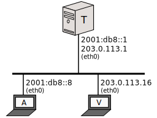

[Documentation](documentation.html) > [Other Sample Runs](documentation.html#other-sample-runs) > Single Interface

# Single Interface

This nugget is here only to tell you that if you want your SIIT or NAT64 to service both protocols on the same interface, you're still covered. Jool can see packets coming from any interface, and can send packets via any interface. (It ignores loopback, though.)

This is the same setup as in the [Stateful NAT64 Run](run-nat64.html), except from the fact that everyone is now sharing the same cord, and also I removed the redundant nodes because you get the point.

_A_ and _V_ are configured exactly as in their stateful run counterparts, so I'll skip their commands. All that's different is _T_ now having all of its addresses on the same interface:

	user@T:~# /sbin/ip link set eth0 up
	user@T:~# /sbin/ip address add 2001:db8::1/96 dev eth0
	user@T:~# /sbin/ip address add 203.0.113.1/24 dev eth0
	user@T:~# 
	user@T:~# sysctl -w net.ipv4.conf.all.forwarding=1
	user@T:~# sysctl -w net.ipv6.conf.all.forwarding=1
	user@T:~# 
	user@T:~# /sbin/modprobe jool
	user@T:~# jool instance add --netfilter --pool6 64:ff9b::/96

So basically, _A_ and _V_ share a cord, but they still can't talk because they don't speak the same language. That is, unless they ask _T_ to translate their little chat:

	user@A:~$ /bin/ping6 64:ff9b::203.0.113.16
	PING 64:ff9b::203.0.113.16(64:ff9b::cb00:7110) 56 data bytes
	64 bytes from 64:ff9b::cb00:7110: icmp_seq=1 ttl=63 time=10.0 ms
	64 bytes from 64:ff9b::cb00:7110: icmp_seq=2 ttl=63 time=8.16 ms
	64 bytes from 64:ff9b::cb00:7110: icmp_seq=3 ttl=63 time=8.39 ms
	64 bytes from 64:ff9b::cb00:7110: icmp_seq=4 ttl=63 time=5.64 ms
	^C
	--- 64:ff9b::203.0.113.16 ping statistics ---
	4 packets transmitted, 4 received, 0% packet loss, time 3003ms
	rtt min/avg/max/mdev = 5.645/8.057/10.025/1.570 ms

