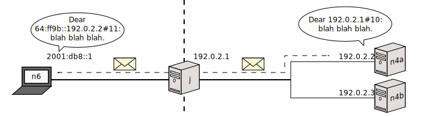
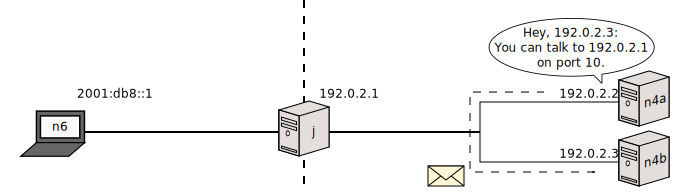
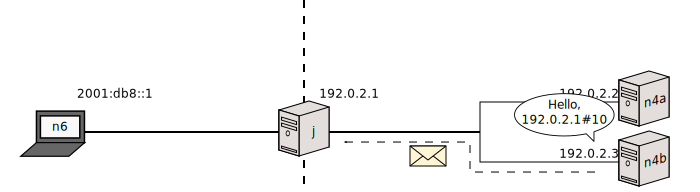
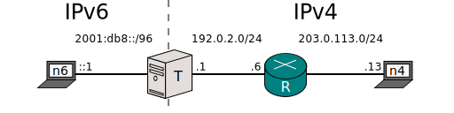
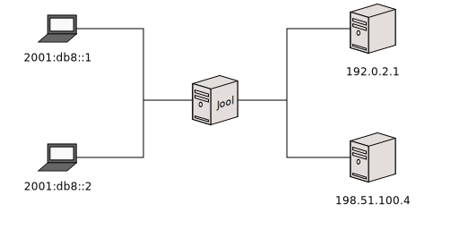

[Documentation](documentation.html) > [Userspace Clients](documentation.html#userspace-clients) > `global` Mode

# `global` Mode

## Index

1. [Description](#description)
2. [Syntax](#syntax)
3. [Examples](#examples)
4. [Keys](#keys)
	1. [`manually-enabled`](#manually-enabled)
	1. [`pool6`](#pool6)
	1. [`lowest-ipv6-mtu`](#lowest-ipv6-mtu)
	1. [`logging-debug`](#logging-debug)
	1. [`address-dependent-filtering`](#address-dependent-filtering)
	2. [`drop-icmpv6-info`](#drop-icmpv6-info)
	3. [`drop-externally-initiated-tcp`](#drop-externally-initiated-tcp)
	4. [`udp-timeout`](#udp-timeout)
	5. [`tcp-est-timeout`](#tcp-est-timeout)
	6. [`tcp-trans-timeout`](#tcp-trans-timeout)
	7. [`icmp-timeout`](#icmp-timeout)
	8. [`maximum-simultaneous-opens`](#maximum-simultaneous-opens)
	8. [`source-icmpv6-errors-better`](#source-icmpv6-errors-better)
	8. [`logging-bib`](#logging-bib)
	8. [`logging-session`](#logging-session)
	9. [`zeroize-traffic-class`](#zeroize-traffic-class)
	10. [`override-tos`](#override-tos)
	11. [`tos`](#tos)
	13. [`amend-udp-checksum-zero`](#amend-udp-checksum-zero)
	14. [`randomize-rfc6791-addresses`](#randomize-rfc6791-addresses)
	13. [`mtu-plateaus`](#mtu-plateaus)
	15. [`eam-hairpin-mode`](#eam-hairpin-mode)
	16. [`rfc6791v4-prefix`](#rfc6791v4-prefix)
	16. [`rfc6791v6-prefix`](#rfc6791v6-prefix)
	21. [`f-args`](#f-args)
	22. [`handle-rst-during-fin-rcv`](#handle-rst-during-fin-rcv)
	23. [`ss-enabled`](#ss-enabled)
	24. [`ss-flush-asap`](#ss-flush-asap)
	25. [`ss-flush-deadline`](#ss-flush-deadline)
	26. [`ss-capacity`](#ss-capacity)
	27. [`ss-max-payload`](#ss-max-payload)
	28. [`ss-max-sessions-per-packet`](#ss-max-sessions-per-packet)

## Description

Controls several of Jool's internal variables.

## Syntax

	(jool_siit | jool) global display [--csv]
	(jool_siit | jool) global update <flag key> <new value>

## Examples

Display the current configuration, keys and values:

	# jool_siit global display

Pause Jool:

	# jool global update manually-enabled false

Turn "address dependent filtering" on:

	$ # true, false, 1, 0, yes, no, on and off all count as valid booleans.
	# jool global update address-dependent-filtering true

Update the plateaus list:

	# jool_siit global update mtu-plateaus "6000, 5000, 4000, 3000, 2000, 1000"

## Keys

The following flag keys are available:

### `manually-enabled`

- Type: Boolean
- Default: True
- Modes: Both (SIIT and Stateful NAT64)

Resumes (`true`) and pauses (`false`) translation of packets.

When Netfilter Jool is paused, packets skip it and are handled normally by the kernel. When iptables Jool is paused, it drops the traffic that matches its iptables rules.

Timers will _not_ be paused. [BIB](usr-flags-bib.html)/[session](usr-flags-session.html) entries and stored [packets](#maximum-simultaneous-opens) might die while Jool is idle.

### `pool6`

- Type: IPv6 prefix
- Default: null
- Modes: SIIT only
- Translation direction: Both
- Source: [RFC 6052](https://tools.ietf.org/html/rfc6052)

Updates the [IPv6 Address Pool prefix](pool6.html).

**This flag is SIIT-only**. It is no longer possible for NAT64 instaces to change the prefix that was set during the instance add due to race conditions.

If you want, the prefix can unset through the `null` keyword:


user@T:~# jool_siit global update pool6 null


### `lowest-ipv6-mtu`

- Type: Integer
- Default: 1280
- Modes: Both (SIIT and Stateful NAT64)
- Translation direction: IPv4 to IPv6
- Source: [RFC 7915](https://tools.ietf.org/html/rfc7915)

You want to set this value as the minimum MTU accross all your IPv6 networks. All incoming IPv4 packets containing a disabled Don't Fragment (DF) flag will be fragmented to `lowest-ipv6-mtu` size once translated to IPv6.

Why? Because the IPv6 header lacks a DF counterpart. All IPv6 packets behave as if DF were enabled. If Jool translates a DF-disabled IPv4 packet into an IPv6 packet, and the resulting packet is larger than the available MTU, then it will not be able to reach its destination. If the IPv4 note insists on sending such DF-disabled large packets in hopes that the IPv6 router will eventually fragment them, the result will be a black hole.

This flag does not affect DF-enabled IPv4 packets, because those operate under normal Path MTU Discovery rules, so never rely on fragmenting routers.

To enhance performance, you want to minimize fragmentation, which means you want to assign the largest possible value to this flag. You do not want to assign a value that is larger than your overall minimum IPv6 MTU however, as this may end up causing black holes as explained above.

A more graphic explanation can be found [here](mtu.html).

### `logging-debug`

- Type: Boolean
- Default: false
- Modes: Both (SIIT and Stateful NAT64)
- Source: [Issue 336](https://github.com/NICMx/Jool/issues/336)

Print the instance's debug messages on the log?

The logging messages can typically be found by querying the [`dmesg`](https://www.man7.org/linux/man-pages/man1/dmesg.1.html) program, or (if syslog is listening) the `/var/log/syslog` file.

Here's an example of a successful IPv4->IPv6 SIIT translation:

	$ sudo jool_siit global update logging-debug true
	$ dmesg -t
	Jool SIIT/6b514d00/default: ===============================================
	Jool SIIT/6b514d00/default: Packet: 198.51.100.2->192.0.2.33
	Jool SIIT/6b514d00/default: UDP 4000->2000
	Jool SIIT/6b514d00/default: Translating the Packet.
	Jool SIIT/6b514d00/default: Result: 2001:db8:1c6:3364:2::->2001:db8:1c0:2:21::
	Jool SIIT/6b514d00/default: Routing: 2001:db8:1c6:3364:2::->2001:db8:1c0:2:21::
	Jool SIIT/6b514d00/default: Packet routed via device 'to_client_v6'.
	Jool SIIT/6b514d00/default: Sending packet.
	Jool SIIT/6b514d00/default: Success.

The label `SIIT/6b514d00/default` is the instance identifier (`<stateness>/<namespace>/<name>`). See [`instance display`](usr-flags-instance.html#examples).

Here's an example of a successful IPv6->IPv4 NAT64 translation:

	$ sudo jool global update logging-debug true
	$ dmesg -t
	Jool NAT64/6b514d00/default: ===============================================
	Jool NAT64/6b514d00/default: Packet: 2001:db8::5->64:ff9b::c000:205
	Jool NAT64/6b514d00/default: TCP 2000->4000
	Jool NAT64/6b514d00/default: Step 1: Determining the Incoming Tuple
	Jool NAT64/6b514d00/default: Tuple: 2001:db8::5#2000 -> 64:ff9b::c000:205#4000 (TCP)
	Jool NAT64/6b514d00/default: Done step 1.
	Jool NAT64/6b514d00/default: Step 2: Filtering and Updating
	Jool NAT64/6b514d00/default: BIB entry: 2001:db8::5#2000 - 192.0.2.2#2000 (TCP)
	Jool NAT64/6b514d00/default: Session entry: 2001:db8::5#2000 - 64:ff9b::c000:205#4000 | 192.0.2.2#2000 - 192.0.2.5#4000 (TCP)
	Jool NAT64/6b514d00/default: Done: Step 2.
	Jool NAT64/6b514d00/default: Step 3: Computing the Outgoing Tuple
	Jool NAT64/6b514d00/default: Tuple: 192.0.2.2#2000 -> 192.0.2.5#4000 (TCP)
	Jool NAT64/6b514d00/default: Done step 3.
	Jool NAT64/6b514d00/default: Step 4: Translating the Packet
	Jool NAT64/6b514d00/default: Routing: 192.0.2.2->192.0.2.5
	Jool NAT64/6b514d00/default: Packet routed via device 'to_client_v4'.
	Jool NAT64/6b514d00/default: Done step 4.
	Jool NAT64/6b514d00/default: Sending packet.
	Jool NAT64/6b514d00/default: Success.

By default, debug logging needs to be enabled on a per-instance basis, and only prints debug messages that correspond to that particular instance. The compilation flag [`-DDEBUG`](https://github.com/NICMx/Jool/wiki/Jool's-Compilation-Options#-ddebug) enables all debug logging by default, including debug logging not associated with an instance.

Though it's called "instance _debug_ logging," Jool actually uses INFO severity. This is because DEBUG level requires the `-DDEBUG` flag.

Make sure to disable this flag in production. It slows things down, and if syslog is listening, the log messages quickly eat up large amounts of disk space.

### `address-dependent-filtering`

<!-- TODO I think this documentation is somewhat incorrect now. -->

- Type: Boolean
- Default: OFF
- Modes: Stateful NAT64 only
- Source: Scattered at RFC 6146. One summary is at the end of [section 1.2.3](http://tools.ietf.org/html/rfc6146#section-1.2.3).

Long story short:

- `address-dependent-filtering` ON means Jool should be an (address)-restricted-cone NAT.
- `address-dependent-filtering` OFF means Jool should be a full-cone NAT.

Long story long:

Suppose _n6_ is talking with _n4a_ via the NAT64:



The relevant [BIB entry](bib.html) is

| IPv6 transport address | IPv4 transport address | Protocol |
|------------------------|------------------------|----------|
| 2001:db8::1#10         | 192.0.2.1#10           | TCP      |

_n4b_ realizes the existence of _n6_'s service, perhaps because _n4a_ tells him about it:



Then _n4b_ tries to chat _n6_ too:



Because the BIB entry exists, _J_ knows that _n4b_ means "2001:db8::1#10" when he says "192.0.2.1#10", so the packet can technically be translated. However, because of the session tables, _J_ can also tell that _n6_ hasn't been talking to _n4b_ in the past.

If `address-dependent-filtering` is OFF, _J_ will allow _n4b_'s packet through. If `address-dependent-filtering` is ON, _J_ will drop _n4b_'s packet and respond with a "Communication Administratively Prohibited" ICMP error. This effectively wrecks any IPv4-started communication attempts, even if there are BIB entries (static or otherwise).

* If you're using the NAT64 to publish a IPv6-only service to the IPv4 Internet, it makes sense for `address-dependent-filtering` to be OFF. This is because clients are expected to find out about the IPv6 service on their own, and the server doesn't normally start packet streams.
* If you're using the NAT64 to allow IPv6 nodes to browse the IPv4 Internet, please consider the recommendation on [RFC6888 REQ-7](https://tools.ietf.org/html/rfc6888#section-3) before setting `address-dependent-filtering` to ON.  While it's true that  clients choose their ports at random, so it is suspicious for random outsider nodes to guess these ports, `address-dependent-filtering` ON might break NAT traversal methods like STUN (or at least make some operation modes impossible) or it might impair some games and peer-to-peer applications.

### `drop-icmpv6-info`

- Type: Boolean
- Default: OFF
- Modes: Stateful NAT64 only
- Source: [RFC 6146, section 3.5.3](http://tools.ietf.org/html/rfc6146#section-3.5.3)

If you turn this on, pings (both requests and responses) will be blocked while being translated from ICMPv6 to ICMPv4.

For some reason, we're not supposed to block pings from ICMPv4 to ICMPv6, but since you need both a request and a response for a successful echo, the outcome seems to be the same.

This rule will not affect Error ICMP messages.

### `drop-externally-initiated-tcp`

- Type: Boolean
- Default: OFF
- Modes: Stateful NAT64 only
- Source: [RFC 6146, section 3.5.2.2](http://tools.ietf.org/html/rfc6146#section-3.5.2.2)

Turn `drop-externally-initiated-tcp` ON to wreck any attempts of IPv4 nodes to initiate TCP communication to IPv6 nodes.

Of course, this will not block IPv4 traffic if some IPv6 node first requested it.

The filtering will be completely silent; no ICMP error ("Communication Administratively Prohibited" or otherwise) will be returned to the v4 nodes.

### `udp-timeout`

- Type: String ("`[[HH:]MM:]SS[.mmm]`" format)
- Default: 5:00
- Modes: Stateful NAT64 only
- Source: [RFC 6146, section 3.5.1](http://tools.ietf.org/html/rfc6146#section-3.5.1)

When a UDP session has been lying around inactive for this long, its entry will be removed from the database automatically.

When you change this value, the lifetimes of all already existing UDP sessions are updated.

### `tcp-est-timeout`

- Type: Integer ("`[[HH:]MM:]SS[.mmm]`" format)
- Default: 2:00:00
- Modes: Stateful NAT64 only
- Source: [RFC 6146, section 3.5.2.2](http://tools.ietf.org/html/rfc6146#section-3.5.2.2)

When an established TCP connection has remained inactive for this long, its existence will be questioned. Jool will send a probe packet to one of the endpoints and kill the session if a response is not received before the `tcp-trans-timeout` timeout.

When you change this value, the lifetimes of all already existing established TCP sessions are updated.

### `tcp-trans-timeout`

- Type: Integer ("`[[HH:]MM:]SS[.mmm]`" format)
- Default: 4:00
- Modes: Stateful NAT64 only
- Source: [RFC 6146, derivatives of section 3.5.2](http://tools.ietf.org/html/rfc6146#section-3.5.2)

When an unhealthy TCP session has been lying around inactive for this long, its entry will be removed from the database automatically. An "unhealthy" session is one in which the TCP handshake has not yet been completed, it is being (or has been) terminated by the endpoints, or is technically established but has remained inactive for `tcp-est-timeout` time.

When you change this value, the lifetimes of all already existing transitory TCP sessions are updated.

### `icmp-timeout`

- Type: Integer ("`[[HH:]MM:]SS[.mmm]`" format)
- Default: 1:00
- Modes: Stateful NAT64 only
- Source: [RFC 6146, section 3.5.3](http://tools.ietf.org/html/rfc6146#section-3.5.3)

When a ICMP session has been lying around inactive for this long, its entry will be removed from the database automatically.

When you change this value, the lifetimes of all already existing ICMP sessions are updated.

### `maximum-simultaneous-opens`

- Type: Integer
- Default: 10
- Modes: Stateful NAT64 only
- Source: [RFC 6146, section 5.3](http://tools.ietf.org/html/rfc6146#section-5.3) (indirectly)

When an external (IPv4) node first attempts to open a connection and there's no [BIB entry](bib.html) for it, Jool normally answers with an Address Unreachable (type 3, code 1) ICMP error message, since it cannot know which IPv6 node the packet is heading.

In the case of TCP, the situation is a little more complicated because the IPv4 node might be attempting a <a href="{{ site.repository-url }}/issues/58#issuecomment-43537094" target="_blank">Simultaneous Open of TCP Connections</a>. To really know what's going on, Jool has to store the packet for 6 seconds.

`maximum-simultaneous-opens` is the maximum amount of packets Jool will store at a time. The default means that you can have up to 10 "simultaneous" simultaneous opens; Jool will fall back to immediately answer the ICMP error message on the eleventh one.

### `source-icmpv6-errors-better`

- Type: Boolean
- Default: True
- Modes: Stateful NAT64 only
- Translation direction: IPv4 to IPv6 (ICMP errors only)
- Source: [Issue 132]({{ site.repository-url }}/issues/132)

For some reason, RFC 6146 wants the source of translated ICMPv6 errors to be the same as their inner packets' destination address. This looks really weird.



Say the link between _R_ and _n4_ collapses.

1. _n6_ TCP-packets _n4_: 2001:db8::1 -> 64:ff9b::203.0.113.13.
2. _T_ translates and forwards: 192.0.2.1 -> 203.0.113.13
3. _R_ answers ICMPv4 error "Host unreachable". The error packet's addresses are 192.0.2.6 -> 192.0.2.1.
4. _T_ translates into an IPv6 packet whose addresses are 64:ff9b::203.0.113.13 -> 2001:db8::1 (because this is the inverse of the first packet).

[This breaks traceroutes]({{ site.repository-url }}/issues/132). Shouldn't it have been 64:ff9b::**192.0.2.6** -> 2001:db8::1 instead?

- `source-icmpv6-errors-better` OFF will make Jool obey RFC 6146 (and break traceroutes).
- `source-icmpv6-errors-better` ON will translate the outer source address directly, simply appending the prefix to the source address of the original (step 3) packet.

### `logging-bib`

- Type: Boolean
- Default: False
- Modes: Stateful NAT64 only
- Translation direction: Both
- Source: [RFC 6888, section 4](http://tools.ietf.org/html/rfc6888#section-4)

Enables logging of transport address mappings as they are created and destroyed. If you are a Service Provider, your government might require you to do this.

Analysis of these logs can let you know which IPv4 address and port masked your "internal" (IPv6) nodes at a certain time. Here's a sample output:

	$ jool global update logging-bib true
	$ dmesg
	[  312.493235] alpha 2015/4/8 16:13:2 (GMT) - Mapped 2001:db8::5#19945 to 192.0.2.2#8208 (UDP)
	[  373.724229] alpha 2015/4/8 16:14:3 (GMT) - Mapped 2001:db8::8#46516 to 192.0.2.2#12592 (TCP)
	[  468.675524] alpha 2015/4/8 16:15:38 (GMT) - Forgot 2001:db8::5#19945 to 192.0.2.2#8208 (UDP)

In this example,

1. `2001:db8::5` used (its own) port 19945 to speak to someone using the UDP protocol. This someone thought `2001:db8::5`'s address was `192.0.2.2`, and that it was using port 8208. 
2. Roughly a minute later, `2001:db8::8` (on port 46516) started speaking to somebody using TCP. It's being masked as `192.0.2.2`#12592. This connection has not yet ended.
3. Some time later, Jool forgot the UDP mapping (because of inactivity, not because the last packet happened at 16:15:38. "How much inactivity" is controlled by the timeouts - in this case, the [UDP one](#udp-timeout)). At this point, `192.0.2.2`#8208 is free from `2001:db8::5` and Jool can reassign it.

All of this was performed by the instance whose name is "alpha."

So, if your government comes and says "I detected somebody named `192.0.2.2`#8208 did something illegal at 4:14 pm via UDP", you can report the culprit is `2001:db8::5`#19945 and free yourself from the blame.

There are several important things to notice:

- Each mapping's uniquenesss extends to the protocol. If your logging only says `Mapped 2001:db8::5#19945 to 192.0.2.2#8208 (UDP)`, you **can't** assume `2001:db8::5`#19945 is `192.0.2.2`#8208 on TCP as well.
- Your IPv6 nodes share IPv4 addresses! Therefore, mind the ports.
- There's no information on _who_ was `2001:db8::5` talking to. This is a _good_ thing; it means you're honoring your client's privacy as much as you can.
- The logging uses GMT; you might need to convert this for comfort.

This defaults to false because it generates humongous amounts of logs while active (remember you need infrastructure to maintain them). Notice the maps are dumped into the _kernel log_, so the messages will be mixed along with anything else the kernel has to say. The log messages will have [INFO priority](http://stackoverflow.com/questions/16390004/change-default-console-loglevel-during-boot-up).

If logging the destination makes sense for you, see `logging-session` (below). To comply with REQ-12 of RFC 6888 you want to set `loging-bib` as true and `logging-session` as false.

### `logging-session`

- Type: Boolean
- Default: False
- Modes: Stateful NAT64 only
- Translation direction: Both
- Source: [RFC 6888, section 4](http://tools.ietf.org/html/rfc6888#section-4)

Enables logging of every session as they are created and destroyed.

The format is

	<instance name> <date> <time> (GMT) - <action> session <IPv6 node>|<IPv6 representation of IPv4 node>|<IPv4 representation of IPv6 node>|<IPv4 node>|Protocol

Here's a sample output:

	$ jool global update logging-session true
	$ dmesg
	[ 3238.087902] alpha 2015/4/8 17:1:47 (GMT) - Added session 1::5#47073|64:ff9b::c000:205#80|192.0.2.2#63527|192.0.2.5#80|TCP
	[ 3238.099997] alpha 2015/4/8 17:1:47 (GMT) - Added session 1::5#47074|64:ff9b::c000:205#80|192.0.2.2#42527|192.0.2.5#80|TCP
	[ 3241.624104] alpha 2015/4/8 17:1:51 (GMT) - Added session 1::5#33160|64:ff9b::c000:205#8080|192.0.2.2#15496|192.0.2.5#8080|TCP
	[ 3241.630905] alpha 2015/4/8 17:1:51 (GMT) - Added session 1::5#33161|64:ff9b::c000:205#8080|192.0.2.2#7060|192.0.2.5#8080|TCP
	[ 3478.498559] alpha 2015/4/8 17:5:48 (GMT) - Forgot session 1::5#47073|64:ff9b::c000:205#80|192.0.2.2#63527|192.0.2.5#80|TCP
	[ 3478.499758] alpha 2015/4/8 17:5:48 (GMT) - Forgot session 1::5#47074|64:ff9b::c000:205#80|192.0.2.2#42527|192.0.2.5#80|TCP
	[ 3481.632214] alpha 2015/4/8 17:5:51 (GMT) - Forgot session 1::5#33160|64:ff9b::c000:205#8080|192.0.2.2#15496|192.0.2.5#8080|TCP
	[ 3481.632342] alpha 2015/4/8 17:5:51 (GMT) - Forgot session 1::5#33161|64:ff9b::c000:205#8080|192.0.2.2#7060|192.0.2.5#8080|TCP

This log is remarcably more voluptuous than [`logging-bib`](#logging-bib), not only because each message is longer, but because sessions are generated and destroyed more often than BIB entries. (Each BIB entry can have multiple sessions.) Because of REQ-12 from [RFC 6888 section 4](http://tools.ietf.org/html/rfc6888#section-4), chances are you don't even want the extra information sessions grant you.

### `zeroize-traffic-class`

- Type: Boolean
- Default: OFF
- Modes: Both (SIIT and Stateful NAT64)
- Translation direction: IPv4 to IPv6
- Source: [RFC 7915, section 4.1]({{ site.rfc-siit }}#section-4.1)

The <a href="http://en.wikipedia.org/wiki/IPv6_packet#Fixed_header" target="_blank">IPv6 header</a>'s Traffic Class field is very similar to <a href="http://en.wikipedia.org/wiki/IPv4#Header" target="_blank">IPv4</a>'s Type of Service (TOS).

If you leave this OFF, the TOS value will be copied directly to the Traffic Class field. If you turn this ON, Jool will always set Traffic Class as **zero** instead.

### `override-tos`

- Type: Boolean
- Default: OFF
- Modes: Both (SIIT and Stateful NAT64)
- Translation direction: IPv6 to IPv4
- Source: [RFC 7915, section 5.1]({{ site.rfc-siit }}#section-5.1)

The <a href="http://en.wikipedia.org/wiki/IPv6_packet#Fixed_header" target="_blank">IPv6 header</a>'s Traffic Class field is very similar to <a href="http://en.wikipedia.org/wiki/IPv4#Header" target="_blank">IPv4</a>'s Type of Service (TOS).

If you leave this OFF, the Traffic Class value will be copied directly to the TOS field during IPv6-to-IPv4 translations. If you turn this ON, Jool will always set TOS as [`tos`](#tos) instead.

### `tos`

- Type: Integer
- Default: 0
- Modes: Both (SIIT and Stateful NAT64)
- Translation direction: IPv6 to IPv4
- Source: [RFC 7915, section 5.1]({{ site.rfc-siit }}#section-5.1)

Value to set the TOS value of the packets' IPv4 fields during IPv6-to-IPv4 translations. _This only applies when [`override-tos`](#override-tos) is ON_.

### `amend-udp-checksum-zero`

- Type: Boolean
- Default: OFF
- Modes: SIIT only
- Translation direction: IPv4 to IPv6 (UDP only)
- Source: [RFC 7915, section 4.5]({{ site.rfc-siit }}#section-4.5)

It is legal for IPv4/UDP packets to contain zero as checksum. This is because the whole thing about UDP is that it is unreliable, and the value of checksum validation might therefore not justify its overhead.

Zero is an invalid checksum value for IPv6/UDP packets.

- If `amend-udp-checksum-zero` is ON and a zero-checksum IPv4-UDP packet arrives, Jool will compute its checksum before translating it. This can be computationally expensive.
- If `amend-udp-checksum-zero` is OFF and a zero-checksum IPv4-UDP packet arrives, Jool will unceremoniously drop the packet and log its addresses (with [Log Level](http://elinux.org/Debugging_by_printing#Log_Levels) KERN_DEBUG).

This does not affect _fragmented_ zero-checksum IPv4-UDP packets. SIIT Jool does not reassemble, which means it _cannot_ compute the checksum. In these cases, the packet will be dropped regardless of `amend-udp-checksum-zero`.

Stateful NAT64 Jool _always_ computes zero-checksums from IPv4-UDP packets. Because it reassembles, it will also do so for fragmented packets.

The `JSTAT46_FRAGMENTED_ZERO_CSUM` [stat](usr-flags-stats.html) counts packets dropped by `amend-udp-checksum-zero`, as well as fragmented zero-checksum IPv4/UDP packets.

### `randomize-rfc6791-addresses`

- Type: Boolean
- Default: ON
- Modes: SIIT only
- Translation direction: IPv6 to IPv4
- Source: [Issue 130]({{ site.repository-url }}/issues/130)

If an ICMPv6 error's source cannot be translated, [RFC 6791](https://tools.ietf.org/html/rfc6791) wants us to assign as source a random IPv4 address from the [RFC 6791 pool](#rfc6791v4-prefix).

- If `randomize-rfc6791-addresses` is ON, Jool will follow RFC 6791's advice, assigning a random address from the pool.
- If `randomize-rfc6791-addresses` is OFF, Jool will assign the `hop limit`th address from the pool.

Why? [It can be argued that `hop limit`th is better]({{ site.repository-url }}/issues/130).

### `mtu-plateaus`

- Type: List of Integers separated by commas (If you want whitespace, remember to quote).
- Default: "65535, 32000, 17914, 8166, 4352, 2002, 1492, 1006, 508, 296, 68"
- Modes: Both (SIIT and Stateful NAT64)
- Translation direction: IPv4 to IPv6 (ICMP errors only)
- Source: [RFC 7915, section 4.2]({{ site.rfc-siit }}#section-4.2)

When a packet should not be fragmented and doesn't fit into a link it's supposed to traverse, the troubled router is supposed to respond an error message indicating _Fragmentation Needed_. Ideally, this error message would contain the MTU of the link so the original emitter would be aware of the ideal packet size and avoid fragmentation. However, the original ICMPv4 specification did not require routers to include this information, so old ware might tend to omit it.

Backwards compatibility awards IPv4 emmiters strategies to fall back when they encounter such a situation, but IPv6 has always been designed with the field present in mind. Therefore, if Jool translates a zero-MTU ICMPv4 message into a zero-MTU ICMPv6 message, chaos *might* ensue (actual results will depend mainly on the IPv6 client's implementation).

To address this problem, when Jool finds itself attempting to translate a zero-MTU message, it will replace the MTU with the greatest plateau which is lower than the original packet's Total Length field. Admittedly, this might or might not be the correct MTU, but is a very educated guess. See [this example](usr-flags-plateaus.html) for more details. More in-depth information can be found in [RFC 1191](http://tools.ietf.org/html/rfc1191).

Notice that the minimum IPv6 MTU is 1280. This will override the plateau result if the resulting value is less than 1280.

You don't really need to sort the values as you input them.

### `eam-hairpin-mode`

- Type: enum
- Default: intrinsic
- Modes: SIIT only
- Translation direction: Both (mainly v6 to v4)
- Source: [RFC 7757, section 4](http://tools.ietf.org/html/rfc7757#section-4)

Defines how is hairpinning handled in EAMT-translated traffic. "Hairpinning" is when an IPv6-to-IPv4 translation has to be immediately followed by a IPv4-to-IPv6 translation for the same packet. (This can happen because, according to the EAMT, the [destination of the IPv4 packet represents a node in the IPv6 network](https://tools.ietf.org/html/rfc7757#appendix-B.1).) See [section 4](https://tools.ietf.org/html/rfc7757#section-4) for a complete explanation.

`eam-hairpin-mode` is an enum. Its available values are `none`, [`simple`](https://tools.ietf.org/html/rfc7757#section-4.2.1) and [`intrinsic`](https://tools.ietf.org/html/rfc7757#section-4.2.2).

### `rfc6791v4-prefix`

- Type: IPv4 prefix
- Default: null
- Modes: SIIT only
- Translation direction: IPv6 to IPv4
- Source: [RFC 6791](https://tools.ietf.org/html/rfc6791) (We have a [summary](pool6791.html).)

A pool from which Jool will extract an IPv4 address whenever it needs to deliver an ICMPv4 error, but does not otherwise have an IPv4 address to source the packet with.

If this prefix is unset, the SIIT will fall back to use its node's own addresses. Use the keyword `null` to unset:

	jool_siit rfc6791v4-prefix null

### `rfc6791v6-prefix`

- Type: IPv6 prefix
- Default: null
- Modes: SIIT only
- Translation direction: IPv4 to IPv6
- Source: [Issue 176]({{ site.repository-url }}/issues/176)

The IPv6 counterpart of [`rfc6791v4-prefix`](#rfc6791v4-prefix).

A pool from which Jool will extract an IPv6 address whenever it needs to deliver an ICMPv6 error, but does not otherwise have an IPv6 address to source the packet with.

This can be needed when `pool6` is empty and the EAMT does not span all the IPv4 routers between the SIIT and the clients.

If this prefix is unset, the SIIT will fall back to use its node's own addresses. Use the keyword `null` to unset:

	jool_siit rfc6791v6-prefix null

### `f-args`

- Type: Integer
- Default: 11 (binary 1011)
- Modes: Stateful NAT64 only
- Translation direction: IPv6 to IPv4
- Source: [Issue 195]({{ site.repository-url }}/issues/195)

When choosing an IPv4 transport address to mask an IPv6 source, it is [recommended]({{ site.draft-nat64-port-allocation }}) that the address should be as random as possible, but at the same time, dependent of several properties from the connection. You want the randomness to enhance the defense against hijacking of flows, and you want the dependence so that similar connections share similar masks. (Which enhances reliability when IPv4 outsiders expect so.)

In other words, when translating an IPv6 packet from a new connection, the translator needs a function (`F`) that hashes certain fields into an IPv4 transport address (`m`) from pool4, which is then used as the IPv4 packet source (and stored in the BIB and session database):

	F(Source IPv6 address, Destination IPv6 address, Destination port) = m

(Jool's implementation of `F` is [Algorithm 3 of RFC 6056](https://tools.ietf.org/html/rfc6056#page-14).)

The following three packet flows exemplify how this works out. Let's say `2001:db8::1` writes packet `2001:db8::1#5000 -> 64:ff9b::192.0.2.1#80`.



Jool needs a mask. Let's say `F`'s hash yields `203.0.113.6#6789`:

	F(2001:db8::1, 64:ff9b::192.0.2.1, 80) = 203.0.113.6#6789

So Jool stores BIB entry `2001:db8::1#5000 | 203.0.113.6#6789` and the packet is translated as `203.0.113.6#6789 -> 192.0.2.1#80`.

Now let's say another IPv6 node (`2001:db8::2`) opens a socket to someone else. The new packet is `2001:db8::2#6000 -> 64:ff9b::198.51.100.4#443`. `F` yields something else because it has been given different arguments:

	F(2001:db8::2, 64:ff9b::198.51.100.4, 443) = 203.0.113.25#4421

So Jool stores BIB entry `2001:db8::2#6000 | 203.0.113.25#4421` and the packet is translated as `203.0.113.25#4421 -> 198.51.100.4#443`.

Finally, the same IPv6 node needs to open another socket towards the same IPv4 service. (This often happens in multiple socket applications such as gaming. The server will, of course, expect the client's address to be the same.) The new packet is `2001:db8::2#7000 -> 64:ff9b::198.51.100.4#443`. Because all of the relevant arguments are the same, `F` yields the same source as in the previous flow.

	F(2001:db8::2, 64:ff9b::198.51.100.4, 443) = 203.0.113.25#4421

Two BIB entries cannot share the same IPv4 transport address (a _collision_ just happened), so Jool picks a nearby available one. It creates BIB entry `2001:db8::2#7000 | 203.0.113.25#4422` and the packet is translated as `203.0.113.25#4422 -> 198.51.100.4#443`.

You can see the mechanism is designed so masks are scattered randomly across the pool4 domain as much as possible, unless the IPv4 node expects a transport source that is similar to one from a previous connection. (Including the source port in `F` would break this.)

That's all well and good, but it turns out there's at least one protocol (FTP using EPSV) in which the server expects a client to open a second connection on a similar transport source, but the connection is also supposed to interact with another server port. The mechanism explained above usually breaks this second connection because the Destination port randoms the `F` hash so `m` is not necessarily a similar source.

`f-args` allows you to include and exclude arguments from `F`. You can use this to engineer argument combinations that will be friendlier to awkwardly-designed application protocols. Keep in mind though, excluding arguments from `F` increases collision rate because of the reduced randomness, which is somewhat expensive to handle. (for kernel standards, anyway.)

`f-args` is a bit field. Each bit in `f-args` represents an argument to `F`. Activate the bit to include the respective argument (from most significant to least):

1. Source (IPv6) address
2. Source port
3. Destination (IPv6) address
4. Destination port

So, the default value (decimal 11, binary 1011) excludes source port from the equation.

To fix the FTP/EPSV problem, you would remove Destination port from `F`. This would force all connections involving the same nodes to be masked similarly.

Unfortunately, `f-args` can only be entered via its decimal representation. This is possible:

	$ jool global update f-args 10

While this is not:

	$ jool global update f-args 0b1010

### `handle-rst-during-fin-rcv`

- Type: Boolean
- Default: OFF
- Modes: Stateful NAT64 only
- Translation direction: Both
- Source: [Issue 212]({{ site.repository-url }}/issues/212)

Some endpoints have a nasty habit of ending TCP connections ungracefully. Instead of performing a standard FIN handshake (FIN, FIN-ACK, ACK), they kill half-finished packet streams abruptly (FIN, RST). The current NAT64 specification does not seem to consider this, so their respective NAT64 mappings stay alive for `tcp-est-timeout` seconds. Since the connection is being terminated, a `tcp-trans-timeout`-second timeout would be more appropriate. This means these sessions stay alive for longer than they probably should.

If you activate `handle-rst-during-fin-rcv`, Jool will assign the transitory lifetime to connections ended with a FIN followed by a RST. This is nonstandard behavior, but should optimize pool4 utilization.

The only known downside to activating `handle-rst-during-fin-rcv` is that attackers can potentially terminate connections that fulfill the following conditions:

- Are idle. (more than `tcp-trans-timeout` seconds between packets)
- One endpoint has already sent a FIN.

### `ss-enabled`

- Type: Boolean
- Default: OFF
- Modes: Stateful NAT64 only
- Source: [Issue 113]({{ site.repository-url }}/issues/113)

Enable/Disable [Session Synchronization (SS)](session-synchronization.html) on the kernel module.

### `ss-flush-asap`

- Type: Boolean
- Default: ON
- Modes: Stateful NAT64 only
- Source: [Issue 113]({{ site.repository-url }}/issues/113)

Try to send SS sessions as soon as they are created?

When SS is enabled, every packet translation yields an update to the session tables that must be informed to other Jool instances.

In the Active/Active scenario in particular, this essentially means that every translation should ideally yield two packets: A translated version of the input and a multicast to inform the session update to other NAT64 instances. This second packet needs to be sent as soon as possible so whichever instance happens to receive the response to the original packet is updated and prepared for it.

In the Active/Passive model, on the other hand, this level of compulsive replication is rather undesired. Since a single big packet is easier to send than the equivalent many smaller ones, it is preferable to queue the session updates and wrap a bunch of them in a single big multicast, thereby reducing the SS packet-to-translated packet ratio and CPU overhead. This is appropriate in Active/Passive mode because the backup NAT64s are not expected to receive traffic in the near future, and losing a few recent queued session updates on crash is no big deal when the sizeable rest of the database has already been dispatched.

Sessions will be queued until the maximum packet size is reached or a timer expires. The maximum packet size is defined by [`ss-max-sessions-per-packet`](#ss-max-sessions-per-packet) and the duration of the timer is [`ss-flush-deadline`](#ss-flush-deadline).

As a rule of thumb, you might think of this option as an "Active/Active vs Active/Passive" switch; in the former this flag is practically mandatory, while in the latter it is needlessly CPU-taxing. (But still legal, which explains the default.)

In reality, some degree of queuing is still done when this flag is enabled, as otherwise Jool tends to saturate the Netlink (kernel-to-userspace) channel, losing sessions.

### `ss-flush-deadline`

- Type: Integer (milliseconds)
- Default: 2 seconds
- Modes: Stateful NAT64 only
- Source: [Issue 113]({{ site.repository-url }}/issues/113)

If there are queued sessions, an SS packet will be forced out after this amount of time has ellapsed since the last.

Whenever the kernel module sends a packet to userspace, `joold` is expected to answer an ACK. Jool accounts this ACK as a green light to send the next SS packet. This prevents Jool from over-saturating the Netlink channel.

Being that Netlink is not a reliable protocol, the main intent of `ss-flush-deadline` is to prevent lost ACKs from stagnating the SS queue.

It also prevents sessions from staying in the queue for too long regardless of that, particularly when [`ss-flush-asap`](#ss-flush-asap) is disabled.

### `ss-capacity`

- Type: Integer
- Default: 512
- Modes: Stateful NAT64 only
- Source: [Issue 113]({{ site.repository-url }}/issues/113)

Absolute maximum number of sessions the SS queue will allow itself to hold.

If SS cannot keep up with the amount of traffic it needs to multicast, this maximum will be reached and sessions will have to start being dropped.

Watch out for this message in the kernel logs:

	joold: Too many sessions deferred! I need to drop some; sorry.

### `ss-max-payload`

- Type: Integer
- Default: 1452
- Modes: Stateful NAT64 only
- Source: [Issue 113]({{ site.repository-url }}/issues/113)

Deprecated; does nothing as of Jool 4.1.11.

### `ss-max-sessions-per-packet`

- Type: Integer
- Default: 10
- Modes: Stateful NAT64 only
- Source: [Issue 113]({{ site.repository-url }}/issues/113), [issue 410]({{ site.repository-url }}/issues/410)

`joold` (the daemon) is (aside from a few validations) just a bridge; it receives bytes from the kernel module, wraps them in a UDP packet and sends it to other daemons, who similarly pass the bytes untouched. They are not even aware that those bytes contain sessions.

Since fragmentation is undesired, and since the kernel module is (to all intents and purposes) the one that's building the SS packets, it should not exceed the PMTU while doing so. The module has little understanding of the "multicast" network though, so it lacks fancy utilities to compute it. That's where this option comes in.

`ss-max-sessions-per-packet` is the maximum number of sessions joold will transfer per joold packet. You want to maximize it as much as possible, while avoiding IPv4/IPv6 fragmentation.

When `ss-flush-asap false`, Jool will pretty much always wait until this number of sessions has been collected before sending a joold packet. On `ss-flush-asap true`, it will tend to send sessions more eagerly, but will still strictly constrain itself to the maximum.

The optimal value is `floor((M - I - U - R) / S)`, where

1. `M` is the MTU of the path between your joolds (usually 1500),
2. `I` is the size of the header of the IP protocol your joolds will use to exchange sessions (40 for IPv6, 20 for IPv4),
3. `U` is the size of the UDP header (8),
4. `R` is the size of a Netlink attribute header,
5. and `S` is the size of a serialized session.

`R` should be constant (unless something has gone horribly wrong), but ultimately depends on your kernel version. `S` depends on your Jool version, and should only change between minor updates (ie. when the first or second numbers of Jool's version change). One way to find both is by running Jool's `joold` unit test:

```
$ cd /path/to/jool/source
$ cd test/unit/joold
$ make
$ sudo make test | head
...
Jool: Netlink attribute header size: 4
Jool: Serialized session size: 140
...
```

So the default value came out of

```
floor((1500 - max(20, 40) - 8 - 4) / 140)
```

