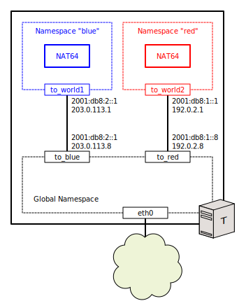

[Documentation](documentation.html) > [Userspace Clients](documentation.html#userspace-clients) > `instance` Mode

# `instance` mode

## Index

1. [Description](#description)
2. [Syntax](#syntax)
3. [Arguments](#arguments)
   1. [Operations](#operations)
   2. [Options](#options)
4. [Examples](#examples)
   1. [Basic Terminal Commands](#basic-terminal-commands)
   1. [Multiple NAT64s in a Single Machine](#multiple-nat64s-in-a-single-machine)
   2. [iptables NAT64 Example](#iptables-nat64-example)

## Description

While `modprobe jool` and `modprobe jool_siit` can respectively be used to teach NAT64 and SIIT to a kernel, they no longer immediately change the kernel's behavior in any way, as of Jool 4.0.0.

To actually start packet translation, an SIIT or NAT64 instance has to be created and attached somewhere in the network stack. That's where `instance` comes in.

As of now, Jool supports two instance types: _Netfilter_ instances and _iptables_ instances. See the [introduction to Jool](intro-jool.html#design) to read upon the differences between the two.

## Syntax

	(jool_siit | jool) instance (
		display
		| add [<name>] (--netfilter|--iptables) [--pool6 <pool6>]
		| remove [<name>]
		| flush
	)

## Arguments

### Operations

* `display`: Print a table listing all the instances known by Jool. (From all network namespaces.)
* `add`: Creates and hooks instance `<name>` to the current network namespace.
* `remove`: Unhooks and deletes instance `<name>` from the current network namespace.
* `flush`: Unhooks and deletes all the instances in the current namespace.

### Options

| Flag              | Default  | Description                                         |
|-------------------|----------|-----------------------------------------------------|
| `--netfilter`     | (absent) | Sit the instance on top of the Netfilter framework. |
| `--iptables`      | (absent) | Sit the instance on top of the iptables framework.  |
| `--pool6`         | `null`   | The instance's [IPv6 Address pool](pool6.html).<br />This argument is mandatory (and must not be `null`) in NAT64. |

### Payload

`<name>`, the name of the instance to add or remove, exists to differentiate separate instances loaded in the same network namespace. You will need it later to configure other aspects of the instance.

It can be up to 15 printable ASCII characters, and defaults to "`default`."

All instances that share stateness and namespace must have different names.

## Examples

### Basic Terminal Commands

```bash
me@T:~# modprobe jool_siit
me@T:~# 
me@T:~# jool_siit instance add --iptables
me@T:~# jool_siit instance add --iptables  alpha
me@T:~# jool_siit instance add --netfilter beta
me@T:~# 
me@T:~# ip netns add blue
me@T:~# ip netns exec blue jool_siit instance add --netfilter alpha
me@T:~# 
me@T:~# jool_siit instance display
+--------------------+-----------------+-----------+
|          Namespace |            Name | Framework |
+--------------------+-----------------+-----------+
| 0xffff8e7ae438e400 |         default |  iptables |
| 0xffff8e7ae438e400 |           alpha |  iptables |
| 0xffff8e7ae438e400 |            beta | netfilter |
| 0xffff8e7ae0001900 |           alpha | netfilter |
+--------------------+-----------------+-----------+
```

Notice that the namespace identifier is fairly nonsensical garbage. Unfortunately, this is expected behavior for now, because namespace names do not exist in the kernel, so Jool has no concept of them. The point is, instances that share a namespace will print the same garbage.

```bash
me@T:~# jool_siit instance remove alpha
me@T:~# jool_siit instance display
+--------------------+-----------------+-----------+
|          Namespace |            Name | Framework |
+--------------------+-----------------+-----------+
| 0xffff8e7ae438e400 |         default |  iptables |
| 0xffff8e7ae438e400 |            beta | netfilter |
| 0xffff8e7ae0001900 |           alpha | netfilter |
+--------------------+-----------------+-----------+
me@T:~# jool_siit instance flush
me@T:~# jool_siit instance display
+--------------------+-----------------+-----------+
|          Namespace |            Name | Framework |
+--------------------+-----------------+-----------+
| 0xffff8e7ae0001900 |           alpha | netfilter |
+--------------------+-----------------+-----------+
me@T:~# ip netns exec blue jool_siit instance flush
me@T:~# jool_siit instance display
+--------------------+-----------------+-----------+
|          Namespace |            Name | Framework |
+--------------------+-----------------+-----------+
+--------------------+-----------------+-----------+
```

### Multiple NAT64s in a Single Machine



Create two namespaces with two _local_ networks each:

```bash
me@T:~# modprobe jool
me@T:~#
me@T:~# # First!
me@T:~# ip netns add blue
me@T:~# ip link add name to_blue type veth peer name to_world1
me@T:~# ip link set dev to_world1 netns blue
me@T:~#
me@T:~# ip link set to_blue up
me@T:~# ip addr add 2001:db8:1::8/96 dev to_blue
me@T:~# ip addr add 192.0.2.8/24 dev to_blue
me@T:~#
me@T:~# ip netns exec blue bash
me@T:~# ip link set to_world1 up
me@T:~# ip addr add 2001:db8:1::1/96 dev to_world1
me@T:~# ip addr add 192.0.2.1/24 dev to_world1
me@T:~# sysctl -w net.ipv4.conf.all.forwarding=1
me@T:~# sysctl -w net.ipv6.conf.all.forwarding=1
me@T:~# exit
me@T:~#
me@T:~# # Second!
me@T:~# ip netns add red
me@T:~# ip link add name to_red type veth peer name to_world2
me@T:~# ip link set dev to_world2 netns red
me@T:~#
me@T:~# ip link set to_red up
me@T:~# ip addr add 2001:db8:2::8/96 dev to_red
me@T:~# ip addr add 203.0.113.8/24 dev to_red
me@T:~#
me@T:~# ip netns exec red bash
me@T:~# ip link set to_world2 up
me@T:~# ip addr add 2001:db8:2::1/96 dev to_world2
me@T:~# ip addr add 203.0.113.1/24 dev to_world2
me@T:~# sysctl -w net.ipv4.conf.all.forwarding=1
me@T:~# sysctl -w net.ipv6.conf.all.forwarding=1
me@T:~# exit
```

Add a NAT64 to each namespace:

```bash
me@T:~# ip netns exec blue bash
me@T:~# jool instance add --netfilter --pool6 2001:db8:64::/96
me@T:~# exit
me@T:~#
me@T:~# ip netns exec red bash
me@T:~# jool instance add --netfilter --pool6 2001:db8:46::/96
me@T:~# exit
me@T:~#
me@T:~# ip route add 2001:db8:64::/96 via 2001:db8:1::1
me@T:~# ip route add 2001:db8:46::/96 via 2001:db8:2::1
```

Ensure the NAT64s are different:

```bash
me@T:~# ip netns exec blue jool global display | grep pool6
pool6: 2001:db8:64::/96
me@T:~# ip netns exec red jool global display | grep pool6
pool6: 2001:db8:46::/96
```

Ping yourself through each NAT64:

```bash
me@T:~$ ping6 2001:db8:64::192.0.2.8 -c 4
PING 2001:db8:64::192.0.2.8(2001:db8:64::c000:208) 56 data bytes
64 bytes from 2001:db8:64::c000:208: icmp_seq=1 ttl=63 time=0.525 ms
64 bytes from 2001:db8:64::c000:208: icmp_seq=2 ttl=63 time=0.263 ms
64 bytes from 2001:db8:64::c000:208: icmp_seq=3 ttl=63 time=0.625 ms
64 bytes from 2001:db8:64::c000:208: icmp_seq=4 ttl=63 time=0.298 ms

--- 2001:db8:64::192.0.2.8 ping statistics ---
4 packets transmitted, 4 received, 0% packet loss, time 3001ms
rtt min/avg/max/mdev = 0.263/0.427/0.625/0.154 ms

me@T:~$ ping6 2001:db8:46::203.0.113.8 -c 4
PING 2001:db8:46::203.0.113.8(2001:db8:46::cb00:7108) 56 data bytes
64 bytes from 2001:db8:46::cb00:7108: icmp_seq=1 ttl=63 time=0.236 ms
64 bytes from 2001:db8:46::cb00:7108: icmp_seq=2 ttl=63 time=0.422 ms
64 bytes from 2001:db8:46::cb00:7108: icmp_seq=3 ttl=63 time=0.480 ms
64 bytes from 2001:db8:46::cb00:7108: icmp_seq=4 ttl=63 time=0.154 ms

--- 2001:db8:46::203.0.113.8 ping statistics ---
4 packets transmitted, 4 received, 0% packet loss, time 3002ms
rtt min/avg/max/mdev = 0.154/0.323/0.480/0.132 ms
```

Check out each NAT64's [state](usr-flags-session.html):

```bash
me@T:~# ip netns exec blue jool session display --icmp --numeric
ICMP:
---------------------------------
Expires in 42 seconds
Remote: 192.0.2.8#62253	2001:db8:1::8#3206
Local: 192.0.2.1#62253	2001:db8:64::c000:208#3206
---------------------------------
  (Fetched 1 entries.)
me@T:~# ip netns exec red jool session display --icmp --numeric
ICMP:
---------------------------------
Expires in 48 seconds
Remote: 203.0.113.8#62941	2001:db8:2::8#3207
Local: 203.0.113.1#62941	2001:db8:46::cb00:7108#3207
---------------------------------
  (Fetched 1 entries.)
```

### iptables NAT64 Example

>  For the sake of focusing on iptables, I'm obviating the network configuration in this example. The NAT64's IPv4 interface address is 192.0.2.1, and pretty much everything else is up to you.

It's important to note that the rule and the instance need separate configurations because they are independent components. First, let's create and configure the instance:

<div class="distro-menu">
	<span class="distro-selector" onclick="showDistro(this);">Implicit pool4</span>
	<span class="distro-selector" onclick="showDistro(this);">Explicit pool4</span>
</div>

<!-- Implicit pool4 -->
```bash
me@T:~# modprobe jool
me@T:~# jool instance add alpha --iptables --pool6 64:ff9b::/96
```

<!-- Explicit pool4 -->
```bash
me@T:~# modprobe jool
me@T:~# jool instance add alpha --iptables --pool6 64:ff9b::/96
me@T:~# jool -i alpha pool4 add --tcp  192.0.2.1 61001-65535
me@T:~# jool -i alpha pool4 add --udp  192.0.2.1 61001-65535
me@T:~# jool -i alpha pool4 add --icmp 192.0.2.1 0-65535
```

You need at least two rules per instance. This is because they are the entry point for packets that will reach the instance, and so you need at least one for each of the IP protocols:

<div class="distro-menu">
	<span class="distro-selector" onclick="showDistro(this);">Implicit pool4</span>
	<span class="distro-selector" onclick="showDistro(this);">Explicit pool4</span>
</div>

<!-- Implicit pool4 -->
```bash
me@T:~# ip6tables -t mangle -A PREROUTING --destination 64:ff9b::/96 -j JOOL --instance alpha
me@T:~# iptables  -t mangle -A PREROUTING --destination 192.0.2.1    -j JOOL --instance alpha
```

<!-- Explicit pool4 -->
```bash
me@T:~# ip6tables -t mangle -A PREROUTING --destination 64:ff9b::/96 \
		-j JOOL --instance alpha
me@T:~# iptables  -t mangle -A PREROUTING --destination 192.0.2.1 \
		-p tcp  --dport 61001:65535 -j JOOL --instance alpha
me@T:~# iptables  -t mangle -A PREROUTING --destination 192.0.2.1 \
		-p udp  --dport 61001:65535 -j JOOL --instance alpha
me@T:~# iptables  -t mangle -A PREROUTING --destination 192.0.2.1 \
		-p icmp                     -j JOOL --instance alpha
```

When it comes to matching, in a perfectly natural configuration, `ip6tables`'s destination should equal pool6, and `iptables`'s destination should equal pool4. However, you can get away with less, because Jool bounces untranslatable packets back to the chain. Of course, you can also get away with more, if you need to narrow down the traffic that reaches the translator.

Convince yourself that this is fairly standard iptables fare:

<div class="distro-menu">
	<span class="distro-selector" onclick="showDistro(this);">Implicit pool4</span>
	<span class="distro-selector" onclick="showDistro(this);">Explicit pool4</span>
</div>

<!-- Implicit pool4 -->
```bash
me@T:~# ip6tables -t mangle -L PREROUTING -n
Chain PREROUTING (policy ACCEPT)
target     prot opt source               destination         
JOOL       all      ::/0                 64:ff9b::/96         instance:alpha

me@T:~# iptables  -t mangle -L PREROUTING -n
Chain PREROUTING (policy ACCEPT)
target     prot opt source               destination         
JOOL       all  --  0.0.0.0/0            192.0.2.1            instance:alpha
```

<!-- Explicit pool4 -->
```bash
me@T:~# ip6tables -t mangle -L PREROUTING -n
Chain PREROUTING (policy ACCEPT)
target     prot opt source               destination         
JOOL       all      ::/0                 64:ff9b::/96         instance:alpha

me@T:~# iptables  -t mangle -L PREROUTING -n
Chain PREROUTING (policy ACCEPT)
target     prot opt source               destination         
JOOL       tcp  --  0.0.0.0/0            192.0.2.1            tcp dpts:61001:65535 instance:alpha
JOOL       udp  --  0.0.0.0/0            192.0.2.1            udp dpts:61001:65535 instance:alpha
JOOL       icmp --  0.0.0.0/0            192.0.2.1            instance:alpha
```

And try performing some translation (in this case, from some other IPv6 node):

```bash
me@T:~$ ping6 64:ff9b::8.8.8.8
```

