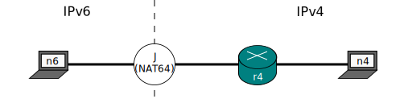
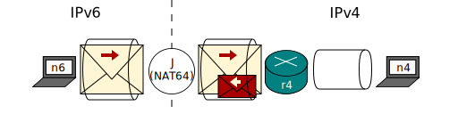
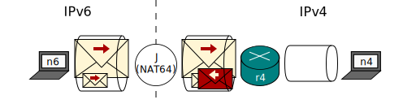

[Documentation](documentation.html) > [Userspace Clients](documentation.html#userspace-clients) > [global](usr-flags-global.html) > `mtu-plateaus`

# MTU Plateaus (Example)

## Introduction

This article explains the purpose of the `mtu-plateaus` flag by example.

This is the sample network:

The maximum bytes per packet (MTU) of links _n6-J_ and _J-r4_ is 1500.

Link _r4-n4_ is an ARPANET network. Therefore, [its packets can be up to 8159-96 bits long](https://en.wikipedia.org/wiki/BBN_Report_1822) (~1007 bytes).

For illustrative purposes, let's pretend Jool will not mangle the size of the packets it translates. In reality, IPv4 headers are 20 bytes shorter than IPv6 headers, and there are other quirks as well, but they're irrelevant for the purposes of this example.

Here it goes:

## Example

_n6_ wants to write a 1500-byte IPv6 packet to _n4_ (Think 100 bytes of headers and 1400 bytes of data payload). _J_ converts it to a 1500-byte IPv4 packet and sends it to _r4_. _r4_ cannot forward it because it's too big for the 1007-byte limit of the _r4-n4_ network, so it returns a ICMP error to _n6_.

<a href="http://en.wikipedia.org/wiki/Path_MTU_Discovery" target="_blank">Path MTU discovery</a> operates under the assumption that the router who could not forward the packet will report the maximum packet size it can transmit. At this point, the ICMP error would contain the magic number "1007", and so _n6_ would know that he has to slice his packet into according pieces if he's still interested in the arrival of his message.

Unfortunately, the inclusion of this number is an afterthought; the original ICMPv4 specification does not mandate it. If _r4_ is old enough, it will leave the MTU field unset (ie. zero), and _n6_ will be baffled at the prospect of having to divide its data into chunks of zero bytes each (ICMPv6 does mandate the MTU field, so IPv6 nodes actually rely on it).

Being the only one who has a grasp of what the problem is, the task of hacking a solution befalls on the NAT64.

_J_ will realize that the problem exists by observing that it's trying to translate a ICMPv4 error with a zero MTU to ICMPv6, where that is illegal. _J_ does not have a way to know the MTU of the _r4-n4_ network so it has to guess. It does know that the rejected packet was 1500 bytes long, so it takes a look at `mtu-plateaus` (whose default value is based on the following table) and picks the first plateau which would reject a 1500-sized packet:

	   Plateau    MTU    Comments                      Reference
	   ------     ---    --------                      ---------
		      65535  Official maximum MTU          RFC 791
		      65535  Hyperchannel                  RFC 1044
	   65535
	   32000             Just in case
		      17914  16Mb IBM Token Ring
	   17914
		      8166   IEEE 802.4                    RFC 1042
	   8166
		      4464   IEEE 802.5 (4Mb max)          RFC 1042
		      4352   FDDI (Revised)                RFC 1188
	   4352 (1%)
		      2048   Wideband Network              RFC 907
		      2002   IEEE 802.5 (4Mb recommended)  RFC 1042
	   2002 (2%)
		      1536   Exp. Ethernet Nets            RFC 895
		      1500   Ethernet Networks             RFC 894
		      1500   Point-to-Point (default)      RFC 1134
		      1492   IEEE 802.3                    RFC 1042
	   1492 (3%)
		      1006   SLIP                          RFC 1055
		      1006   ARPANET                       BBN 1822
	   1006
		      576    X.25 Networks                 RFC 877
		      544    DEC IP Portal
		      512    NETBIOS                       RFC 1088
		      508    IEEE 802/Source-Rt Bridge     RFC 1042
		      508    ARCNET                        RFC 1051
	   508 (13%)
		      296    Point-to-Point (low delay)    RFC 1144
	   296
	   68                Official minimum MTU          RFC 791

So _J_ suspects the _r4-n4_ network is a IEEE 802.3. It translates the zero-MTU ICMPv4 error into a 1492-MTU ICMPv6 error.

_n6_ slices its message and now tries to send one 1492 long packet (100 bytes of headers and 1392 bytes of data payload) and one 108-byte packet (100 header, 8 payload). _r4_ again rejects the attempt because a 1492 packet still does not fit in a 1007-MTU network.

_J_ again realizes that it is trying to translate a zero MTU ICMP error, so it again tries to report the first plateau which would object to the rejected packet. The next plateau of 1492 is 1006 this time, so _J_ guesses _r4-n4_ is a SLIP or an ARPANET. The guess was correct this time, as you can see.

Upon receiving the news, n6 now slices its data into a 1006 (100 + 906) packet and a 594 (100 + 494) packet. The translated versions finally fit and arrive at their destination.

## Wrapping up

The plateaus strategy is the better alternative out of several Path MTU discovery approaches. Because it is aware of existing MTUs, it converges quickly and leaves little room for under-utilization. (See <a href="http://tools.ietf.org/html/rfc1191#section-5" target="_blank">section 5 of RFC 1191</a>.)

You might have noticed, however, that ARPANET was disbanded a long time ago, which speaks poorly of the default plateaus list. And this is true; though RFC 1191 says "implementors should use up-to-date references to pick a set of plateaus", none seem to come up.

It's not that bad, given that some of the protocols in the table are still in use, and having a few redundant plateaus is better than having a few missing ones.

And it doesn't mean the plateaus list is hardcoded into Jool, either. If you want to change your plateaus list, run

	(jool_siit | jool) global update mtu-plateaus <list>

For example:

	jool_siit global update mtu-plateaus "80000, 40000, 20000, 10000"

