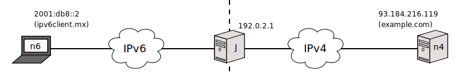

[Documentation](documentation.html) > [Userspace Clients](documentation.html#userspace-clients) > `session` Mode

# `session` Mode

## Index

1. [Description](#description)
2. [Syntax](#syntax)
3. [Arguments](#arguments)
   1. [`display`](#display)
   2. [Flags](#flags)
4. [Examples](#examples)

## Description

From Jool's point of view, sessions mostly exist so the NAT64 can decide when BIB entries should die. You can also use them to know exactly who is speaking to your IPv6 nodes.

Each BIB entry is a mapping, which describes the IPv4 name of one of your IPv6 services. For every BIB entry, there are zero or more session entries, each of which represents an active connection currently using that mapping.

You can use this command to get information on each of these connections.

## Syntax

	jool session display [PROTOCOL] [--numeric] [--csv] [--no-headers]

	PROTOCOL := --tcp | --udp | --icmp

>  **Warning**: Jool 3's `PROTOCOL` label used to be defined as `[--tcp] [--udp] [--icmp]`. The flags are mutually exclusive now, and default to `--tcp`.

## Arguments

### `display`

The session table that corresponds to the `PROTOCOL` protocol is printed in standard output.

### Flags

| **Flag** | **Description** |
| `--tcp` | Operate on the TCP table. This is the default protocol. |
| `--udp` | Operate on the UDP table. |
| `--icmp` | Operate on the ICMP table. |
| `--numeric` | By default, `display` will attempt to resolve the names of the remote nodes involved in each session. _If your nameservers aren't answering, this will pepper standard error with messages and slow the output down_. Use `--numeric` to disable the lookups. |
| `--csv` | Print the table in [_Comma/Character-Separated Values_ format](http://en.wikipedia.org/wiki/Comma-separated_values). This is intended to be redirected into a .csv file. Because every record is printed in a single line, CSV is also better for grepping. |
| `--no-headers` | Print the table entries only; omit the headers. (Table headers exist only on CSV mode.) |

## Examples

`ipv6client.mx` makes two HTTP requests and a ping to `example.com`.

Show the TCP table, resolve names, console format:


user@T:~# jool session display
---------------------------------
(V4_FIN_V6_FIN_RCV) Expires in 2 minutes, 57 seconds
Remote: example.com#http	ipv6client.mx#58239
Local: 192.0.2.1#60477		64:ff9b::5db8:d877#80
---------------------------------
(V4_FIN_V6_FIN_RCV) Expires in 3 minutes, 52 seconds
Remote: example.com#http	ipv6client.mx#58237
Local: 192.0.2.1#6617		64:ff9b::5db8:d877#80
---------------------------------


Show the TCP table, do not query the DNS, console format:


user@T:~# jool session display --tcp --numeric
---------------------------------
(V4_FIN_V6_FIN_RCV) Expires in 2 minutes, 57 seconds
Remote: 93.184.216.119#80	2001:db8::2#58239
Local: 192.0.2.1#60477		64:ff9b::5db8:d877#80
---------------------------------
(V4_FIN_V6_FIN_RCV) Expires in 3 minutes, 52 seconds
Remote: 93.184.216.119#80	2001:db8::2#58237
Local: 192.0.2.1#6617		64:ff9b::5db8:d877#80
---------------------------------


Do not resolve names, CSV format:


user@T:~# jool session display --numeric --csv > session.csv


[session.csv](../obj/session.csv)
