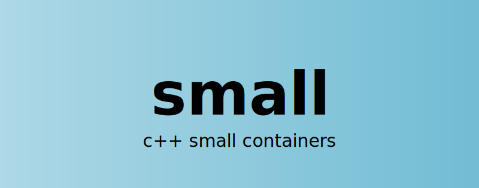

# Small

> C++ Small Containers

[](https://alandefreitas.github.io/small/)

<br/>

- Applications usually contain many auxiliary small data structures for each large collection of values. Container implementations often include several optimizations for the case when they are small.
- These optimizations cannot usually make it to the STL because of ABI compatibility issues. Users might need to reimplement these containers or rely on frameworks that include these implementations.
- Depending on large library collections for simple containers might impose a cost on the user that's higher than necessary and hinder collaboration on the evolution of these containers.
- This library includes independent implementations of the main STL containers optimized for the case when they are small.

<br/>

[](https://github.com/alandefreitas/small/actions?query=workflow%3ASmall+event%3Apush)
[](https://GitHub.com/alandefreitas/small/releases/)
[](https://alandefreitas.github.io/small/)
[](https://github.com/alandefreitas/small/discussions)

<br/>

<!-- https://github.com/bradvin/social-share-urls -->
[](https://www.facebook.com/sharer/sharer.php?t=small:%20C%2B%2B%20Small%20Containers&u=https://github.com/alandefreitas/small/)
[](http://sns.qzone.qq.com/cgi-bin/qzshare/cgi_qzshare_onekey?url=https://github.com/alandefreitas/small/&title=small:%20C%2B%2B%20small%20containers&summary=small:%20C%2B%2B%20small%20containers)
[](http://sns.qzone.qq.com/cgi-bin/qzshare/cgi_qzshare_onekey?url=https://github.com/alandefreitas/small/&title=small:%20C%2B%2B%20small%20containers&summary=small:%20C%2B%2B%20small%20containers)
[](http://www.reddit.com/submit?url=https://github.com/alandefreitas/small/&title=Small:%20CPP%20Small%20Containers)
[](https://twitter.com/intent/tweet?text=small:%20C%2B%2B%20small%20containers&url=https://github.com/alandefreitas/small/&hashtags=Containers,Small,Cpp,Programming)
[](https://www.linkedin.com/shareArticle?mini=false&url=https://github.com/alandefreitas/small/&title=small:%20C%2B%2B%20small%20containers)
[](https://api.whatsapp.com/send?text=small:%20C%2B%2B%20small%20containers:+https://github.com/alandefreitas/small/)
[](https://lineit.line.me/share/ui?url=https://github.com/alandefreitas/small/&text=small:%20C%2B%2B%20small%20containers)
[](https://telegram.me/share/url?url=https://github.com/alandefreitas/small/&text=small:%20C%2B%2B%20small%20containers)
[](https://news.ycombinator.com/submitlink?u=https://github.com/alandefreitas/small/&t=small:%20C%2B%2B%20small%20containers)

<br/>

<!-- START mdsplit-ignore -->
<!-- Remove link to documentation from the documentation -->

<h2>

[READ THE DOCUMENTATION FOR A QUICK START AND EXAMPLES](https://alandefreitas.github.io/small/)

</h2>

<!-- START doctoc generated TOC please keep comment here to allow auto update -->
<!-- DON'T EDIT THIS SECTION, INSTEAD RE-RUN doctoc TO UPDATE -->
<details>
<summary>Table of Contents</summary>

- [Quickstart](#quickstart)
- [Vectors](#vectors)
- [Strings](#strings)
- [Sets and Maps](#sets-and-maps)
- [Contributing](#contributing)
  - [Get Involved](#get-involved)
  - [Ideas and Roadmap](#ideas-and-roadmap)
  - [Guidelines](#guidelines)
  - [Contributors](#contributors)
- [References](#references)

</details>
<!-- END doctoc generated TOC please keep comment here to allow auto update -->
<!-- END mdsplit-ignore -->

## Quickstart

Integration:

=== "CMake"

    === "Add subdirectory"

        ```bash
        git clone https://github.com/alandefreitas/small/
        ```

        ```cmake
        add_subdirectory(small)
        # ...
        add_executable(your_target main.cpp)
        target_link_libraries(your_target PUBLIC small::small)
        ```

    === "Fetch content"

        ```cmake
        include(FetchContent)
        
        FetchContent_Declare(small
            GIT_REPOSITORY https://github.com/alandefreitas/small
            GIT_TAG origin/master # or whatever tag you want
        )

        FetchContent_GetProperties(small)
        if(NOT small_POPULATED)
            FetchContent_Populate(small)
            add_subdirectory(${small_SOURCE_DIR} ${small_BINARY_DIR} EXCLUDE_FROM_ALL)
        endif()

        # ...
        add_executable(your_target main.cpp)
        target_link_libraries(your_target PUBLIC small::small)
        ```

    === "External package"

        ```cmake
        # Follow installation instructions and then... 
        find_package(small REQUIRED)
        if(NOT small_FOUND)
            # Throw or put your FetchContent script here
        endif()

        # ...
        add_executable(your_target main.cpp)
        target_link_libraries(your_target PUBLIC small::small)
        ```

=== "Install"

    !!! note

        Get the binary package from the [release section](https://github.com/alandefreitas/small/releases). 

        These binaries refer to the latest release version of small.

    !!! hint
        
        If you need a more recent version of `small`, you can download the binary packages from the CI artifacts or build the library from the source files.

=== "Build from source"

    !!! note

        Ensure your C++ compiler and CMake are up-to-date and then:

    === "Ubuntu + GCC"

        ```bash
        # Create a new directory
        mkdir build
        cd build
        # Configure
        cmake .. -DCMAKE_BUILD_TYPE=Release -DCMAKE_CXX_FLAGS="-O2"
        # Build
        sudo cmake --build . --parallel 2 --config Release
        # Install 
        sudo cmake --install .
        # Create packages
        sudo cpack .
        ```

    === "Mac Os + Clang"
    
        ```bash
        # Create a new directory
        mkdir build
        cd build
        # Configure
        cmake .. -DCMAKE_BUILD_TYPE=Release -DCMAKE_CXX_FLAGS="-O2"
        # Build
        cmake --build . --parallel 2 --config Release
        # Install 
        cmake --install .
        # Create packages
        cpack .
        ```
    
    === "Windows + MSVC"
    
        ```bash
        # Create a new directory
        mkdir build
        cd build
        # Configure
        cmake .. -DCMAKE_BUILD_TYPE=Release -DCMAKE_CXX_FLAGS="/O2"
        # Build
        cmake --build . --parallel 2 --config Release
        # Install 
        cmake --install .
        # Create packages
        cpack .
        ```
    
    !!! hint "Parallel Build"
        
        Replace `--parallel 2` with `--parallel <number of cores in your machine>`

    !!! note "Setting C++ Compiler"

        If your C++ compiler that supports C++17 is not your default compiler, make sure you provide CMake with the compiler location with the DCMAKE_C_COMPILER and DCMAKE_CXX_COMPILER options. For instance:
    
        ```bash
        cmake .. -DCMAKE_BUILD_TYPE=Release -DCMAKE_CXX_FLAGS="-O2" -DCMAKE_C_COMPILER=/usr/bin/gcc-8 -DCMAKE_CXX_COMPILER=/usr/bin/g++-8
        ```

=== "File amalgamation"

    !!! note

        Because containers are header-only, you can directly copy the contents from the `source` directory into your project.

    !!! hint

        In that case, you are responsible for setting the appropriate target include directories and any compile definitions you might require.


Once the library is properly integrated, you can create containers from the namespace `small` like any other STL container:

```cpp
--8<-- "examples/main.cpp"
```

All containers are optimized for the case when they're small but also efficient when they are large. The containers mix the common techniques found in other small container libraries:

- Inline allocation for small containers
- Custom expected sizes
- Identification of relocatable types
- Custom growth factors with better defaults
- Communication with system memory allocators
- Explicit consideration of CPU cache sizes and branch prediction 

Most applications have many small lists and sets of elements. These containers avoid spending a lot of time with large containers
that contain just a few elements. Small containers usually try to use the stack before dynamically allocating memory and try
to represent associative containers with stack arrays, unless these sets are very large.

The following containers are available:

- `small::vector`
- `small::max_size_vector`
- `small::string`
- `small::set`
- `small::max_size_set`
- `small::multiset`
- `small::max_size_multiset`
- `small::unordered_set`
- `small::max_size_unordered_set`
- `small::unordered_multiset`
- `small::max_size_unordered_multiset`
- `small::map`
- `small::max_size_map`
- `small::multimap`
- `small::max_size_multimap`
- `small::unordered_map`
- `small::max_size_unordered_map`
- `small::unordered_multimap`
- `small::max_size_unordered_multimap`
- `small::stack`
- `small::queue`
- `small::priority_queue`

Although many compilers support small string optimization (SSO) already, this library will ensure all strings support SOO, custom inline sizes, relocation, and unicode.    

## Vectors

This small vector implementation includes:

- Inline allocation for small vectors
- Custom expected size
- Special treatment of relocatable types
    - Relocatable types can be moved with `memcpy`, bypassing destructors and constructors.
    - Relocatable types are defined by default for POD types and aggregate types of PODs
    - The `small::is_relocatable` traits can be used as an extension point for custom types
- Better growth factors
- Consider the cache line size in allocations
- Heap allocations can be disabled with `small::max_size_vector`

When there are fewer elements than a given threshold, the elements are kept in a stack buffer for small vectors. Otherwise, the vector works as usual. However, if you are 100% sure you will never need more than `N` elements, you can use a `max_size_vector`, where elements are always inline. 

The default number of elements in a small vector is usually the number of elements we can already fit inline in a vector. For larger data types, the `default_inline_storage` trait can be used as an extension point where one can define how many elements a small vector of that type should contain by default. 

```cpp
--8<-- "examples/default_inline_storage.cpp"
```

When there's a reasonable default for the number of inline elements, this strategy avoids multiple vector type instantiations for different inline storage sizes. 

This small vector implementation used folly, abseil, and LLVM as a reference.

## Strings

The small string includes all the common optimizations for small vectors, and a custom template parameter to set how large we expect the string to be (in bytes).

However, when strings are representing text, if there's one thing that makes them not small is not supporting UTF8. In addition to the common interface for strings, `small::string` includes extra functions to identify and work with UTF8 code points with random access.

```cpp
--8<-- "examples/unicode_strings.cpp"
```

The problem of supporting UTF8 is easier to explain than it is to solve. Programming languages tend to solve this problem by (1) forbidding byte or substring access, and/or (2) allowing only access to code points with `O(n)` cost, where `n` is the number of code points. Because anything that forbids byte access would be incompatible with a C++ string, we allow direct byte access, and strings are allowed to be malformed unicode, which we can check with `small::is_malformed`. 

All capacity and access functions contain extra overloads that accept codepoint indexes, defined as a strong type, rather than byte indexes. By using these functions, one can ensure the string is never malformed. It's up to the user to decide whether these access functions are useful and worth it in a particular application.  

Access to codepoints is provided with an inline lookup-table trick that allows us to access codepoints in `O(log m)` time, where `m` is the number of multibyte code points in the strings. When there are no multibyte codepoints in the string, the string works as usual and no extra memory is required for the table.

## Sets and Maps

The small set/map classes use a more cache-friendly flat set/map and all other optimizations mentioned above for internal algorithms. As with other small containers, a custom template parameter can be used to define the number of inline elements in the container.

The `small::default_inline_storage` and `small::is_relocatable` trait can also be defined for custom types, and all the usual set/map, ordered/unordered, uni/multi variants are also provided:

```cpp
--8<-- "examples/associative.cpp"
```

Unlike a `small::vector` or `small::string`, the asymptotic time complexities of flat sets/maps are very different from their `std::` counterparts and should only be used when they are small. Because they are internally implemented as arrays, manipulating these containers costs `O(n)`.

For large containers, you can use `std` containers with custom allocators. Or for efficient large containers, you can use the abseil containers, implemented as B+-trees.

## Contributing

### Get Involved

* Discussions are concentrated on our GitHub [discussions](https://github.com/alandefreitas/small/discussions) page. Don't refrain from asking questions and proposing ideas. If this library helps you create something interesting, please divulge it with the community.
* If you are a programmer with good ideas, please [share](https://github.com/alandefreitas/small/discussions/new) these ideas with us.
* Academic collaboration is more than welcome. It'd be great to see this library help people write papers.

### Ideas and Roadmap

Feel free to contribute new features to this library. For complex features and changes, consider [getting feedback](https://github.com/alandefreitas/small/discussions/new) from the community first. Contributing to an existing code base with its conventions might seem obscure at first but please don't let that discourage you from sharing your ideas.

There are many ways in which you can contribute to this library:

* Testing the library in new environments <sup>see [1](https://github.com/alandefreitas/small/issues?q=is%3Aopen+is%3Aissue+label%3A%22cross-platform+issue+-+windows%22), [2](https://github.com/alandefreitas/small/issues?q=is%3Aopen+is%3Aissue+label%3A%22cross-platform+issue+-+linux%22), [3](https://github.com/alandefreitas/small/issues?q=is%3Aopen+is%3Aissue+label%3A%22cross-platform+issue+-+macos%22) </sup>
* Contributing with interesting examples <sup>see [1](source/examples)</sup>
* Finding problems in this documentation <sup>see [1](https://github.com/alandefreitas/small/issues?q=is%3Aopen+is%3Aissue+label%3A%22enhancement+-+documentation%22) </sup>
* Finding bugs in general <sup>see [1](https://github.com/alandefreitas/small/issues?q=is%3Aopen+is%3Aissue+label%3A%22bug+-+compilation+error%22), [2](https://github.com/alandefreitas/small/issues?q=is%3Aopen+is%3Aissue+label%3A%22bug+-+compilation+warning%22), [3](https://github.com/alandefreitas/small/issues?q=is%3Aopen+is%3Aissue+label%3A%22bug+-+runtime+error%22), [4](https://github.com/alandefreitas/small/issues?q=is%3Aopen+is%3Aissue+label%3A%22bug+-+runtime+warning%22) </sup>
* Whatever idea seems interesting to you

The only thing we ask you is to make sure your contribution is not destructive. Some contributions in which we are not interested are:

* "I don't like this optional feature, so I removed/deprecated it"
* "I removed this feature to support older versions of C++" but have not provided an equivalent alternative
* "I removed this feature, so I don't have to install/update ______" but have not provided an equivalent alternative
* "I'm creating this high-cost promise that we'll support ________ forever" but I'm not sticking around to keep that promise

In doubt, please open a [discussion](https://github.com/alandefreitas/small/discussions) first

### Guidelines

If contributing with code, please leave all warnings ON (`-DSMALL_BUILD_WITH_PEDANTIC_WARNINGS=ON`), use [cppcheck](http://cppcheck.sourceforge.net/), and [clang-format](https://clang.llvm.org/docs/ClangFormat.html).

If contributing to the documentation, please edit [`README.md`](README.md) directly, as the files in [`./docs`](./docs) are automatically generated with [mdsplit](https://github.com/alandefreitas/mdsplit).

### Contributors

<!-- readme: collaborators,contributors -start --> 
<table>
<tr>
    <td align="center">
        <a href="https://github.com/alandefreitas">
            
            <br />
            <sub><b>Alan De Freitas</b></sub>
        </a>
    </td>
    <td align="center">
        <a href="https://github.com/tearfur">
            
            <br />
            <sub><b>Yat Ho</b></sub>
        </a>
    </td>
    <td align="center">
        <a href="https://github.com/tomasz-szyszko">
            
            <br />
            <sub><b>tomasz-szyszko</b></sub>
        </a>
    </td>
    <td align="center">
        <a href="https://github.com/marcosfpr">
            
            <br />
            <sub><b>Marcos Pontes</b></sub>
        </a>
    </td></tr>
</table>
<!-- readme: collaborators,contributors -end -->

## References

These are some references we used for this work:

- [Abseil](https://github.com/abseil/abseil-cpp)
- [Folly](https://github.com/facebook/folly)
- [LLVM](https://github.com/llvm/llvm-project)
- [Boost Containers](https://github.com/boostorg/container)
- [Tiny-utf8](https://github.com/DuffsDevice/tiny-utf8)

